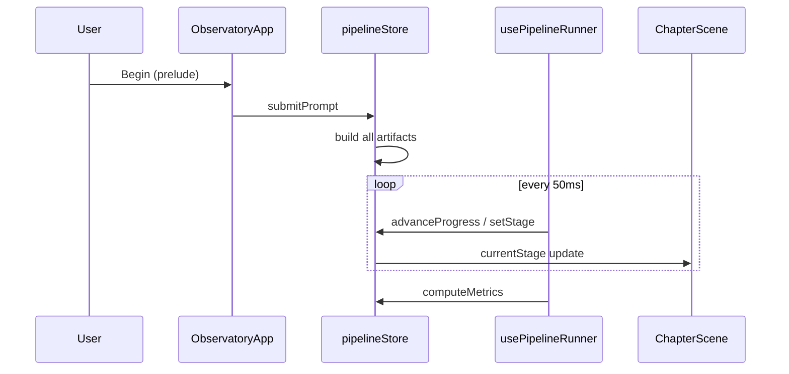
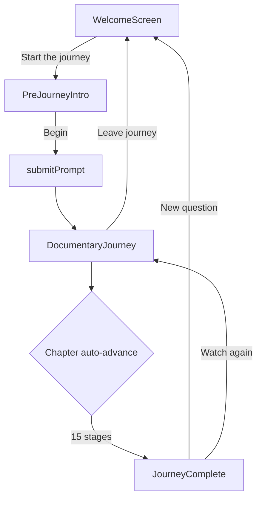

# Inside AI — Full Repository Review Pack for Claude

This single file contains the **entire product/architectural documentation** and **core source code** of the Inside AI project. Use this for comprehensive review, quality audits, regression testing analysis, and feature expansion planning.

## Table of Contents

### I. Documentation Files
1. [llm-observatory/docs/AI/contributor-guide.md](#llm-observatorydocsaicontributor-guidemd)
2. [llm-observatory/docs/AI/review-pack.md](#llm-observatorydocsaireview-packmd)
3. [llm-observatory/docs/ARCHITECTURE/app-structure.md](#llm-observatorydocsarchitectureapp-structuremd)
4. [llm-observatory/docs/ARCHITECTURE/data-flow.md](#llm-observatorydocsarchitecturedata-flowmd)
5. [llm-observatory/docs/ARCHITECTURE/overview.md](#llm-observatorydocsarchitectureoverviewmd)
6. [llm-observatory/docs/COMPONENTS/README.md](#llm-observatorydocscomponentsreadmemd)
7. [llm-observatory/docs/COMPONENTS/artificial-brain.md](#llm-observatorydocscomponentsartificial-brainmd)
8. [llm-observatory/docs/COMPONENTS/attention-arcs.md](#llm-observatorydocscomponentsattention-arcsmd)
9. [llm-observatory/docs/COMPONENTS/cinematic-scene.md](#llm-observatorydocscomponentscinematic-scenemd)
10. [llm-observatory/docs/COMPONENTS/neural-universe.md](#llm-observatorydocscomponentsneural-universemd)
11. [llm-observatory/docs/COMPONENTS/probability-field.md](#llm-observatorydocscomponentsprobability-fieldmd)
12. [llm-observatory/docs/COMPONENTS/stage-layout.md](#llm-observatorydocscomponentsstage-layoutmd)
13. [llm-observatory/docs/CONTRIBUTING/README.md](#llm-observatorydocscontributingreadmemd)
14. [llm-observatory/docs/CONTRIBUTING/maintenance.md](#llm-observatorydocscontributingmaintenancemd)
15. [llm-observatory/docs/CONTRIBUTING/setup.md](#llm-observatorydocscontributingsetupmd)
16. [llm-observatory/docs/DECISIONS/001-scene-based-ux.md](#llm-observatorydocsdecisions001-scene-based-uxmd)
17. [llm-observatory/docs/DECISIONS/002-beginner-default.md](#llm-observatorydocsdecisions002-beginner-defaultmd)
18. [llm-observatory/docs/DECISIONS/003-contextual-brain.md](#llm-observatorydocsdecisions003-contextual-brainmd)
19. [llm-observatory/docs/DECISIONS/004-prelude-before-simulation.md](#llm-observatorydocsdecisions004-prelude-before-simulationmd)
20. [llm-observatory/docs/DECISIONS/005-single-zustand-store.md](#llm-observatorydocsdecisions005-single-zustand-storemd)
21. [llm-observatory/docs/DECISIONS/README.md](#llm-observatorydocsdecisionsreadmemd)
22. [llm-observatory/docs/DESIGN/principles.md](#llm-observatorydocsdesignprinciplesmd)
23. [llm-observatory/docs/LEARNING_SYSTEM/copywriting.md](#llm-observatorydocslearning_systemcopywritingmd)
24. [llm-observatory/docs/LEARNING_SYSTEM/overview.md](#llm-observatorydocslearning_systemoverviewmd)
25. [llm-observatory/docs/LEARNING_SYSTEM/progressive-disclosure.md](#llm-observatorydocslearning_systemprogressive-disclosuremd)
26. [llm-observatory/docs/MOTION/overview.md](#llm-observatorydocsmotionoverviewmd)
27. [llm-observatory/docs/MOTION/transitions.md](#llm-observatorydocsmotiontransitionsmd)
28. [llm-observatory/docs/PERFORMANCE/overview.md](#llm-observatorydocsperformanceoverviewmd)
29. [llm-observatory/docs/PIPELINE/lifecycle.md](#llm-observatorydocspipelinelifecyclemd)
30. [llm-observatory/docs/PIPELINE/overview.md](#llm-observatorydocspipelineoverviewmd)
31. [llm-observatory/docs/PIPELINE/stage-machine.md](#llm-observatorydocspipelinestage-machinemd)
32. [llm-observatory/docs/PRODUCT/audience.md](#llm-observatorydocsproductaudiencemd)
33. [llm-observatory/docs/PRODUCT/identity.md](#llm-observatorydocsproductidentitymd)
34. [llm-observatory/docs/PRODUCT/vision.md](#llm-observatorydocsproductvisionmd)
35. [llm-observatory/docs/README.md](#llm-observatorydocsreadmemd)
36. [llm-observatory/docs/REFERENCE/README.md](#llm-observatorydocsreferencereadmemd)
37. [llm-observatory/docs/ROADMAP/overview.md](#llm-observatorydocsroadmapoverviewmd)
38. [llm-observatory/docs/ROADMAP/technical-debt.md](#llm-observatorydocsroadmaptechnical-debtmd)
39. [llm-observatory/docs/SETUP.md](#llm-observatorydocssetupmd)
40. [llm-observatory/docs/SIMULATION_ENGINE/overview.md](#llm-observatorydocssimulation_engineoverviewmd)
41. [llm-observatory/docs/STAGES/README.md](#llm-observatorydocsstagesreadmemd)
42. [llm-observatory/docs/STAGES/_remaining-chapters.md](#llm-observatorydocsstages_remaining-chaptersmd)
43. [llm-observatory/docs/STAGES/embedding.md](#llm-observatorydocsstagesembeddingmd)
44. [llm-observatory/docs/STAGES/input.md](#llm-observatorydocsstagesinputmd)
45. [llm-observatory/docs/STAGES/tokenization.md](#llm-observatorydocsstagestokenizationmd)
46. [llm-observatory/docs/STATE_MANAGEMENT/actions.md](#llm-observatorydocsstate_managementactionsmd)
47. [llm-observatory/docs/STATE_MANAGEMENT/overview.md](#llm-observatorydocsstate_managementoverviewmd)
48. [llm-observatory/docs/STATE_MANAGEMENT/persistence.md](#llm-observatorydocsstate_managementpersistencemd)
49. [llm-observatory/docs/THEMING/overview.md](#llm-observatorydocsthemingoverviewmd)
50. [llm-observatory/docs/UX/experience-flow.md](#llm-observatorydocsuxexperience-flowmd)
51. [llm-observatory/docs/UX/philosophy.md](#llm-observatorydocsuxphilosophymd)
52. [llm-observatory/docs/VISUAL_SYSTEM/overview.md](#llm-observatorydocsvisual_systemoverviewmd)
53. [llm-observatory/docs/VISUAL_SYSTEM/surfaces.md](#llm-observatorydocsvisual_systemsurfacesmd)
54. [llm-observatory/docs/VISUAL_SYSTEM/typography.md](#llm-observatorydocsvisual_systemtypographymd)
55. [llm-observatory/docs/WORKFLOWS.md](#llm-observatorydocsworkflowsmd)
56. [llm-observatory/docs/WORKFLOWS/README.md](#llm-observatorydocsworkflowsreadmemd)

### II. Critical Source Code Files
1. [llm-observatory/src/components/ObservatoryApp.tsx](#llm-observatorysrccomponentsobservatoryapptsx)
2. [llm-observatory/src/components/journey/DocumentaryJourney.tsx](#llm-observatorysrccomponentsjourneydocumentaryjourneytsx)
3. [llm-observatory/src/components/journey/ChapterScene.tsx](#llm-observatorysrccomponentsjourneychapterscenetsx)
4. [llm-observatory/src/components/sections/StageContent.tsx](#llm-observatorysrccomponentssectionsstagecontenttsx)
5. [llm-observatory/src/components/sections/EmbeddingSection.tsx](#llm-observatorysrccomponentssectionsembeddingsectiontsx)
6. [llm-observatory/src/components/viz/EmbeddingSpace.tsx](#llm-observatorysrccomponentsvizembeddingspacetsx)
7. [llm-observatory/src/components/ui/CinematicScene.tsx](#llm-observatorysrccomponentsuicinematicscenetsx)
8. [llm-observatory/src/store/pipelineStore.ts](#llm-observatorysrcstorepipelinestorets)
9. [llm-observatory/src/hooks/usePipelineRunner.ts](#llm-observatorysrchooksusepipelinerunnerts)
10. [llm-observatory/src/hooks/useLearningDepth.ts](#llm-observatorysrchooksuselearningdepthts)
11. [llm-observatory/src/types/pipeline.ts](#llm-observatorysrctypespipelinets)
12. [llm-observatory/src/lib/inference.ts](#llm-observatorysrclibinferencets)
13. [llm-observatory/src/lib/stageTips.ts](#llm-observatorysrclibstagetipsts)
14. [llm-observatory/src/app/globals.css](#llm-observatorysrcappglobalscss)

---

# Part I: Documentation

<a name="llm-observatorydocsaicontributor-guidemd"></a>
## File: `llm-observatory/docs/AI/contributor-guide.md`

```markdown
# AI / Cursor contributor guide

For **AI coding assistants** and automation working in this repo.

---

## Read first

1. [../PRODUCT/vision.md](../PRODUCT/vision.md)  
2. [../UX/philosophy.md](../UX/philosophy.md)  
3. [../DECISIONS/001-scene-based-ux.md](../DECISIONS/001-scene-based-ux.md)  
4. [../ARCHITECTURE/app-structure.md](../ARCHITECTURE/app-structure.md)  

---

## Non-negotiable rules

| Rule | Reason |
|------|--------|
| **Do not** remount dashboard shell (sidebar + always-on brain + scrubber) as default | ADR-001 |
| **Do not** break Zustand single-store flow or `PIPELINE_STAGES` order without updating all docs | Pipeline contract |
| **Do not** call real LLM APIs without explicit feature flag + docs | Product is simulated |
| **Do not** expose tensors/logits/heatmaps in Beginner primary focal area | Progressive disclosure |
| **Do** update `docs/` when changing flows, stages, or design tokens | Maintenance policy |
| **Do** match Thought Museum tokens in `globals.css` | Visual consistency |

---

## Architecture rules

- **Presentation** changes go in `components/journey/`, `components/home/`, `sections/`, `viz/`.  
- **Simulation** changes go in `src/lib/*` only — no React in lib.  
- **Orchestration** in `hooks/usePipelineRunner.ts` — 50ms tick contract.  
- **Prelude** is React local state in `ObservatoryApp` — not Zustand until `submitPrompt`.  

---

## Adding a pipeline chapter

See [../PIPELINE/stage-machine.md](../PIPELINE/stage-machine.md) checklist + [../STAGES/README.md](../STAGES/README.md).

---

## UI consistency

- Headlines: `.display-title` (in `ChapterScene` only — **not** in sections)
- Chapter sections: **`StageLayout`** (compact) or **`CinematicScene`** (immersive) — see [../COMPONENTS/stage-layout.md](../COMPONENTS/stage-layout.md) and [../COMPONENTS/cinematic-scene.md](../COMPONENTS/cinematic-scene.md)
- Panels: `.museum-card` / `GlassPanel` — hero focal uses `variant="hero"`
- CTAs: `.btn-primary`
- Motion: `useMotionPreferences` + `neuralMotion.ts` — respect pause & reduced motion  

---

## Naming conventions

| Kind | Convention |
|------|------------|
| Stage sections | `FooSection.tsx` in `sections/` |
| Viz | `PascalCase` in `viz/` |
| ViewMode IDs | `beginner` \| `engineer` \| `research` (UI: Beginner/Curious/Advanced) |

---

## What NOT to break

- `submitPrompt` artifact build sequence  
- `PreferencesHydrator` + `persistence.ts` key  
- `useLearningDepth` gating pattern  
- ChapterScene single-focus layout  

---

## After your change

1. Update relevant `docs/STAGES/<id>.md`  
2. Update [../WORKFLOWS/README.md](../WORKFLOWS/README.md) if flow changed  
3. Run `npm run build` and `npm run lint`  

```

---

<a name="llm-observatorydocsaireview-packmd"></a>
## File: `llm-observatory/docs/AI/review-pack.md`

```markdown
# Inside AI — Documentation Review Pack

**Purpose:** Single document for external AI review (Claude, GPT, etc.). It summarizes all material under `llm-observatory/docs/` plus essential code context. For full detail, follow links to individual docs.

**Repo:** `Inside-AI/llm-observatory` · **Stack:** Next.js 16 · React 19 · Zustand · Framer Motion · TypeScript · Tailwind v4

---

## How to use this pack (for the reviewing AI)

You are reviewing **Inside AI** — a browser-only educational app that simulates LLM inference as a 15-chapter guided documentary.

**Suggested review angles:**

| Angle | Focus |
|-------|--------|
| Product coherence | Does UX match vision (beginner-first, honest simulation)? |
| Architecture | Is single-store + client-only simulation appropriate? |
| Doc ↔ code drift | Do described flows match likely implementation? |
| UX decisions | Are ADRs still valid? Any dashboard regression risk? |
| Gaps | Missing stage docs, tests, accessibility, debt items |
| Copy & learning | Progressive disclosure, tone, glossary coverage |

**Non-negotiable constraints** (from product + ADRs):

- Default UX is **scene-based chapters**, not a multi-panel dashboard.
- **No real LLM APIs** without explicit feature flag + docs.
- **Beginner default** — no logits/heatmaps/tensors as primary focal visuals.
- **Prelude before simulation** — `submitPrompt` only after prelude **Begin**.
- **Docs must stay in sync** with architecture/flow changes.

**Critical code paths** (verify against `src/` if doing deep review):

```
src/app/page.tsx → ObservatoryApp
  → welcome | prelude | DocumentaryJourney
  → usePipelineRunner (50ms) → ChapterScene → StageSection
  → pipelineStore + src/lib/* simulation
```

---

## 1. Executive summary

**One line:** A calm, chapter-based browser journey through a **simulated** AI mind — from your words arriving to a reply streaming back.

**User path:**

```
Welcome → Prelude (3 ideas + ready) → 15 chapters → Finale
```

**What it is:** Interactive educational documentary for non-engineers.  
**What it is NOT:** Real LLM client, observability platform, benchmark, or GPU monitor.

**Names:**

| Context | Name |
|---------|------|
| UI | Inside AI |
| Folder / npm | `llm-observatory` |
| Legacy internal | Neural Observatory |

**Success criteria:**

- First-time user grasps product in **< 10 seconds** on welcome.
- Beginners never *must* understand tensors/logits/embeddings to proceed.
- Documentation is the source of truth — not chat history.

---

## 2. Product

### Vision & goals

After the journey, users should:

1. **Feel** AI processing as understandable steps — not magic.
2. **Remember** receive → break apart → mean → remember → think → choose → speak.
3. **Know** they can go deeper (Curious / Advanced) when ready.

### Principles

| Principle | Meaning |
|-----------|---------|
| Guided documentary | One chapter, one idea, one focal visualization |
| Emotional safety | Calm pacing, plain language, no control-room density |
| Progressive depth | Beginner default; jargon opt-in |
| Honest simulation | All in-browser; stated clearly |

### Audience

| Persona | Needs |
|---------|-------|
| **Curious beginner** (primary) | One headline, one button, one idea per screen |
| **Technical explorer** | Correct terms gradually; heatmaps behind disclosure |
| **Educator / presenter** | Beginner default, no API keys, predictable flow |

**Anti-personas:** ML researchers benchmarking models, platform engineers tracing prod LLMs, users seeking a chat product.

### Brand voice

Warm, clear, human. Museum tour / science documentary — **not** cyberpunk dashboard.  
Avoid: “neural cathedral,” “tensor storm,” dense monospace on primary UI.

**Full docs:** [PRODUCT/vision.md](../PRODUCT/vision.md) · [identity.md](../PRODUCT/identity.md) · [audience.md](../PRODUCT/audience.md)

---

## 3. UX & experience flow

### Core thesis

Beginners learn from **focused scenes**, not persistent multi-panel workspaces. Rejected: sidebar rails, always-visible full brain, scrubber + top bar + stage panel simultaneously.

### Phases (`ObservatoryApp` local state)

| Phase | Component | Store `active` | Purpose |
|-------|-----------|----------------|---------|
| `welcome` | `WelcomeScreen` | `false` | Entry, prompt, collapsed settings |
| `prelude` | `PreJourneyIntro` | `false` | Expectations; **no simulation yet** |
| `journey` | `DocumentaryJourney` | `true` | 15 chapters after `submitPrompt()` |

```
welcome ──(Start the journey)──► prelude ──(Begin)──► journey
   ▲                                                    │
   └──────────── reset / exit ──────────────────────────┘
```

**Why prelude is separate:** Artifacts are not built until user confirms readiness.

### Journey chapter shell

```
usePipelineRunner (50ms) → currentStage + stageProgress
  → ChapterScene (title, summary, brain focus chip)
  → StageSection → sections/*Section.tsx
  → SceneChrome + SceneProgress
```

### Navigation philosophy

| Tier | Mechanism |
|------|-----------|
| Primary | Auto-play through chapters |
| Secondary | Bottom transport (pause, prev/next) |
| Tertiary | Dot progress (jump to completed) |
| Quaternary | Menu (depth, glossary, exit) |

No permanent sidebar in documentary flow.

### Keyboard shortcuts (journey)

| Key | Action |
|-----|--------|
| Space | Pause / resume |
| Shift + ← / → | Previous / next chapter |
| ⌘/Ctrl + Enter | Start journey (welcome) |

**Full docs:** [UX/philosophy.md](../UX/philosophy.md) · [experience-flow.md](../UX/experience-flow.md)

---

## 4. Design system

### Thought Museum (visual)

- **Fonts:** Fraunces (display) + DM Sans (body); IBM Plex Mono for Advanced metrics only.
- **Surfaces:** `.museum-card`, `.museum-card-elevated`, `.btn-primary`, `.btn-ghost`
- **Tokens:** `--void`, `--deep`, `--elevated`, `--surface`, `--accent`, `--text`, `--muted` in `globals.css`
- **Atmosphere:** `NeuralUniverse` canvas (~35 particles, calm), `AmbientShell` fog/orbs, low-opacity noise
- **Removed from default:** grid drift, tensor rivers, megastructures, holographic frames

### Motion

- Framer Motion + `neuralMotion.ts` timing + CSS keyframes
- Slow chapter cross-fades; stagger content after header; pause respects `isPaused`
- **TODO:** `prefers-reduced-motion` for ambient canvas (roadmap)

### Theming

| UI label | ID | CSS |
|----------|-----|-----|
| Sage | `teal` | `[data-accent="teal"]` |
| Lavender | `violet` | `[data-accent="violet"]` |
| Warm | `amber` | `[data-accent="amber"]` |

App root also sets `data-view` (viewMode) and `data-phase` (welcome/prelude/journey).

**Full docs:** [DESIGN/principles.md](../DESIGN/principles.md) · [VISUAL_SYSTEM/](../VISUAL_SYSTEM/) · [MOTION/](../MOTION/) · [THEMING/overview.md](../THEMING/overview.md)

---

## 5. Architecture

### Layers

```
Presentation   → home/, journey/, sections/, viz/, ui/
Orchestration  → usePipelineRunner, useLearningDepth, useKeyboardShortcuts
State          → pipelineStore.ts (Zustand)
Simulation     → src/lib/* (no React)
Shell          → app/layout.tsx, page.tsx, globals.css
```

**Client-only SPA.** No backend API. All inference simulated in TypeScript.

### App structure

- **Phase state** is React local in `ObservatoryApp` until `submitPrompt`.
- **Dynamic imports:** `NeuralUniverse`, `ArtificialBrain` (legacy) — no SSR for canvas/SVG heavy viz.
- **Next config:** `transpilePackages: ['three']`

### Data flow (prompt → UI)

**Once on `submitPrompt`:**

```
tokenize → buildEmbeddings → buildContextBlocks → buildAttentionMatrix
  → buildLogits → buildKVCache → buildHiddenStateSlices → simulateResponse
```

Stored in Zustand; **not** recomputed on chapter change.

**Continuous (runner):**

```
usePipelineRunner (50ms) → advanceProgress / setStage
  → ChapterScene → StageSection → store selectors
```

**Exceptions:**

- `streaming` stage: `appendStreamToken` mutates `streamedText`
- `autoregressive` stage: periodic `refreshLogits(arStep)`

**Full docs:** [ARCHITECTURE/overview.md](../ARCHITECTURE/overview.md) · [app-structure.md](../ARCHITECTURE/app-structure.md) · [data-flow.md](../ARCHITECTURE/data-flow.md)

---

## 6. State management

**Single Zustand store:** `src/store/pipelineStore.ts`

| Category | Examples |
|----------|----------|
| Navigation | `currentStage`, `stageProgress`, `stageStatuses`, `isPaused`, `playbackSpeed` |
| Session | `active`, `prompt`, `generationComplete` |
| Prefs | `viewMode`, `themeAccent`, `modelPreset`, `ragEnabled`, `config` |
| Artifacts | `tokens`, `embeddings`, `attention`, `logits`, `streamedText`, … |
| Interaction | `selectedTokenIndex`, `selectedHead`, `inspectedLayer` |

### Key actions

| Action | Notes |
|--------|-------|
| `submitPrompt(prompt)` | Runs all lib builders; sets `active`; **only after prelude Begin** |
| `advanceProgress(delta)` | 0–100 for current stage |
| `jumpToStage` / `goToNextStage` / `goToPrevStage` | Manual navigation |
| `scrubToGlobal(progress)` | Legacy scrub math via `tourProgress.ts` |
| `reset()` | Clears session; **keeps** user prefs |
| `rerunTour()` | Re-runs `submitPrompt` with same prompt |

### Persistence

- Key: `neural-observatory-prefs`
- Hydrated by `PreferencesHydrator` on mount
- Fields: `viewMode`, `playbackSpeed`, `ragEnabled`, `themeAccent`, `modelPreset`

**Full docs:** [STATE_MANAGEMENT/](../STATE_MANAGEMENT/)

---

## 7. Pipeline & stage machine

### Stage order (15 chapters)

```
input → tokenization → embedding → context → transformer →
attention → gpu → hidden → logits → autoregressive → kvcache →
safety → rag → streaming → analytics
```

**Source of truth:** `PIPELINE_STAGES` in `src/types/pipeline.ts`  
**Durations:** `STAGE_META[id].durationMs` in `src/lib/constants.ts` (~1–3s @ 1×)

### Lifecycle

1. **Idle** — welcome/prelude, `active === false`
2. **Build** — `submitPrompt` materializes artifacts
3. **Play** — runner advances progress
4. **Complete** — `generationComplete`, `computeMetrics()`
5. **Reset** — `reset()` or new question

### Status logic

`buildStageStatuses(current, progress)`: past = complete, current = active, future = pending. Powers `SceneProgress` dots.

### Adding a stage (checklist)

1. Append `PIPELINE_STAGES`
2. Add `STAGE_META`
3. Add `STAGE_TIPS` in `stageTips.ts`
4. Map in `brainRegions.ts`
5. Create `sections/NewSection.tsx` + register in `StageContent.tsx`
6. Add `docs/STAGES/<id>.md`

**Full docs:** [PIPELINE/](../PIPELINE/) · [STAGES/README.md](../STAGES/README.md)

---

## 8. All 15 chapters (summary)

| # | ID | Beginner label | Region | Primary viz / section |
|---|-----|----------------|--------|------------------------|
| 1 | `input` | Receiving your words | Receiving | You ↔ AI flow (`InputSection`) |
| 2 | `tokenization` | Breaking into pieces | Understanding words | `SemanticToken` glyphs |
| 3 | `embedding` | Finding meaning | Understanding words | `EmbeddingSpace` / latent viz |
| 4 | `context` | Building memory | Memory | Context blocks |
| 5 | `transformer` | Thinking deeper | Deep thinking | `TransformerStack`, `TransformerCity` |
| 6 | `attention` | What matters most | Deep thinking | `AttentionArcs`, heatmap (Curious+) |
| 7 | `gpu` | Fast parallel thought | Deep thinking | `ComputeChamber`, `MatrixMultiply` |
| 8 | `hidden` | Ideas evolving | Deep thinking | `HiddenStateFlow` |
| 9 | `logits` | Choosing next words | Choosing words | `ProbabilityField`, `LogitBars` |
| 10 | `autoregressive` | Writing step by step | Choosing words | Sampling + logit refresh |
| 11 | `kvcache` | Remembering past work | Memory | KV / `TensorGrid` |
| 12 | `safety` | Checking safety | Speaking back | Moderation scores |
| 13 | `rag` | Looking things up | Memory | `RAGSection` (placeholder if disabled) |
| 14 | `streaming` | Speaking back | Speaking back | Streamed text append |
| 15 | `analytics` | Journey complete | Speaking back | Metrics (Advanced) |

**Copy source:** `src/lib/stageTips.ts` — per stage × viewMode (`beginner` | `engineer` | `research`).

**Doc coverage:** Full docs for chapters 1–3; chapters 4–15 summarized in [STAGES/_remaining-chapters.md](../STAGES/_remaining-chapters.md) (roadmap: expand individually).

---

## 9. Simulation engine

**Location:** `src/lib/` — pure TypeScript, **no React imports**.

| Module | Role |
|--------|------|
| `tokenizer.ts` | Greedy BPE-style split → `TokenUnit[]` |
| `inference.ts` | Embeddings, context, attention, logits, KV, response |
| `analytics.ts` | Metrics, FLOPs estimates |
| `constants.ts` | `DEFAULT_CONFIG`, `STAGE_META` |
| `modelPresets.ts` | Compact / Standard / Frontier configs |
| `tensorAnim.ts` | GPU viz helpers |
| `tourProgress.ts` | Global scrub math |
| `brainRegions.ts` | Stage → cognitive region |
| `stageTips.ts` | Educational copy |
| `glossary.ts` | Static terms |
| `persistence.ts` | localStorage |

**Fidelity disclaimer:** Attention, logits, embeddings are **heuristic** (seeded noise, position influence) — **not** from a trained model. Must be disclosed in any export.

**Extension points:** Replace tokenizer; server weight JSON; live API behind flag.

**Full doc:** [SIMULATION_ENGINE/overview.md](../SIMULATION_ENGINE/overview.md)

---

## 10. Learning system

| UI label | `ViewMode` ID | Flags |
|----------|---------------|-------|
| Beginner | `beginner` | No technical, no metrics, calm layout |
| Curious | `engineer` | Technical on, metrics off |
| Advanced | `research` | Technical + metrics |

**Default:** Beginner (persisted).

**Progressive disclosure (in order):**

1. Chapter title + plain summary
2. `SimpleInsight` (one sentence)
3. `LearningDetail` (Curious+)
4. `AdvancedDetail` (metrics, JSON, FLOPs)

**Beginner-only:** `ChapterBrainFocus` region chip (not full `ArtificialBrain` map).

**Gating components:** `LearningDetail`, `AdvancedDetail`, `Equation`, `StageSectionHeader`  
**Hook:** `useLearningDepth.ts`

**Full docs:** [LEARNING_SYSTEM/](../LEARNING_SYSTEM/)

---

## 11. Components

### Active path (documentary journey)

`ObservatoryApp` → `WelcomeScreen` / `PreJourneyIntro` → `DocumentaryJourney` → `ChapterScene` → `StageSection` → `SceneChrome` + `SceneProgress` → `JourneyComplete`

### Key visualizations

| Component | Stage | Beginner role |
|-----------|-------|---------------|
| `AttentionArcs` | attention | Synapse arcs between tokens |
| `ProbabilityField` | logits | Collapse to chosen word |
| `SemanticToken` | tokenization, attention | Token glyphs |
| `NeuralUniverse` | ambient | Background particles only |
| `TransformerCity` | transformer | Layer megastructure |
| `ComputeChamber` | gpu | Matrix reactors |

### Legacy (dashboard era — **not mounted**)

`TopBar`, `StageRail`, `BrainJourney`, `TimelineScrubber`, `PromptBanner`, `TokenConsciousness`, `MiniPipelineMap`, `HomeView`, `WelcomeIntro`, full `ArtificialBrain` in default flow.

**Do not restore without new ADR.**

**Full doc:** [COMPONENTS/README.md](../COMPONENTS/README.md)

---

## 12. Architecture Decision Records (ADRs)

| ID | Decision | Consequence |
|----|----------|-------------|
| **001** Scene-based UX over dashboard | Full-screen chapters; minimal chrome | Lower cognitive load; power users lose always-visible scrubber |
| **002** Beginner default | `viewMode: beginner` persisted | Workshop-friendly; internal IDs still `engineer`/`research` |
| **003** Contextual brain focus | `ChapterBrainFocus` chip vs always-on `ArtificialBrain` | Less noise; full map optional future feature |
| **004** Prelude before simulation | `submitPrompt` only on prelude **Begin** | Clear onboarding; phase state local to `ObservatoryApp` |
| **005** Single Zustand store | One `pipelineStore` for nav + artifacts + prefs | Simple runner sync; large store file acceptable |

**Full docs:** [DECISIONS/README.md](../DECISIONS/README.md)

---

## 13. Workflows (technical)

### Bootstrap

```
layout.tsx → page.tsx → ObservatoryApp
  → PreferencesHydrator.hydratePrefs()
  → AmbientShell → WelcomeScreen
```

### Start journey

```
WelcomeScreen.onStartJourney(prompt) → phase=prelude, pendingPrompt
PreJourneyIntro.onBegin → submitPrompt(pendingPrompt) → phase=journey, active=true
  → usePipelineRunner interval starts
```

### Auto-advance

50ms tick; `STAGE_META.durationMs`; respects pause/speed. Special cases: AR → `refreshLogits`; streaming → `appendStreamToken`.

### Exit

`SceneChrome` → `reset()` + `onExit()` → phase `welcome`.

**Full doc:** [WORKFLOWS/README.md](../WORKFLOWS/README.md)

---

## 14. Performance & stack

| Concern | Approach |
|---------|----------|
| Simulation cost | Runs once at `submitPrompt`; keep O(n) on token count |
| Canvas | Single `NeuralUniverse` rAF loop, calm mode |
| 3D | R3F not on critical path; dynamic import where used |
| Re-renders | Narrow Zustand selectors; `ChapterScene` keyed on `currentStage` |
| Bundle | Remove unused `gsap` (debt item) |

**Dependencies:** Next 16.2, React 19, Zustand 5, Framer Motion 12, D3 7, Three/R3F (optional viz), Tailwind 4.

**Full doc:** [PERFORMANCE/overview.md](../PERFORMANCE/overview.md)

---

## 15. Technical debt & roadmap

### Known debt

| Item | Impact |
|------|--------|
| Legacy `layout/*` unused | Contributor confusion |
| `ViewMode` ID naming drift | UI says Curious/Advanced; code says engineer/research |
| Uneven Beginner gating | embedding, streaming, analytics denser than ideal |
| No automated tests | Regression risk on welcome → chapter flow |
| Unused `gsap`, `NeuralBackground` R3F | Dead code / bundle |
| Scrubber store logic without prominent UI | Partially dead API |

### Roadmap highlights

- **Near:** Complete STAGES docs 4–15, `prefers-reduced-motion`, remove legacy dashboard, drop gsap
- **Medium:** Optional full brain map (Curious+), stronger Beginner simplification, ViewMode ID migration
- **Long:** Real tokenizer plug-in, optional server weights, i18n, Playwright smoke tests

**Full docs:** [ROADMAP/overview.md](../ROADMAP/overview.md) · [technical-debt.md](../ROADMAP/technical-debt.md)

---

## 16. Contributing & doc maintenance

### PR expectations

- Match documentary UX (no dashboard regression)
- Beginner path tested manually
- **Update docs in same PR** when changing flows, stages, tokens
- `npm run build` and `npm run lint` pass

### When docs MUST update

| Change | Update |
|--------|--------|
| Flow / phase | UX, ARCHITECTURE, WORKFLOWS |
| Stage | STAGES/, PIPELINE/, stageTips |
| Store shape | STATE_MANAGEMENT/ |
| Visual tokens | VISUAL_SYSTEM/, THEMING/ |
| Major UX choice | New ADR in DECISIONS/ |

**Full docs:** [CONTRIBUTING/](../CONTRIBUTING/) · [AI/contributor-guide.md](./contributor-guide.md)

---

## 17. Critical file map

| Path | Purpose |
|------|---------|
| `src/components/ObservatoryApp.tsx` | Phase router |
| `src/components/journey/DocumentaryJourney.tsx` | Journey shell |
| `src/components/journey/ChapterScene.tsx` | Chapter layout |
| `src/components/sections/StageContent.tsx` | Stage → section router |
| `src/store/pipelineStore.ts` | Zustand store |
| `src/hooks/usePipelineRunner.ts` | 50ms auto-advance |
| `src/hooks/useLearningDepth.ts` | View mode flags |
| `src/types/pipeline.ts` | `PIPELINE_STAGES`, types |
| `src/lib/stageTips.ts` | Chapter copy |
| `src/lib/inference.ts` | Simulation core |
| `src/app/globals.css` | Thought Museum tokens |

---

## 18. Suggested prompts for external review

Copy one of these when handing this pack to another AI:

**Product & UX**

> Read this review pack. Evaluate whether the product vision, UX philosophy, and ADRs are coherent. Flag contradictions, missing personas, or places where Beginner mode might still feel like a developer tool.

**Architecture**

> Assess the client-only single-store architecture for this educational simulator. What would break first at 10× complexity? Is the prelude/local-phase split sound?

**Documentation quality**

> Compare this pack to the linked doc tree. What is under-documented? Which roadmap/debt items are highest risk? Propose a prioritized doc backlog.

**Implementation readiness**

> Assume you will implement the next sprint from the roadmap. List the top 5 changes you'd make, dependencies between them, and which docs must update for each.

---

## 19. Full documentation index

All paths relative to `llm-observatory/docs/`.

| Folder | Contents |
|--------|----------|
| [README.md](../README.md) | Documentation hub |
| [PRODUCT/](../PRODUCT/) | vision, identity, audience |
| [UX/](../UX/) | philosophy, experience-flow |
| [DESIGN/](../DESIGN/) | principles |
| [VISUAL_SYSTEM/](../VISUAL_SYSTEM/) | overview, typography, surfaces |
| [MOTION/](../MOTION/) | overview, transitions |
| [THEMING/](../THEMING/) | accent moods |
| [ARCHITECTURE/](../ARCHITECTURE/) | overview, app-structure, data-flow |
| [STATE_MANAGEMENT/](../STATE_MANAGEMENT/) | overview, actions, persistence |
| [PIPELINE/](../PIPELINE/) | overview, lifecycle, stage-machine |
| [STAGES/](../STAGES/) | 15 chapters (+ `_remaining-chapters.md`) |
| [SIMULATION_ENGINE/](../SIMULATION_ENGINE/) | lib modules |
| [LEARNING_SYSTEM/](../LEARNING_SYSTEM/) | depth modes, copy, disclosure |
| [COMPONENTS/](../COMPONENTS/) | journey shell, viz, legacy list |
| [WORKFLOWS/](../WORKFLOWS/) | bootstrap, submit, advance, exit |
| [PERFORMANCE/](../PERFORMANCE/) | canvas, bundle, re-renders |
| [DECISIONS/](../DECISIONS/) | ADR-001 through ADR-005 |
| [ROADMAP/](../ROADMAP/) | planned work, technical debt |
| [CONTRIBUTING/](../CONTRIBUTING/) | setup, maintenance, PR rules |
| [AI/](../AI/) | contributor-guide, **this review pack** |
| [REFERENCE/](../REFERENCE/) | shortcuts, file map, glossary pointer |
| [SETUP.md](../SETUP.md) | Deprecated → CONTRIBUTING/setup |
| [WORKFLOWS.md](../WORKFLOWS.md) | Deprecated → WORKFLOWS/README |

---

*Generated as a consolidated summary of the Inside AI documentation system. Last aligned with docs as of project import — verify critical paths in `src/` before acting on review findings.*

```

---

<a name="llm-observatorydocsarchitectureapp-structuremd"></a>
## File: `llm-observatory/docs/ARCHITECTURE/app-structure.md`

```markdown
# App structure

## Entry

```
src/app/page.tsx
  └── ObservatoryApp
```

## Phase state (React local)

`ObservatoryApp` holds:

- `phase: 'welcome' | 'prelude' | 'journey'`  
- `pendingPrompt: string`  

Zustand `active` becomes `true` only after prelude **Begin** → `submitPrompt(pendingPrompt)`.

**Why local phase:** Prelude is pre-simulation UX; it should not pollute global store or trigger runner.

## Directory tree (abbreviated)

```
src/
├── app/
├── components/
│   ├── ObservatoryApp.tsx
│   ├── PreferencesHydrator.tsx
│   ├── home/           WelcomeScreen, PreJourneyIntro
│   ├── journey/        DocumentaryJourney, ChapterScene, SceneChrome, …
│   ├── sections/       *Section.tsx ×15, StageContent.tsx
│   ├── viz/            AttentionArcs, ProbabilityField, …
│   ├── ui/             GlassPanel, SimpleInsight, AmbientShell, …
│   ├── layout/         Legacy dashboard chrome (unused in documentary)
│   ├── brain/          ArtificialBrain (legacy full map)
│   └── environment/    NeuralUniverse
├── hooks/
├── lib/
├── motion/
├── store/
└── types/
```

## Dynamic imports

| Component | Reason |
|-----------|--------|
| `NeuralUniverse` | Canvas — no SSR |
| `ArtificialBrain` | SVG animation — optional legacy |

## Next.js config

`next.config.ts`: `transpilePackages: ['three']`, `allowedDevOrigins` for local HMR only.

```

---

<a name="llm-observatorydocsarchitecturedata-flowmd"></a>
## File: `llm-observatory/docs/ARCHITECTURE/data-flow.md`

```markdown
# Data flow

## Prompt → artifacts (once)

On `submitPrompt(prompt)`:

```
tokenize(prompt)
  → buildEmbeddings(tokens)
  → buildContextBlocks(prompt, len, ragEnabled)
  → buildAttentionMatrix(tokens, heads)
  → buildLogits(tokens, config, 0)
  → buildKVCache(config, seqLen)
  → buildHiddenStateSlices(...)
  → simulateResponse(prompt)
```

All stored in Zustand. **Not** recomputed on chapter change.

## Runner → UI (continuous)

```
usePipelineRunner (50ms)
  → advanceProgress OR setStage(next)
  → ChapterScene re-renders (currentStage)
  → StageSection mounts section component
  → Section reads store selectors
```

## Streaming exception

During `streaming` stage, runner calls `appendStreamToken` — mutates `streamedText` incrementally from precomputed `generatedTokens`.

## Autoregressive exception

During `autoregressive`, runner periodically `refreshLogits(arStep)` for sampling visualization.

## Completion

When final stage completes → `computeMetrics()` → `metrics` in store → `JourneyComplete` overlay.



```

---

<a name="llm-observatorydocsarchitectureoverviewmd"></a>
## File: `llm-observatory/docs/ARCHITECTURE/overview.md`

```markdown
# Architecture overview

Inside AI is a **client-only Next.js SPA** wrapped by the App Router. All inference is **simulated in TypeScript**; there is no backend API.

---

## Layer diagram

```
┌─────────────────────────────────────────────────────────────┐
│ Presentation (React)                                         │
│  welcome / prelude / DocumentaryJourney / ChapterScene       │
│  sections/* · viz/* · ui/*                                   │
├─────────────────────────────────────────────────────────────┤
│ Orchestration (hooks)                                        │
│  usePipelineRunner · useLearningDepth · useKeyboardShortcuts │
├─────────────────────────────────────────────────────────────┤
│ State (Zustand)                                              │
│  pipelineStore.ts                                            │
├─────────────────────────────────────────────────────────────┤
│ Simulation (lib/*)                                           │
│  tokenizer · inference · analytics · tensorAnim              │
├─────────────────────────────────────────────────────────────┤
│ Shell (Next.js)                                              │
│  app/layout.tsx · app/page.tsx · globals.css                 │
└─────────────────────────────────────────────────────────────┘
```

---

## Module responsibilities

| Area | Path | Responsibility |
|------|------|----------------|
| App shell | `src/app/` | HTML, fonts, metadata, CSS tokens |
| Root UI | `ObservatoryApp.tsx` | Phase routing (welcome/prelude/journey) |
| Journey | `src/components/journey/` | Documentary shell, chapter layout, chrome |
| Home | `src/components/home/` | Welcome, prelude |
| Sections | `src/components/sections/` | One component per pipeline stage |
| Viz | `src/components/viz/` | Reusable visualizations |
| Layout (legacy) | `src/components/layout/` | Old dashboard chrome — **not mounted** in documentary flow |
| Brain (legacy) | `src/components/brain/` | Full SVG brain — optional / legacy |
| Store | `src/store/pipelineStore.ts` | Single source of truth |
| Types | `src/types/pipeline.ts` | `PipelineStage`, artifacts, config |
| Motion | `src/motion/` | Timing + transition variants |

---

## Rendering flow

1. `page.tsx` renders `ObservatoryApp` (client).  
2. `PreferencesHydrator` loads `localStorage` prefs.  
3. Phase `journey` + `active` mounts `DocumentaryJourney`.  
4. `usePipelineRunner` ticks → updates `currentStage` / `stageProgress`.  
5. `ChapterScene` reads stage + `viewMode` → `StageSection` renders active section.  
6. Section components read artifacts from Zustand (tokens, attention, etc.).

---

## Data flow summary

See [data-flow.md](./data-flow.md) and [../PIPELINE/lifecycle.md](../PIPELINE/lifecycle.md).

---

## Related

- [app-structure.md](./app-structure.md)  
- [../STATE_MANAGEMENT/overview.md](../STATE_MANAGEMENT/overview.md)  
- [../SIMULATION_ENGINE/overview.md](../SIMULATION_ENGINE/overview.md)  

```

---

<a name="llm-observatorydocscomponentsreadmemd"></a>
## File: `llm-observatory/docs/COMPONENTS/README.md`

```markdown
# Components index

Major UI and visualization components. **Active path** = used in documentary journey.

## Journey shell (active)

| Component | Path | Role |
|-----------|------|------|
| `ObservatoryApp` | `ObservatoryApp.tsx` | Phase routing |
| `WelcomeScreen` | `home/WelcomeScreen.tsx` | Welcome |
| `PreJourneyIntro` | `home/PreJourneyIntro.tsx` | Prelude |
| `DocumentaryJourney` | `journey/DocumentaryJourney.tsx` | Journey shell |
| `ChapterScene` | `journey/ChapterScene.tsx` | Chapter layout + copy |
| `ChapterBrainFocus` | `journey/ChapterBrainFocus.tsx` | Beginner region chip |
| `SceneProgress` | `journey/SceneProgress.tsx` | Dot progress |
| `SceneChrome` | `journey/SceneChrome.tsx` | Transport + menu |
| `JourneyComplete` | `journey/JourneyComplete.tsx` | Finale overlay |
| `StageSection` | `sections/StageContent.tsx` | Stage router |
| `StageLayout` | `ui/StageLayout.tsx` | Compact chapter composition |
| `CinematicScene` | `ui/CinematicScene.tsx` | Viewport-owned immersive scenes — [cinematic-scene.md](./cinematic-scene.md) |

## Visualizations

| Component | Stage(s) | Doc |
|-----------|----------|-----|
| `AttentionArcs` | attention | [attention-arcs.md](./attention-arcs.md) |
| `AttentionHeatmap` | attention | Curious+ D3 heatmap |
| `ProbabilityField` | logits | [probability-field.md](./probability-field.md) |
| `SemanticToken` | tokenization, attention | Token glyph |
| `TransformerCity` | transformer | Layer megastructure |
| `ComputeChamber` | gpu | Matrix reactors |
| `NeuralUniverse` | ambient | [neural-universe.md](./neural-universe.md) |
| `ArtificialBrain` | legacy | [artificial-brain.md](./artificial-brain.md) |

## UI primitives

`GlassPanel`, `SimpleInsight`, `LearningDetail`, `MetricCard`, `AmbientShell` — see [../VISUAL_SYSTEM/surfaces.md](../VISUAL_SYSTEM/surfaces.md).

## Legacy (dashboard era — not mounted)

`TopBar`, `StageRail`, `BrainJourney`, `TimelineScrubber`, `PromptBanner`, `TokenConsciousness`, `MiniPipelineMap`, `HomeView`, `WelcomeIntro`

Do not wire these back without ADR. See [../DECISIONS/001-scene-based-ux.md](../DECISIONS/001-scene-based-ux.md).

```

---

<a name="llm-observatorydocscomponentsartificial-brainmd"></a>
## File: `llm-observatory/docs/COMPONENTS/artificial-brain.md`

```markdown
# ArtificialBrain

**Path:** `src/components/brain/ArtificialBrain.tsx`  
**Status:** Legacy — **not mounted** in documentary journey (replaced by `ChapterBrainFocus` for Beginner).

## Responsibility

Full six-region SVG map with paths, region labels, and narration from `stageTips`.

## When to use

- Optional “full map” feature in menu (future)  
- Curious+ overview mode  
- Do **not** restore as always-visible header without ADR  

## Dependencies

`brainRegions.ts`, `stageTips.ts`, `NEURAL_TIMING`, Zustand `currentStage`, `viewMode`

## Performance

SVG + Framer Motion paths; dynamic import recommended.

See [../DECISIONS/003-contextual-brain.md](../DECISIONS/003-contextual-brain.md).

```

---

<a name="llm-observatorydocscomponentsattention-arcsmd"></a>
## File: `llm-observatory/docs/COMPONENTS/attention-arcs.md`

```markdown
# AttentionArcs

**Path:** `src/components/viz/AttentionArcs.tsx`  
**Stage:** `attention`

## UX purpose (Beginner)

“The AI decides which words matter most” — synapse-like arcs between semantic tokens.

## Dependencies

`attention` matrix, `tokens`, `selectedTokenIndex`, `compareTokenIndex`

## Interactions

Click token; Shift+click compare (Curious+).

## Motion

Beam travel along arcs; intensity from attention weights (heuristic).

```

---

<a name="llm-observatorydocscomponentscinematic-scenemd"></a>
## File: `llm-observatory/docs/COMPONENTS/cinematic-scene.md`

```markdown
# CinematicScene

**Path:** `src/components/ui/CinematicScene.tsx`  
**Config:** `src/lib/sceneComposition.ts`

## Purpose

Viewport-driven chapter layout for immersive stages. The hero visualization **owns the screen**; narrative floats as overlay; Curious+ content opens in a bottom sheet instead of stacking vertically.

Use for chapters marked `mode: "cinematic"` in `SCENE_COMPOSITION`.

## Structure

```
CinematicScene
├── scene-hero-layer (absolute fill — no card wrapper)
├── vignettes (readability gradients)
├── insight overlay (Beginner only)
└── SceneDetailsPanel (Curious+ — bottom sheet)
```

## When to use

| Layout | Component |
|--------|-----------|
| Immersive viz chapters (embedding, transformer, gpu, …) | `CinematicScene` |
| Narrative / compact chapters (input, tokenization, …) | `StageLayout` |

## Props

| Prop | Role |
|------|------|
| `hero` | Full-bleed visualization — must use `h-full min-h-0` internally |
| `insight` | Beginner insight string or node — floats above chrome |
| `curious` | Curious+ panels — **not** rendered inline |
| `advanced` | Advanced metrics — appended inside details sheet |

## Scene composition

Per-stage settings in `sceneComposition.ts`:

- `mode`: `"compact"` \| `"cinematic"`
- `viewportUsage`: target hero fraction (0–1)
- `minimizeChrome`: slimmer bottom transport

`ChapterScene` reads composition via `useSceneComposition()` and switches header/main layout.

## Related

- [stage-layout.md](./stage-layout.md) — compact chapters  
- [../UX/philosophy.md](../UX/philosophy.md)  
- ADR-001 scene-based UX

```

---

<a name="llm-observatorydocscomponentsneural-universemd"></a>
## File: `llm-observatory/docs/COMPONENTS/neural-universe.md`

```markdown
# NeuralUniverse

**Path:** `src/components/environment/NeuralUniverse.tsx`  
**Mounted via:** `AmbientShell`

## Responsibility

Subtle canvas particle field + sparse connection lines. Atmosphere only — not a data visualization.

## Props

| Prop | Default | Effect |
|------|---------|--------|
| `calm` | `true` | ~35 particles, lower opacity |

## Performance

Single `requestAnimationFrame` loop; resize-aware. Avoid increasing particle count without profiling.

## UX role

Background “alive” feeling without dashboard noise. No tensor rivers or megastructures (removed in Thought Museum).

```

---

<a name="llm-observatorydocscomponentsprobability-fieldmd"></a>
## File: `llm-observatory/docs/COMPONENTS/probability-field.md`

```markdown
# ProbabilityField

**Path:** `src/components/viz/ProbabilityField.tsx`  
**Stage:** `logits`

## UX purpose

Collapse many possible next words into **one chosen path** — probability as spatial field, not a metrics table.

## Dependencies

`logits`, sampling params from `config`

## Beginner vs Advanced

Beginner: animated collapse / highlight winner. Advanced: temperature, top-k/p controls.

## Motion

`collapse-chosen` CSS class on selected token per `globals.css`.

```

---

<a name="llm-observatorydocscomponentsstage-layoutmd"></a>
## File: `llm-observatory/docs/COMPONENTS/stage-layout.md`

```markdown
# StageLayout

**Path:** `src/components/ui/StageLayout.tsx`

Documentary chapter composition contract. **`ChapterScene` owns titles** — sections must not add duplicate `h2` headers.

## Slots

| Slot | Visibility | Purpose |
|------|------------|---------|
| `insight` | Beginner (`SimpleInsight`) | Plain-language lesson line |
| `focal` | **Always** | Single hero visualization |
| `explanation` | Always (optional) | Supporting copy below focal |
| `curious` | Curious + Advanced | Wrapped in `LearningDetail` |
| `advanced` | Advanced only | Wrapped in `AdvancedDetail` |

## Example

```tsx
<StageLayout
  insight="One sentence a beginner can feel."
  focal={<GlassPanel variant="hero">…</GlassPanel>}
  curious={
    <>
      <StageSectionHeader stage="logits" icon={Dice5} />
      <MetricCard … />
    </>
  }
  advanced={<GlassPanel title="Export">…</GlassPanel>}
/>
```

## Rules

1. **Focal must never live inside `LearningDetail`.**
2. Use `GlassPanel` with `variant="hero"` for the primary surface.
3. Prefer `divider={false}` on hero panels to avoid double-border noise.
4. Use design tokens (`var(--*)`) — not raw `slate-*` / `cyan-*` in primary UI.
5. Register new chapters in `StageContent.tsx` and `docs/STAGES/`.

## Related

- [../LEARNING_SYSTEM/progressive-disclosure.md](../LEARNING_SYSTEM/progressive-disclosure.md)
- [../UX/philosophy.md](../UX/philosophy.md)
- [GlassPanel](./README.md)

```

---

<a name="llm-observatorydocscontributingreadmemd"></a>
## File: `llm-observatory/docs/CONTRIBUTING/README.md`

```markdown
# Contributing

Thank you for helping make Inside AI maintainable and welcoming.

## Before you code

1. Read [../docs/README.md](../README.md) navigation  
2. Read [../AI/contributor-guide.md](../AI/contributor-guide.md) if using Cursor/AI tools  
3. Check [../DECISIONS/README.md](../DECISIONS/README.md) for prior choices  

## Setup

[setup.md](./setup.md)

## Pull request expectations

- [ ] Code matches documentary UX (no dashboard regression)  
- [ ] Beginner path tested manually  
- [ ] **Documentation updated** in same PR ([maintenance.md](./maintenance.md))  
- [ ] `npm run build` passes  

## Code style

- TypeScript strict paths `@/*`  
- Match existing component patterns  
- Comments explain **why**, not what — see [../AI/contributor-guide.md](../AI/contributor-guide.md)  

## Questions

Open an issue with **product**, **UX**, or **technical** label.

```

---

<a name="llm-observatorydocscontributingmaintenancemd"></a>
## File: `llm-observatory/docs/CONTRIBUTING/maintenance.md`

```markdown
# Documentation maintenance

Documentation is **part of the product**. Treat doc updates as required work, not optional.

---

## When you MUST update docs

| Change type | Update |
|-------------|--------|
| New/changed app phase or flow | `UX/experience-flow.md`, `ARCHITECTURE/`, `WORKFLOWS/` |
| New/changed stage | `STAGES/<id>.md`, `PIPELINE/`, `stageTips.ts` comment in doc |
| Zustand shape or action | `STATE_MANAGEMENT/` |
| Visual tokens / fonts | `VISUAL_SYSTEM/`, `THEMING/` |
| Motion timing | `MOTION/`, `neuralMotion.ts` header comment |
| Major UX/product choice | New ADR in `DECISIONS/` |
| New component in critical path | `COMPONENTS/` |

---

## Same PR rule

Architecture, UX, or flow changes **without** doc updates should not merge.

---

## Drift checks (periodic)

1. Compare `PIPELINE_STAGES` to `STAGES/README.md` table  
2. Compare `ObservatoryApp` phases to `UX/experience-flow.md`  
3. Root `README.md` links still valid  
4. Legacy components list in `COMPONENTS/README.md` still accurate  

---

## Deprecated docs

- Root `docs/SETUP.md` → points here  
- Old `docs/WORKFLOWS.md` → migrated to `WORKFLOWS/README.md`  

Do not duplicate long content at repo root — use `docs/` as source of truth.

```

---

<a name="llm-observatorydocscontributingsetupmd"></a>
## File: `llm-observatory/docs/CONTRIBUTING/setup.md`

```markdown
# Setup & installation

Step-by-step guide to run **Inside AI** locally.

---

## Prerequisites

| Requirement | Version |
|-------------|---------|
| Node.js | 20.x+ |
| npm | 10.x+ |
| Browser | Modern Chrome, Firefox, Safari, Edge |

No Docker, database, or API keys.

---

## Install & run

```bash
cd llm-observatory   # from repo root: Inside-AI/llm-observatory
npm install
npm run dev
```

Open **http://localhost:3000**

You should see **“See how AI thinks.”** → enter prompt → **Start the journey** → prelude → chapters.

---

## Verify

1. Complete prelude → **Begin**  
2. Chapter 1 “Receiving your words” appears full-screen  
3. **Space** pauses auto-advance  
4. Bottom dots show progress  

---

## LAN / mobile testing

```bash
npm run dev -- -H 0.0.0.0
```

If HMR warns about cross-origin, add **your** LAN IP locally in `next.config.ts` — do not commit personal IPs. See `allowedDevOrigins` comment in config.

---

## Production

```bash
npm run build
npm run start
```

---

## Troubleshooting

| Issue | Fix |
|-------|-----|
| `ENOENT package.json` | Run commands inside `llm-observatory/`, not repo root only |
| Port in use | `npm run dev -- -p 3001` |
| Stale styles | Remove `.next`, restart dev |

---

## Environment variables

None required for core app.

```

---

<a name="llm-observatorydocsdecisions001-scene-based-uxmd"></a>
## File: `llm-observatory/docs/DECISIONS/001-scene-based-ux.md`

```markdown
# ADR-001: Scene-based documentary UX over dashboard

## Status
Accepted (2025 — structural redesign)

## Context
Early layouts exposed sidebar rails, always-visible brain map, timeline scrubber, top bar, and prompt banner simultaneously. Beginners reported feeling they needed to “understand the whole system.”

## Decision
Replace persistent dashboard shell with:

- Phases: welcome → prelude → journey  
- Full-screen **chapters** via `DocumentaryJourney` + `ChapterScene`  
- Minimal chrome: `SceneProgress` + `SceneChrome`  
- Legacy layout components remain in repo but are **not mounted** in default flow  

## Consequences

- ✅ Lower cognitive load, clearer focal point per chapter  
- ✅ Better alignment with “interactive documentary” product vision  
- ⚠️ Power users lose always-visible scrubber — dots + menu partially compensate  
- 📁 `src/components/layout/*` mostly legacy until removed or repurposed  

```

---

<a name="llm-observatorydocsdecisions002-beginner-defaultmd"></a>
## File: `llm-observatory/docs/DECISIONS/002-beginner-default.md`

```markdown
# ADR-002: Beginner mode as default

## Status
Accepted

## Context
Defaulting to technical density (former “engineer” mode) intimidated first-time users.

## Decision
- `viewMode` default: `beginner`  
- Persist user choice in `localStorage`  
- Gate technical UI via `LearningDetail` / `AdvancedDetail`  
- Product labels: Beginner / Curious / Advanced  

## Consequences

- ✅ Workshop-friendly out of the box  
- ⚠️ Internal IDs remain `engineer` / `research` — renaming would break persisted prefs  

```

---

<a name="llm-observatorydocsdecisions003-contextual-brainmd"></a>
## File: `llm-observatory/docs/DECISIONS/003-contextual-brain.md`

```markdown
# ADR-003: Contextual brain focus vs permanent full brain

## Status
Accepted

## Context
`ArtificialBrain` six-region SVG always visible duplicated narration and competed with chapter visuals.

## Decision
- Beginner journey: `ChapterBrainFocus` — single region chip + one-line `doing` text  
- Full `ArtificialBrain` retained for legacy / optional future “map view” in menu  
- Region mapping unchanged in `brainRegions.ts`  

## Consequences

- ✅ Less visual noise per chapter  
- ✅ Brain metaphor appears when relevant to “where am I?”  
- 📁 `ArtificialBrain.tsx` still maintained for Curious+ experiments  

```

---

<a name="llm-observatorydocsdecisions004-prelude-before-simulationmd"></a>
## File: `llm-observatory/docs/DECISIONS/004-prelude-before-simulation.md`

```markdown
# ADR-004: Prelude phase before submitPrompt

## Status
Accepted

## Context
Submitting on welcome immediately built artifacts and started the runner, skipping emotional onboarding.

## Decision
- `ObservatoryApp` local phase `prelude` with `PreJourneyIntro`  
- `submitPrompt` only on **Begin** after 3 explainer slides + ready screen  
- Prompt held in React state until then  

## Consequences

- ✅ Sets expectations before simulation  
- ✅ Clear separation: education first, then mechanics  
- ⚠️ Phase state is local to `ObservatoryApp` — not in Zustand (intentional)  

```

---

<a name="llm-observatorydocsdecisions005-single-zustand-storemd"></a>
## File: `llm-observatory/docs/DECISIONS/005-single-zustand-store.md`

```markdown
# ADR-005: Single Zustand pipeline store

## Status
Accepted

## Context
Alternative: split navigation store vs artifact store vs prefs store.

## Decision
One `pipelineStore` for navigation, artifacts, session flags, and prefs hydration fields.

## Consequences

- ✅ Simple data flow for runner + sections  
- ✅ Single place to document state  
- ⚠️ Large store file — acceptable for current scale  

```

---

<a name="llm-observatorydocsdecisionsreadmemd"></a>
## File: `llm-observatory/docs/DECISIONS/README.md`

```markdown
# Architecture Decision Records

ADRs capture **why** major choices were made. When reversing a decision, add a new ADR — do not silently delete history.

| ID | Title | Status |
|----|-------|--------|
| [001](./001-scene-based-ux.md) | Scene-based documentary UX over dashboard | Accepted |
| [002](./002-beginner-default.md) | Beginner mode as default | Accepted |
| [003](./003-contextual-brain.md) | Contextual region focus vs permanent full brain | Accepted |
| [004](./004-prelude-before-simulation.md) | Prelude phase before submitPrompt | Accepted |
| [005](./005-single-zustand-store.md) | Single pipeline store | Accepted |

## Template for new ADRs

```markdown
# ADR-NNN: Title

## Status
Proposed | Accepted | Deprecated

## Context
What problem?

## Decision
What we chose.

## Consequences
Tradeoffs, follow-ups.
```

```

---

<a name="llm-observatorydocsdesignprinciplesmd"></a>
## File: `llm-observatory/docs/DESIGN/principles.md`

```markdown
# Design principles

Design documentation spans three layers:

| Layer | Folder | Question answered |
|-------|--------|-----------------|
| Visual | [../VISUAL_SYSTEM/overview.md](../VISUAL_SYSTEM/overview.md) | How does it look? |
| Motion | [../MOTION/overview.md](../MOTION/overview.md) | How does it move? |
| UX | [../UX/philosophy.md](../UX/philosophy.md) | How does it feel to use? |

---

## Guiding principles

1. **Clarity over spectacle** — Motion and atmosphere support comprehension; they do not compete with it.
2. **One focal point** — Each chapter has one dominant visual idea.
3. **Warm editorial typography** — Fraunces + DM Sans; avoid “sci-fi dashboard” monospace on primary UI.
4. **Honest simulation** — Visuals are pedagogical metaphors, not fake precision.
5. **Progressive depth** — Advanced visuals (heatmaps, JSON, equations) appear only in Curious/Advanced.

---

## Neural metaphor (when to use)

Use **sparingly** in Beginner mode:

- Region focus chip (`ChapterBrainFocus`) — where in the cognitive journey  
- Soft ambient particles (`NeuralUniverse`) — atmosphere only  

Avoid in Beginner primary UI:

- Full six-region SVG brain always visible (legacy `ArtificialBrain` in dashboard layout)  
- Tensor rivers, grid drift, holographic frames  

See [../DECISIONS/003-contextual-brain.md](../DECISIONS/003-contextual-brain.md).

---

## Implementation map

| Concern | Source of truth |
|---------|-----------------|
| CSS tokens | `src/app/globals.css` |
| Tailwind theme | `@theme inline` in `globals.css` |
| Fonts | `src/app/layout.tsx` |
| Component surfaces | `.museum-card`, `.btn-primary` in `globals.css` |
| Chapter layout | `src/components/journey/ChapterScene.tsx` |

```

---

<a name="llm-observatorydocslearning_systemcopywritingmd"></a>
## File: `llm-observatory/docs/LEARNING_SYSTEM/copywriting.md`

```markdown
# Copywriting principles

## Voice

- Second person sparingly (“your words,” “you’ll see”)  
- Active, concrete verbs  
- No fear-mongering about AI  
- Acknowledge simulation honestly  

## Beginner titles

Use `STAGE_META[stage].simpleLabel` — verb-led, no jargon:

- ✅ “What matters most”  
- ❌ “Self-Attention Mechanism”  

## Technical titles

Use `STAGE_META[stage].label` in Curious+ headers.

## `stageTips.ts` structure

Each stage has `beginner | engineer | research` entries:

```typescript
{ title, summary, tryThis? }
```

**tryThis** — one interactive hint; shown under chapter content in Beginner.

## Editing copy

1. Update `src/lib/stageTips.ts`  
2. Update matching `docs/STAGES/<stage>.md`  
3. Do not duplicate conflicting copy in components  

```

---

<a name="llm-observatorydocslearning_systemoverviewmd"></a>
## File: `llm-observatory/docs/LEARNING_SYSTEM/overview.md`

```markdown
# Learning system overview

Three **learning depths** — product labels vs internal IDs:

| UI label | `ViewMode` ID | Hook flags |
|----------|---------------|------------|
| Beginner | `beginner` | `showTechnical: false`, `showMetrics: false`, `calmLayout: true` |
| Curious | `engineer` | `showTechnical: true`, `showMetrics: false` |
| Advanced | `research` | `showTechnical: true`, `showMetrics: true` |

**Default:** Beginner (persisted).

---

## Implementation

| Piece | Path |
|-------|------|
| Flags | `src/hooks/useLearningDepth.ts` |
| Toggle | `ModeToggle` in journey menu |
| Copy | `src/lib/stageTips.ts` per stage × mode |
| Gating wrappers | `LearningDetail`, `AdvancedDetail`, `Equation`, `StageSectionHeader` |
| Beginner insight | `SimpleInsight` |
| Chapter header | `ChapterScene` uses beginner `simpleLabel` |

---

## Progressive disclosure strategy

1. **Chapter title + summary** — always plain language in Beginner  
2. **SimpleInsight** — one highlighted sentence in section  
3. **LearningDetail** — Curious+ panels (heatmaps, terms)  
4. **AdvancedDetail** — metrics, JSON, FLOPs  

Never show logits/heatmaps/tensors as the **first** thing a Beginner sees.

---

## Narration structure

- **Prelude:** three ideas + ready screen  
- **Per chapter:** `getStageTip(stage, viewMode)` → title (in header), summary, optional `tryThis`  
- **Region chip:** `ChapterBrainFocus` — where in cognitive journey (Beginner only)  

---

## Glossary

Static entries in `src/lib/glossary.ts`, surfaced via `GlossaryDrawer` in journey menu.

See [copywriting.md](./copywriting.md) and [progressive-disclosure.md](./progressive-disclosure.md).

```

---

<a name="llm-observatorydocslearning_systemprogressive-disclosuremd"></a>
## File: `llm-observatory/docs/LEARNING_SYSTEM/progressive-disclosure.md`

```markdown
# Progressive disclosure

## Layers (outer → inner)

| Layer | Visible in Beginner? |
|-------|---------------------|
| Welcome + prelude copy | Yes |
| Chapter title + summary | Yes |
| Region focus chip | Yes |
| `SimpleInsight` | Yes |
| Primary metaphor viz (tokens, arcs, collapse) | Yes |
| `StageSectionHeader` | No |
| `LearningDetail` blocks | No |
| Equations, heatmaps, matrix chambers | No |
| `AdvancedDetail` metrics / JSON | No |

## Component wrappers

```tsx
<LearningDetail>{/* Curious+ */}</LearningDetail>
<AdvancedDetail>{/* Advanced only */}</AdvancedDetail>
```

`useLearningDepth()` provides `isBeginner`, `showTechnical`, `showMetrics`, `calmLayout`.

## Calm layout

`calmLayout: true` → narrower max-width, less vertical padding in legacy layouts; chapter scene uses fixed `max-w-lg` for Beginner content.

## Changing depth mid-journey

`setViewMode` updates store immediately; `ChapterScene` and sections re-render with new gating. Tips text swaps via `getStageTip(..., viewMode)`.

```

---

<a name="llm-observatorydocsmotionoverviewmd"></a>
## File: `llm-observatory/docs/MOTION/overview.md`

```markdown
# Motion system overview

**Goals:** Guide attention, support comprehension, reduce simultaneous movement.

**Implementation:** Framer Motion + CSS keyframes in `globals.css` + timing in `src/motion/neuralMotion.ts`.

---

## Philosophy

| Do | Don't |
|----|-------|
| Slow, intentional chapter cross-fades | Multiple looping effects on one screen |
| Pulse on **active** region chip only | Full-brain neuron storms in Beginner |
| Stagger content after header | Background grid drift + rivers + particles at full intensity |
| Pause respects user (`isPaused`) | Motion that cannot be paused |

---

## Timing tokens

`src/motion/neuralMotion.ts`:

| Token | ~Value | Use |
|-------|--------|-----|
| `NEURAL_TIMING.signalPulse` | 2.8s | Region pulse, path dash |
| `NEURAL_TIMING.collapseBeat` | 0.55s | Token selection emphasis |
| `signalEase` | cubic-bezier | Chapter content enter |

Structured for optional future audio sync — do not add sound without updating this doc.

---

## Framer Motion patterns

| Location | Pattern |
|----------|---------|
| `ChapterScene` | `AnimatePresence mode="wait"` on `currentStage` |
| `PreJourneyIntro` | Slide step transitions |
| `ChapterScene` main | `initial opacity/y` + delayed content |
| Section viz | Component-local `motion.*` |

Central variants: `src/motion/stageTransitions.ts` (`panelChild`, etc.) for `GlassPanel`.

---

## CSS keyframes (globals.css)

| Keyframe | Purpose |
|----------|---------|
| `orb-drift` | Ambient orbs — very slow |
| `fog-breathe` | Volumetric fog opacity |
| `token-resonance` | Active semantic token scale |
| `fade-up` | Utility `.animate-fade-up` |

---

## Accessibility considerations

- Respect `prefers-reduced-motion` — **TODO** (roadmap): gate ambient canvas and non-essential loops.  
- Auto-advance always pausable (Space).  
- No motion-only information — copy always states the idea in text.

---

## Related

- [transitions.md](./transitions.md)  
- [../VISUAL_SYSTEM/overview.md](../VISUAL_SYSTEM/overview.md)  

```

---

<a name="llm-observatorydocsmotiontransitionsmd"></a>
## File: `llm-observatory/docs/MOTION/transitions.md`

```markdown
# Transitions

## Chapter change

When `currentStage` changes:

1. `ChapterScene` outer wrapper fades (`AnimatePresence mode="wait"`)  
2. Header updates title + summary from `getStageTip()`  
3. `ChapterBrainFocus` remounts (Beginner) with region chip animation  
4. Main content enters with slight `y` offset + 80ms delay  

**Why wait mode:** Prevents overlapping chapter copy — reduces cognitive bleed between ideas.

---

## Prelude steps

`PreJourneyIntro` uses indexed slides with `y` enter/exit. Progress pills widen on active step.

---

## Menu overlay

`SceneChrome` menu: backdrop fade + sheet `y` slide. Click outside closes.

---

## Completion

`JourneyComplete`: backdrop blur + scale-in card. Does not block store — user can dismiss to read analytics chapter.

---

## Adding motion to a new chapter

1. Prefer **one** hero animation in the section component.  
2. Use shared easing from `neuralMotion.ts`.  
3. Document duration in section file header comment.  
4. Update [../STAGES/](../STAGES/) doc for that chapter.

```

---

<a name="llm-observatorydocsperformanceoverviewmd"></a>
## File: `llm-observatory/docs/PERFORMANCE/overview.md`

```markdown
# Performance notes

## Client-only simulation

All heavy work runs once at `submitPrompt` on main thread. Keep builders O(n) on token count for typical prompts.

## Canvas ambient

`NeuralUniverse` — requestAnimationFrame loop, ~35 particles in calm mode. Single full-screen canvas.

## Dynamic import

| Component | Reason |
|-----------|--------|
| `NeuralUniverse` | `window` / canvas |
| `ArtificialBrain` | Legacy; optional |

## Three.js / R3F

`NeuralBackground.tsx` (home) and `LatentSpaceR3F` — not on critical documentary path. `transpilePackages: ['three']` in Next config.

## Bundle hygiene

- `gsap` in package.json but unused — candidate for removal  
- Prefer SVG/canvas for Beginner chapters over heavy 3D  

## Re-render discipline

- Zustand: section components should select minimal state slices  
- `ChapterScene` keys on `currentStage` to isolate transitions  

See [../ROADMAP/technical-debt.md](../ROADMAP/technical-debt.md).

```

---

<a name="llm-observatorydocspipelinelifecyclemd"></a>
## File: `llm-observatory/docs/PIPELINE/lifecycle.md`

```markdown
# Pipeline lifecycle

## Phase 1: Prelude (no store artifacts)

User enters prompt on welcome → prelude slides → **Begin**.

## Phase 2: Materialize (`submitPrompt`)

Single synchronous build of all simulation data. Sets:

- `active: true`  
- `currentStage: 'input'`  
- `stageProgress: 0`  
- All artifact arrays on store  

## Phase 3: Auto-advance (`usePipelineRunner`)

Every **50ms** when `active && !generationComplete && !isPaused`:

```
increment = (100 / durationMs) * 50 / playbackSpeed
stageProgress += increment
if stageProgress >= 100 → advance to next stage or complete
```

Special cases: `autoregressive` (refreshLogits), `streaming` (appendStreamToken).

## Phase 4: Complete

On last stage 100% → `computeMetrics()` → `generationComplete: true` → `JourneyComplete` UI.

## Phase 5: Exit

`reset()` clears session; prefs remain. `ObservatoryApp` returns to `welcome` phase.

```

---

<a name="llm-observatorydocspipelineoverviewmd"></a>
## File: `llm-observatory/docs/PIPELINE/overview.md`

```markdown
# Pipeline overview

The **pipeline** is the ordered sequence of 15 **chapters** (stages) that auto-advance after the user starts the journey.

**Source of truth:** `PIPELINE_STAGES` in `src/types/pipeline.ts`  
**Durations:** `STAGE_META[stage].durationMs` in `src/lib/constants.ts`

---

## Lifecycle

1. **Idle** — `active === false`, welcome/prelude  
2. **Build** — `submitPrompt` materializes artifacts  
3. **Play** — `usePipelineRunner` advances progress  
4. **Complete** — `generationComplete`, metrics computed  
5. **Reset** — `reset()` or new question  

See [lifecycle.md](./lifecycle.md) and [stage-machine.md](./stage-machine.md).

---

## Stage order

```
input → tokenization → embedding → context → transformer →
attention → gpu → hidden → logits → autoregressive → kvcache →
safety → rag → streaming → analytics
```

---

## Brain region mapping

Multiple stages map to one cognitive region for narration. See `src/lib/brainRegions.ts` and [../STAGES/README.md](../STAGES/README.md).

---

## RAG chapter

If `ragEnabled` is false at submit, RAG stage still exists but uses placeholder/skip UX in section.

```

---

<a name="llm-observatorydocspipelinestage-machinemd"></a>
## File: `llm-observatory/docs/PIPELINE/stage-machine.md`

```markdown
# Stage machine

## Definition

```typescript
// src/types/pipeline.ts
export const PIPELINE_STAGES = [
  "input", "tokenization", "embedding", "context",
  "transformer", "attention", "gpu", "hidden",
  "logits", "autoregressive", "kvcache", "safety",
  "rag", "streaming", "analytics",
] as const;
```

## Status computation

`buildStageStatuses(current, progress)` in `lib/constants.ts`:

- Index `< current` → `complete: true`, `progress: 100`  
- Index `=== current` → `active: true`, `progress: stageProgress`  
- Index `>` current → pending  

Used by `SceneProgress` dots.

## Manual override

| Method | Effect |
|--------|--------|
| `jumpToStage` | Jump + pause |
| `goToNextStage` | Next boundary, progress 0 |
| `goToPrevStage` | Previous at 100%, pause |

## Global scrub progress

`lib/tourProgress.ts` maps `(stage, stageProgress)` ↔ 0–100 global for legacy scrubber. Store field `globalScrubProgress` still updated on ticks.

## Adding a stage (checklist)

1. Append to `PIPELINE_STAGES`  
2. Add `STAGE_META` entry  
3. Add `STAGE_TIPS` in `stageTips.ts`  
4. Map in `brainRegions.ts`  
5. Create `sections/NewSection.tsx` + register in `StageContent.tsx`  
6. Add `docs/STAGES/<id>.md`  
7. Update [../AI/contributor-guide.md](../AI/contributor-guide.md) if patterns change  

```

---

<a name="llm-observatorydocsproductaudiencemd"></a>
## File: `llm-observatory/docs/PRODUCT/audience.md`

```markdown
# Audience & personas

## Primary persona: **Curious beginner**

- Uses ChatGPT or similar weekly  
- Feels mild anxiety about “not understanding AI”  
- Wants intuition, not a CS degree  
- Will abandon if the UI feels like a developer tool  

**Needs:** One headline, one button, one idea per screen, optional depth.

---

## Secondary persona: **Technical explorer**

- Has heard of transformers, attention, tokens  
- Wants a **guided** visual before reading papers  
- Switches to Curious or Advanced mid-journey  

**Needs:** Correct terminology introduced gradually, heatmaps/equations behind disclosure.

---

## Tertiary persona: **Educator / presenter**

- Runs a workshop or demo  
- Needs Beginner default, reliable local run, no API keys  

**Needs:** Predictable 15-chapter flow, pause/skip, replay.

---

## Anti-personas (not our user)

| Anti-persona | Why |
|--------------|-----|
| ML researcher benchmarking models | Simulations are heuristic, not model-accurate |
| Platform engineer tracing prod LLMs | No real telemetry or API integration |
| User seeking a chat product | No real inference |

Design decisions that optimize for anti-personas (dense metrics-first UI) are **explicitly rejected**. See [../DECISIONS/001-scene-based-ux.md](../DECISIONS/001-scene-based-ux.md).

```

---

<a name="llm-observatorydocsproductidentitymd"></a>
## File: `llm-observatory/docs/PRODUCT/identity.md`

```markdown
# Product identity

## Names

| Context | Name |
|---------|------|
| User-facing UI | **Inside AI** |
| npm package / folder | `llm-observatory` |
| Historical / internal | Neural Observatory (legacy docs may reference this) |

When writing user-visible copy, use **Inside AI**. When writing file paths or package names, use `llm-observatory`.

---

## Positioning statement

**For** people who use AI chat tools but do not understand what happens inside them,  
**Inside AI** is an interactive learning journey  
**that** walks through each step of processing a message with calm visuals and plain language,  
**unlike** engineering dashboards or paper-style explanations,  
**because** it prioritizes emotional clarity and one-idea-at-a-time pacing in the browser with no API required.

---

## Brand voice

- Warm, clear, human  
- Curious, not sensational  
- Educational, not preachy  
- Honest about simulation limits  

**Avoid:** “neural cathedral,” “signal held,” “tensor storm,” “enter the matrix,” dense monospace labels on primary UI.

---

## Visual identity (summary)

Full detail: [../VISUAL_SYSTEM/overview.md](../VISUAL_SYSTEM/overview.md)

- **Thought Museum** design system — warm dark surfaces, sage accents  
- **Fraunces** display + **DM Sans** body  
- Soft `.museum-card` surfaces — not holographic clip-path panels  

```

---

<a name="llm-observatorydocsproductvisionmd"></a>
## File: `llm-observatory/docs/PRODUCT/vision.md`

```markdown
# Product vision

**Inside AI** (package name: `llm-observatory`) is an interactive, browser-based **guided documentary** that helps non-engineers understand what happens after they send a message to a language model.

---

## One-line pitch

> A calm, chapter-based journey through a **simulated** AI mind — from your words arriving to a reply streaming back.

---

## Target audience

| Primary | Secondary |
|---------|-----------|
| Students, curious adults, artists, parents | Engineers who want intuition before papers |
| People who use ChatGPT but feel it is a “black box” | Educators running workshops |

**Not** ML researchers evaluating models. **Not** SREs debugging production inference.

---

## Learning goals

After completing the journey, a user should:

1. **Feel** that AI processing is a sequence of understandable steps — not magic.
2. **Remember** a simple mental model: receive → break apart → mean → remember → think → choose → speak.
3. **Know** they can go deeper (Curious / Advanced) when ready — jargon is optional, not mandatory.

---

## Experience philosophy

| Principle | Meaning |
|-----------|---------|
| **Guided documentary** | One chapter, one idea, one focal visualization |
| **Emotional safety** | Calm pacing, plain language, no “control room” density |
| **Progressive depth** | Beginner default; technical layers are opt-in |
| **Honest simulation** | Everything is crafted in-browser — we say so clearly |

See [../UX/philosophy.md](../UX/philosophy.md) for structural UX decisions.

---

## Product identity

- **Name (UI):** Inside AI  
- **Tone:** Museum tour, science documentary, Apple-style onboarding — not cyberpunk dashboard  
- **Metaphor:** A thought traveling through cognitive regions — not a GPU monitor  

---

## What this project is NOT

- ❌ A production LLM client or chat app  
- ❌ Real observability (W&B, LangSmith, Grafana)  
- ❌ Accurate tokenizer / attention from a trained model  
- ❌ A benchmark or cost calculator for real deployments  
- ❌ Requiring API keys, backend, or GPU  

---

## Success criteria (product)

- A first-time user understands the product in **under 10 seconds** on the welcome screen.
- A Beginner user never feels they must understand tensors, logits, or embeddings to proceed.
- The codebase remains **documented** so contributors do not rely on chat history or oral tradition.

---

## Related docs

- [identity.md](./identity.md) — naming, positioning  
- [audience.md](./audience.md) — personas  
- [../LEARNING_SYSTEM/overview.md](../LEARNING_SYSTEM/overview.md) — depth modes  

```

---

<a name="llm-observatorydocsreadmemd"></a>
## File: `llm-observatory/docs/README.md`

```markdown
# Inside AI — Documentation

**Source of truth** for product vision, UX structure, design systems, architecture, and implementation patterns for the `llm-observatory` application.

> **Maintenance rule:** When you change architecture, flows, visual systems, motion, learning modes, or stage behavior — update the relevant doc in the **same PR / change cycle**. See [CONTRIBUTING/maintenance.md](./CONTRIBUTING/maintenance.md).

---

## Quick links

| I want to… | Start here |
|------------|------------|
| Understand what this product is | [PRODUCT/vision.md](./PRODUCT/vision.md) |
| Run the app locally | [CONTRIBUTING/setup.md](./CONTRIBUTING/setup.md) |
| Learn the app flow (welcome → journey) | [UX/experience-flow.md](./UX/experience-flow.md) |
| See how state & simulation work | [STATE_MANAGEMENT/overview.md](./STATE_MANAGEMENT/overview.md) · [SIMULATION_ENGINE/overview.md](./SIMULATION_ENGINE/overview.md) |
| Add or change a pipeline chapter | [STAGES/README.md](./STAGES/README.md) · [AI/contributor-guide.md](./AI/contributor-guide.md) |
| Match UI / motion conventions | [VISUAL_SYSTEM/overview.md](./VISUAL_SYSTEM/overview.md) · [MOTION/overview.md](./MOTION/overview.md) |
| Understand past design choices | [DECISIONS/README.md](./DECISIONS/README.md) |
| Contribute code | [CONTRIBUTING/README.md](./CONTRIBUTING/README.md) |

---

## Documentation map

```
docs/
├── README.md                 ← You are here
├── PRODUCT/                  Product vision, audience, identity
├── UX/                       Experience structure, cognitive load, flows
├── DESIGN/                   Design principles (links to visual + motion)
├── VISUAL_SYSTEM/            Tokens, typography, surfaces, atmosphere
├── MOTION/                   Pacing, transitions, Framer Motion patterns
├── ARCHITECTURE/             App layers, modules, rendering flow
├── STATE_MANAGEMENT/         Zustand store, persistence, scrubber
├── PIPELINE/                 Stage machine, runner, lifecycle
├── STAGES/                   All 15 chapters (one doc each)
├── SIMULATION_ENGINE/        lib/* deterministic simulations
├── LEARNING_SYSTEM/          Beginner / Curious / Advanced, copy, glossary
├── COMPONENTS/               Major UI & viz components
├── THEMING/                  Accent moods, CSS variables
├── PERFORMANCE/              Canvas, dynamic import, bundle notes
├── WORKFLOWS/                End-to-end technical workflows
├── DECISIONS/                Architecture Decision Records (ADRs)
├── ROADMAP/                  Planned work & technical debt
├── CONTRIBUTING/             Setup, conventions, maintenance
├── AI/                       Contributor guide + review pack for external AI
└── REFERENCE/                Glossary, keyboard shortcuts, file map
```

---

## Relationship to root markdown files

| Root file | Role |
|-----------|------|
| [../README.md](../README.md) | Project entry point — overview, quick start, links into `docs/` |
| [../ARCHITECTURE.md](../ARCHITECTURE.md) | **Summary index** — points to `docs/ARCHITECTURE/` for detail |
| [../PROJECT_SUMMARY.md](../PROJECT_SUMMARY.md) | **Summary index** — points to `docs/PRODUCT/` for detail |

Detailed content lives under **`docs/`**. Root files stay short so they do not drift from the nested source of truth.

---

## Audience

| Reader | Recommended path |
|--------|------------------|
| New contributor | PRODUCT → UX → ARCHITECTURE → CONTRIBUTING |
| Designer / UX | PRODUCT → UX → VISUAL_SYSTEM → MOTION |
| Engineer (simulation) | SIMULATION_ENGINE → PIPELINE → STATE_MANAGEMENT |
| Engineer (UI) | COMPONENTS → VISUAL_SYSTEM → STAGES |
| AI coding assistant | [AI/contributor-guide.md](./AI/contributor-guide.md) first |
| External AI review (Claude/GPT) | [AI/review-pack.md](./AI/review-pack.md) — full doc summary in one file |

---

## Diagram: documentation layers vs code layers

```
┌─────────────────────────────────────────────────────────┐
│  PRODUCT · UX · LEARNING_SYSTEM  (why & who)              │
├─────────────────────────────────────────────────────────┤
│  DESIGN · VISUAL_SYSTEM · MOTION  (how it feels)        │
├─────────────────────────────────────────────────────────┤
│  ARCHITECTURE · STATE · PIPELINE · SIMULATION  (how it  │
│  works)                                                 │
├─────────────────────────────────────────────────────────┤
│  COMPONENTS · STAGES · WORKFLOWS  (where in the code)   │
├─────────────────────────────────────────────────────────┤
│  DECISIONS · ROADMAP · REFERENCE  (history & future)    │
└─────────────────────────────────────────────────────────┘
                              │
                              ▼
                    src/  (implementation)
```

```

---

<a name="llm-observatorydocsreferencereadmemd"></a>
## File: `llm-observatory/docs/REFERENCE/README.md`

```markdown
# Reference

## Keyboard shortcuts

| Key | When | Action |
|-----|------|--------|
| Space | Journey active | Pause / resume |
| Shift + ← | Journey active | Previous chapter |
| Shift + → | Journey active | Next chapter |
| ⌘/Ctrl + Enter | Welcome textarea | Start the journey |

## Glossary

Source: `src/lib/glossary.ts` — UI: `GlossaryDrawer` in journey menu.

## File map (critical paths)

| Path | Purpose |
|------|---------|
| `src/components/ObservatoryApp.tsx` | Phase router |
| `src/components/journey/DocumentaryJourney.tsx` | Journey shell |
| `src/store/pipelineStore.ts` | State |
| `src/hooks/usePipelineRunner.ts` | Auto-advance |
| `src/lib/stageTips.ts` | Chapter copy |
| `src/types/pipeline.ts` | Stage order + types |
| `src/app/globals.css` | Design tokens |

## localStorage keys

| Key | Purpose |
|-----|---------|
| `neural-observatory-prefs` | User preferences |
| `inside-ai-intro-seen` | Legacy — optional cleanup |

## Screenshots

> Add captures to `docs/REFERENCE/screenshots/` when available.

```

---

<a name="llm-observatorydocsroadmapoverviewmd"></a>
## File: `llm-observatory/docs/ROADMAP/overview.md`

```markdown
# Roadmap

Living document — update when priorities shift.

---

## Near term

- [ ] Individual `STAGES/*.md` for chapters 4–15 (see [_remaining-chapters.md](../STAGES/_remaining-chapters.md))  
- [ ] `prefers-reduced-motion` for ambient canvas  
- [ ] Screenshot assets in `REFERENCE/screenshots/`  
- [ ] Remove unused `gsap` dependency  
- [ ] Delete or archive legacy dashboard components after confirmation  

## Medium term

- [ ] Optional “full brain map” from journey menu (Curious+)  
- [ ] Chapter transition sound design (hook `NEURAL_TIMING`)  
- [ ] Stronger Beginner simplification in embedding / analytics sections  
- [ ] Rename internal `ViewMode` IDs with migration for localStorage  

## Long term

- [ ] Real tokenizer plug-in (tiktoken) behind Advanced flag  
- [ ] Optional server-side weight export for attention heatmap  
- [ ] i18n for chapter copy  
- [ ] Automated Playwright smoke tests for welcome → chapter 1 flow  

## Educational expansion

- Workshop mode (presenter notes per chapter)  
- Printable chapter summaries  
- Quiz checkpoints between acts  

See [technical-debt.md](./technical-debt.md).

```

---

<a name="llm-observatorydocsroadmaptechnical-debtmd"></a>
## File: `llm-observatory/docs/ROADMAP/technical-debt.md`

```markdown
# Technical debt

| Item | Impact | Notes |
|------|--------|-------|
| Legacy layout components unused | Confusion | `layout/*`, `HomeView`, `BrainJourney` |
| `ViewMode` IDs `engineer`/`research` | Naming drift | UI says Curious/Advanced |
| Uneven Beginner gating in some sections | UX | **Addressed** — all sections use `StageLayout`; verify on change |
| No automated tests | Regression risk | Priority: welcome → submit → chapter advance |
| `gsap` unused in package.json | Bundle | Remove |
| Scrubber store logic without prominent UI | Dead-ish code | Dots replace rail; scrub API remains |
| `NeuralBackground` R3F unused on welcome | Dead code path | Remove or reintroduce subtly |

When fixing debt, update this file and add ADR if architectural.

```

---

<a name="llm-observatorydocssetupmd"></a>
## File: `llm-observatory/docs/SETUP.md`

```markdown
# Setup (moved)

**This file moved.** Use the canonical guide:

→ **[CONTRIBUTING/setup.md](./CONTRIBUTING/setup.md)**

See also [README.md](./README.md) for full documentation index.

```

---

<a name="llm-observatorydocssimulation_engineoverviewmd"></a>
## File: `llm-observatory/docs/SIMULATION_ENGINE/overview.md`

```markdown
# Simulation engine overview

Pure TypeScript under `src/lib/` — **no React imports**. Deterministic where possible (seeded randomness).

---

## Modules

| Module | Purpose |
|--------|---------|
| `tokenizer.ts` | Greedy BPE-style subword split → `TokenUnit[]` |
| `inference.ts` | Embeddings, context, attention, logits, KV cache, response text |
| `analytics.ts` | `computeMetrics`, FLOPs estimates, formatting |
| `constants.ts` | `DEFAULT_CONFIG`, `STAGE_META`, stage status builder |
| `modelPresets.ts` | Compact / Standard / Frontier config bundles |
| `tensorAnim.ts` | Matrix animation helpers for GPU viz |
| `tourProgress.ts` | Global scrub math |
| `brainRegions.ts` | Stage → cognitive region map |
| `stageTips.ts` | Educational copy |
| `glossary.ts` | Static term definitions |
| `persistence.ts` | localStorage prefs |
| `utils.ts` | `cn()`, helpers |

---

## Fidelity disclaimer

Attention, logits, and embeddings are **heuristic** — influenced by token position and seeded noise. They are **not** from a trained model. Document this in any user-facing export.

---

## Extension points

| Goal | Approach |
|------|----------|
| Real tokenizer | Replace `tokenizer.ts`; keep `TokenUnit` shape |
| Real weights | Server export JSON → load in viz components |
| Live API | Add route + gate `submitPrompt` |

See [../ROADMAP/technical-debt.md](../ROADMAP/technical-debt.md).

---

## Called from

`pipelineStore.submitPrompt` only for full build. `refreshLogits` during AR stage.

```

---

<a name="llm-observatorydocsstagesreadmemd"></a>
## File: `llm-observatory/docs/STAGES/README.md`

```markdown
# Pipeline chapters (15 stages)

Each row links to dedicated documentation. Implementation: `src/components/sections/<Name>Section.tsx`.

| # | ID | Beginner label | Region | Doc |
|---|-----|----------------|--------|-----|
| 1 | `input` | Receiving your words | Receiving | [input.md](./input.md) |
| 2 | `tokenization` | Breaking into pieces | Understanding words | [tokenization.md](./tokenization.md) |
| 3 | `embedding` | Finding meaning | Understanding words | [embedding.md](./embedding.md) |
| 4 | `context` | Building memory | Memory | [context.md](./context.md) |
| 5 | `transformer` | Thinking deeper | Deep thinking | [transformer.md](./transformer.md) |
| 6 | `attention` | What matters most | Deep thinking | [attention.md](./attention.md) |
| 7 | `gpu` | Fast parallel thought | Deep thinking | [gpu.md](./gpu.md) |
| 8 | `hidden` | Ideas evolving | Deep thinking | [hidden.md](./hidden.md) |
| 9 | `logits` | Choosing next words | Choosing words | [logits.md](./logits.md) |
| 10 | `autoregressive` | Writing step by step | Choosing words | [autoregressive.md](./autoregressive.md) |
| 11 | `kvcache` | Remembering past work | Memory | [kvcache.md](./kvcache.md) |
| 12 | `safety` | Checking safety | Speaking back | [safety.md](./safety.md) |
| 13 | `rag` | Looking things up | Memory | [rag.md](./rag.md) |
| 14 | `streaming` | Speaking back | Speaking back | [streaming.md](./streaming.md) |
| 15 | `analytics` | Journey complete | Speaking back | [analytics.md](./analytics.md) |

**Duration:** `STAGE_META[id].durationMs` (~1–3s per chapter at 1× speed).

**Copy source:** `src/lib/stageTips.ts` — update docs when tips change.

## Stage doc template

Each `*.md` includes: purpose, beginner metaphor, Curious/Advanced additions, components, state deps, interactions.

```

---

<a name="llm-observatorydocsstages_remaining-chaptersmd"></a>
## File: `llm-observatory/docs/STAGES/_remaining-chapters.md`

```markdown
# Chapters 4–15 (summary)

Full rows follow the same template as [input.md](./input.md). Quick reference:

| ID | Beginner focus | Primary viz / components |
|----|----------------|--------------------------|
| `context` | Bundling memory | Context blocks UI |
| `transformer` | Layer stack | `TransformerStack`, `TransformerCity` |
| `attention` | Which words matter | `AttentionArcs`, `AttentionHeatmap` |
| `gpu` | Parallel math | `ComputeChamber`, `MatrixMultiply` |
| `hidden` | Representations evolve | `HiddenStateFlow` |
| `logits` | Picking next word | `ProbabilityField`, `LogitBars` |
| `autoregressive` | One token at a time | Sampling controls, logit refresh |
| `kvcache` | Cache for speed | `TensorGrid` / KV viz |
| `safety` | Moderation | Safety scores, flags |
| `rag` | Retrieval (optional) | `RAGSection` — skip if disabled |
| `streaming` | Reply appears | Streamed text append |
| `analytics` | Summary | Metrics export (Advanced) |

Expand individual files when a chapter changes significantly.

```

---

<a name="llm-observatorydocsstagesembeddingmd"></a>
## File: `llm-observatory/docs/STAGES/embedding.md`

```markdown
# Chapter 3: embedding

| Field | Value |
|-------|-------|
| **ID** | `embedding` |
| **Section** | `EmbeddingSection.tsx` |
| **Region** | Understanding words |
| **Duration** | ~2000ms |

## Purpose

Each token becomes a **vector** — a point in meaning-space.

## Beginner

- Metaphor: “Words become meaning signals.”  
- Viz: `EmbeddingSpace` or simplified 2D/3D cluster  

## Curious+

- `LatentSpaceR3F` 3D explorer, position encoding notes  

## State

`embeddings`, `tokens`, `selectedTokenIndex`

```

---

<a name="llm-observatorydocsstagesinputmd"></a>
## File: `llm-observatory/docs/STAGES/input.md`

```markdown
# Chapter 1: input

| Field | Value |
|-------|-------|
| **ID** | `input` |
| **Beginner label** | Receiving your words |
| **Region** | Receiving (`ingress`) |
| **Section** | `InputSection.tsx` |
| **Duration** | ~1200ms @ 1× |

## Purpose

Introduce the idea that the user's message **arrives** at the model — a handoff from person to system.

## Beginner experience

- **Metaphor:** “Your words travel from you to the AI.”  
- **Viz:** You ↔ AI simple icon flow with gentle motion  
- **Insight:** `SimpleInsight` one-liner  
- **No** request payload JSON  

## Curious / Advanced

- `StageSectionHeader`, latency/size `MetricCard`s  
- Advanced: JSON payload `GlassPanel`  

## State dependencies

`prompt`, `networkLatencyMs`, `packetSize`, `stageProgress`, `config`

## Interactions

Passive watch (Beginner). Inspect metrics/payload (Advanced).

## Motion

Arrow pulse between You and AI icons tied loosely to `stageProgress`.

```

---

<a name="llm-observatorydocsstagestokenizationmd"></a>
## File: `llm-observatory/docs/STAGES/tokenization.md`

```markdown
# Chapter 2: tokenization

| Field | Value |
|-------|-------|
| **ID** | `tokenization` |
| **Beginner label** | Breaking into pieces |
| **Region** | Understanding words |
| **Section** | `TokenizationSection.tsx` |
| **Duration** | ~1800ms |

## Purpose

Text becomes **tokens** — subword pieces the model can process.

## Beginner experience

- **Metaphor:** “The AI chops text into small chunks.”  
- **Viz:** `SemanticToken` glyphs  
- **Interaction:** Tap token to select (`selectedTokenIndex`)  

## Curious / Advanced

- BPE terminology, token IDs, merge ranks  

## State dependencies

`tokens`, `selectedTokenIndex`

## Key components

`SemanticToken`, `SimpleInsight`

```

---

<a name="llm-observatorydocsstate_managementactionsmd"></a>
## File: `llm-observatory/docs/STATE_MANAGEMENT/actions.md`

```markdown
# Store actions reference

**Source:** `src/store/pipelineStore.ts`

---

## `submitPrompt(prompt: string)`

1. Reads `config` from current model preset.  
2. Runs all `lib/*` builders (see [../SIMULATION_ENGINE/overview.md](../SIMULATION_ENGINE/overview.md)).  
3. Sets `active: true`, resets stage to `input`, clears metrics/stream.  
4. Records first tour keyframe.

**Must not** be called on welcome screen submit — only after prelude **Begin**.

---

## `advanceProgress(delta: number)`

Increments `stageProgress` 0–100 for `currentStage`. Updates `stageStatuses` and `globalScrubProgress`.

---

## `setStage(stage, progress?)`

Hard jump within machine; updates statuses.

---

## `jumpToStage(stage)`

User navigation — sets pause, progress 100 if revisiting past chapter.

---

## `goToNextStage` / `goToPrevStage`

Discrete chapter boundaries. Next may trigger `computeMetrics` at end.

---

## `togglePause` / `setPlaybackSpeed`

Runner respects both.

---

## `scrubToGlobal(progress: number)`

Maps 0–100 global progress → stage + progress via `fromGlobalProgress`. Sets pause.

---

## `reset()`

Returns to `initialState` but **keeps** user prefs (viewMode, theme, preset, rag, speed, config).

---

## `rerunTour()`

Re-runs `submitPrompt` with existing `prompt`.

```

---

<a name="llm-observatorydocsstate_managementoverviewmd"></a>
## File: `llm-observatory/docs/STATE_MANAGEMENT/overview.md`

```markdown
# State management overview

**Library:** Zustand 5 · **Store:** `src/store/pipelineStore.ts`

Single store for pipeline navigation, simulated artifacts, and user preferences. See [actions.md](./actions.md) and [persistence.md](./persistence.md).

## State categories

| Category | Examples |
|----------|----------|
| Navigation | `currentStage`, `stageProgress`, `stageStatuses`, `isPaused`, `playbackSpeed` |
| Session | `active`, `prompt`, `generationComplete` |
| Prefs | `viewMode`, `themeAccent`, `modelPreset`, `ragEnabled`, `config` |
| Artifacts | `tokens`, `embeddings`, `attention`, `logits`, `streamedText`, … |
| Interaction | `selectedTokenIndex`, `selectedHead`, `inspectedLayer` |

## Why one store

One linear journey shares the same artifacts across all chapters; splitting stores would complicate runner ↔ UI sync.

```

---

<a name="llm-observatorydocsstate_managementpersistencemd"></a>
## File: `llm-observatory/docs/STATE_MANAGEMENT/persistence.md`

```markdown
# Persistence

**Module:** `src/lib/persistence.ts`

---

## Stored preferences

| Field | Default | Applied on load |
|-------|---------|-----------------|
| `viewMode` | `beginner` | Store + UI depth |
| `playbackSpeed` | `1` | Runner |
| `ragEnabled` | `false` | Next `submitPrompt` |
| `themeAccent` | `teal` | `document.documentElement.dataset.accent` |
| `modelPreset` | `standard` | `config` via preset |

---

## Hydration

`PreferencesHydrator` → `hydratePrefs()` on mount in `ObservatoryApp`.

---

## Theme application

```typescript
applyThemeAccent(accent) {
  document.documentElement.dataset.accent = accent;
}
```

CSS in `globals.css` maps `[data-accent="teal|violet|amber"]` to Thought Museum palette.

---

## Prelude / welcome localStorage

| Key | Purpose |
|-----|---------|
| `inside-ai-intro-seen` | **Deprecated** — old WelcomeIntro; prelude is now always shown before first run in flow |

Do not add new keys without documenting here.

```

---

<a name="llm-observatorydocsthemingoverviewmd"></a>
## File: `llm-observatory/docs/THEMING/overview.md`

```markdown
# Theming

## Accent moods

User selects in welcome **Customize** or legacy `ThemePicker` (journey menu).

| UI label | `ThemeAccent` ID | CSS `[data-accent]` |
|----------|------------------|---------------------|
| Sage | `teal` | default sage greens |
| Lavender | `violet` | muted purple |
| Warm | `amber` | gold tones |

Applied via:

```typescript
document.documentElement.dataset.accent = accent;
```

Defined in `src/lib/persistence.ts` → `applyThemeAccent`.

## Thought Museum tokens

All moods override `--accent`, `--accent-glow`, `--panel-border`, `--gradient-brand` in `globals.css`.

Default html in `layout.tsx`: `data-accent="sage"` maps to `:root` sage palette.

## View mode attribute

`ObservatoryApp` root: `data-view={viewMode}` for optional CSS targeting (`beginner` | `engineer` | `research`).

## Phase attribute

`data-phase={phase}` on app root — `welcome` | `prelude` | `journey` for debugging/styles.

```

---

<a name="llm-observatorydocsuxexperience-flowmd"></a>
## File: `llm-observatory/docs/UX/experience-flow.md`

```markdown
# Experience flow

## Phases (UI shell)

`ObservatoryApp` drives three **local phases** (`AppPhase`) before/during the Zustand `active` flag:

```
welcome ──(Start the journey)──► prelude ──(Begin)──► journey
   ▲                                                    │
   └──────────── reset / exit ──────────────────────────┘
```

| Phase | Component | Store `active` | Purpose |
|-------|-----------|----------------|---------|
| `welcome` | `WelcomeScreen` | `false` | Editorial entry, prompt, collapsed settings |
| `prelude` | `PreJourneyIntro` | `false` | Cinematic copy; **no simulation yet** |
| `journey` | `DocumentaryJourney` | `true` | 15 chapters after `submitPrompt()` |

**Why split prelude from welcome:** Simulation artifacts are not built until the user confirms readiness. Reduces “something already running” anxiety.

---

## Journey chapter flow (inside `active`)

```
usePipelineRunner (50ms tick)
        │
        ▼
currentStage + stageProgress
        │
        ▼
ChapterScene (title, summary, optional brain focus)
        │
        ▼
StageSection → sections/<Stage>Section.tsx
        │
        ▼
SceneChrome (transport + menu) + SceneProgress (dots)
```

On `generationComplete`, `JourneyComplete` overlay offers summary / replay / new question.

---

## Mermaid: full user path



---

## Learning depth during flow

Set on welcome (Customize) or from journey menu (`ModeToggle`). Affects **same** chapter structure — only **content density** inside `StageSection` changes.

---

## Keyboard shortcuts (journey only)

| Key | Action |
|-----|--------|
| Space | Pause / resume |
| Shift + ← | Previous chapter |
| Shift + → | Next chapter |

See [../REFERENCE/keyboard-shortcuts.md](../REFERENCE/keyboard-shortcuts.md).

---

## Code entry points

| File | Role |
|------|------|
| `src/components/ObservatoryApp.tsx` | Phase routing |
| `src/components/home/WelcomeScreen.tsx` | Welcome |
| `src/components/home/PreJourneyIntro.tsx` | Prelude |
| `src/components/journey/DocumentaryJourney.tsx` | Journey shell |

```

---

<a name="llm-observatorydocsuxphilosophymd"></a>
## File: `llm-observatory/docs/UX/philosophy.md`

```markdown
# UX philosophy

## Core thesis

Beginners do not learn well from **persistent multi-panel workspaces**. They learn from **focused scenes** with a single dominant idea and invisible navigation.

The product is an **interactive guided documentary**, not a live AI control room.

---

## Rejected pattern: dashboard UX

We explicitly abandoned layouts that included:

- Always-visible side rails with 15 stage labels  
- Permanent full-brain diagram + stage panel + scrubber + top bar simultaneously  
- Engineering copy (“signal held,” token counts in headers) on primary surfaces  
- Multiple competing focal points per screen  

**Why rejected:** Creates subconscious pressure — “I need to understand all of this at once.” See [../DECISIONS/001-scene-based-ux.md](../DECISIONS/001-scene-based-ux.md).

---

## Accepted pattern: scene-based chapters

Each pipeline stage renders as a **full-screen chapter**:

1. Chapter label + human title + one plain-language summary  
2. (Beginner) One **region focus** chip — not the full six-region map  
3. **One** primary visualization / interaction for that idea  
4. Minimal chrome: progress dots + compact transport bar + menu  

Implementation: `DocumentaryJourney` → `ChapterScene` → `StageSection`.

---

## Cognitive load reduction

| Technique | Implementation |
|-----------|----------------|
| Hide advanced settings | Welcome → “Customize experience” `<details>` |
| Hide technical chrome | No TopBar during journey; menu for depth/glossary |
| One idea per chapter | `ChapterScene` headline from `stageTips.ts` |
| Progressive disclosure | `LearningDetail`, `AdvancedDetail`, `useLearningDepth` |
| Prelude before simulation | `PreJourneyIntro` sets expectations before `submitPrompt` |

---

## Emotional design goals

- **Safe** — nothing hits a real API; stated on welcome screen  
- **Curious** — prelude frames the journey as exploration  
- **Guided** — auto-advance with pause; user never “lost”  
- **Digestible** — breathing room, large type, calm motion  

---

## Beginner-first default

`viewMode` defaults to `beginner` and persists via `localStorage`. Technical sections, equations, and dense metrics are gated. See [../LEARNING_SYSTEM/overview.md](../LEARNING_SYSTEM/overview.md).

---

## Navigation philosophy

Navigation should feel **invisible** until needed:

- **Primary:** Auto-play through chapters  
- **Secondary:** Bottom transport (pause, prev/next)  
- **Tertiary:** Dot progress (jump to completed chapters)  
- **Quaternary:** Menu (depth, glossary, exit)  

No permanent sidebar in the documentary flow.

---

## Related docs

- [experience-flow.md](./experience-flow.md) — phase diagram  
- [../ARCHITECTURE/app-structure.md](../ARCHITECTURE/app-structure.md) — code mapping  

```

---

<a name="llm-observatorydocsvisual_systemoverviewmd"></a>
## File: `llm-observatory/docs/VISUAL_SYSTEM/overview.md`

```markdown
# Visual system overview

**Codename:** Thought Museum  
**Implementation:** `src/app/globals.css` + Tailwind v4 `@theme inline`

---

## Color philosophy

Warm dark surfaces with **restrained** accent color — readable, calm, educational. Not neon cyberpunk.

| Token | Role |
|-------|------|
| `--void` | Page background base |
| `--deep` / `--elevated` / `--surface` | Layered surfaces |
| `--accent` | Primary actions, focus, progress |
| `--secondary` | Warm secondary highlights |
| `--text` / `--muted` | Body and supporting copy |

Accent moods (`data-accent` on `<html>`): internal IDs `teal` | `violet` | `amber` — UI labels Sage, Lavender, Warm. See [../THEMING/overview.md](../THEMING/overview.md).

---

## Typography hierarchy

| Role | Font | Usage |
|------|------|--------|
| Display | Fraunces (`.display-title`) | Chapter titles, welcome headline |
| Body | DM Sans | UI, paragraphs, buttons |
| Code / metrics | IBM Plex Mono | Advanced mode only |

**Scale (journey):**

- Chapter label: `text-xs` uppercase tracking  
- Chapter title: `text-3xl`–`4xl` display  
- Summary: `text-base`–`lg` muted  
- Insight highlight: `SimpleInsight` panel in sections  

---

## Spacing & layout

- **Welcome / prelude:** centered column, `max-w-lg`–`max-w-2xl`, generous vertical padding  
- **Chapter content:** `max-w-lg` (Beginner) / `max-w-3xl` (Curious+)  
- **Bottom chrome:** fixed gradient fade + `pb-28` on main so content clears transport bar  

---

## Surfaces

| Class | Use |
|-------|-----|
| `.museum-card` | Standard panel |
| `.museum-card-elevated` | Welcome form, menus |
| `.btn-primary` / `.btn-ghost` | CTAs |

Legacy aliases `.glass`, `.neural-frame` map to museum cards for backward compatibility.

---

## Atmospheric systems

| Layer | Component | Beginner intensity |
|-------|-----------|-------------------|
| Canvas particles | `NeuralUniverse` | ~35 particles, low opacity |
| CSS fog / orbs | `AmbientShell` | Always `calm` |
| Noise overlay | `.noise-overlay` | Very low opacity |

**Removed from default ambient:** grid drift, tensor rivers, megastructures.

---

## Visual rhythm

Alternate **calm copy scenes** (prelude, chapter headers) with **interactive moments** (token tap, attention arcs). Auto-advance provides pacing; user can pause.

---

## Screenshots

> Placeholder: add `docs/REFERENCE/screenshots/` when capturing welcome, prelude, and sample chapters.

---

## Related

- [typography.md](./typography.md)  
- [surfaces.md](./surfaces.md)  
- [../MOTION/overview.md](../MOTION/overview.md)  

```

---

<a name="llm-observatorydocsvisual_systemsurfacesmd"></a>
## File: `llm-observatory/docs/VISUAL_SYSTEM/surfaces.md`

```markdown
# Surfaces & components

## Museum cards

Primary container pattern — rounded corners, soft border, subtle shadow. No clip-path chamfers.

```css
.museum-card          /* standard */
.museum-card-elevated /* welcome form, modals */
```

`GlassPanel` (`src/components/ui/GlassPanel.tsx`) wraps museum card classes for section panels.

---

## Buttons

| Class | Role |
|-------|------|
| `.btn-primary` | Main CTAs — filled accent, pill shape |
| `.btn-ghost` | Secondary — outline pill |

---

## Semantic tokens

`.semantic-token` — rounded token glyphs in tokenization / attention UIs. Softer shadow in Thought Museum vs legacy glow rings.

---

## Journey chrome

`SceneChrome` uses:

- `border-[var(--panel-border)]`  
- `bg-[var(--deep)]/90 backdrop-blur-md`  
- Fixed bottom gradient from `--void`  

Keeps transport visible without a “dashboard header.”

```

---

<a name="llm-observatorydocsvisual_systemtypographymd"></a>
## File: `llm-observatory/docs/VISUAL_SYSTEM/typography.md`

```markdown
# Typography

**Implementation:** `src/app/layout.tsx` (Google Fonts) + `globals.css` utilities.

---

## Font stack

```tsx
// layout.tsx
Fraunces  → --font-fraunces  (display)
DM Sans   → --font-dm-sans   (body)
IBM Plex Mono → --font-plex-mono (code)
```

Body default: `font-family: var(--font-dm-sans)`.

---

## Classes

| Class | Font | When |
|-------|------|------|
| `.display-title` | Fraunces | Headlines, chapter titles |
| `.text-gradient` | Brand gradient clip | Welcome accent line (sparingly) |
| `font-mono` | Plex Mono | Advanced metrics, JSON payloads |

**Do not** use monospace uppercase tracking on primary Beginner navigation — reads as observability tooling.

---

## Hierarchy by screen

### Welcome (`WelcomeScreen`)

- H1: `display-title text-4xl md:text-5xl`  
- Subcopy: `text-lg text-[var(--muted)]`  

### Chapter (`ChapterScene`)

- Label: `text-xs uppercase tracking-widest`  
- Title: `display-title text-3xl md:text-4xl`  
- Summary: `text-base md:text-lg muted`  

### Advanced panels (`GlassPanel`, `MetricCard`)

- Title: `text-sm font-medium text-accent` (not mono uppercase)  

```

---

<a name="llm-observatorydocsworkflowsmd"></a>
## File: `llm-observatory/docs/WORKFLOWS.md`

```markdown
# Workflows (moved)

**This file moved and updated** for the documentary UX flow:

→ **[WORKFLOWS/README.md](./WORKFLOWS/README.md)**

Legacy content referencing dashboard rails and `HomeView` is obsolete.

```

---

<a name="llm-observatorydocsworkflowsreadmemd"></a>
## File: `llm-observatory/docs/WORKFLOWS/README.md`

```markdown
# Workflows

Technical end-to-end flows. Product UX flow: [../UX/experience-flow.md](../UX/experience-flow.md).

---

## 1. Bootstrap

```
layout.tsx → page.tsx → ObservatoryApp
  → PreferencesHydrator.hydratePrefs()
  → AmbientShell
  → phase === welcome → WelcomeScreen
```

## 2. Start journey (updated)

```
WelcomeScreen onStartJourney(prompt)
  → ObservatoryApp: phase = prelude, pendingPrompt
PreJourneyIntro onBegin
  → submitPrompt(pendingPrompt)
  → phase = journey, active = true
  → usePipelineRunner interval starts
```

**Note:** `submitPrompt` is NOT called on welcome submit anymore.

## 3. submitPrompt (unchanged engine)

See [../STATE_MANAGEMENT/actions.md](../STATE_MANAGEMENT/actions.md) and [../SIMULATION_ENGINE/overview.md](../SIMULATION_ENGINE/overview.md).

## 4. Stage auto-advance

`usePipelineRunner` — 50ms tick, `STAGE_META.durationMs`, respects pause/speed.

Special: `autoregressive` → `refreshLogits`; `streaming` → `appendStreamToken`.

## 5. Manual navigation

| UI | Store |
|----|-------|
| SceneChrome prev/next | `goToPrevStage` / `goToNextStage` |
| SceneProgress dot | `jumpToStage` |
| Space | `togglePause` |

## 6. Exit

`SceneChrome` → `reset()` + `onExit()` → phase `welcome`.

## 7. Tokenization / attention / streaming

Detailed module notes remain valid — see section components and [../STAGES/](../STAGES/).

---

Legacy references to `HomeView`, `StageRail`, `TimelineScrubber` in old WORKFLOWS are **obsolete** for default UX.

```

---

# Part II: Critical Source Code

<a name="llm-observatorysrccomponentsobservatoryapptsx"></a>
## File: `llm-observatory/src/components/ObservatoryApp.tsx`

```tsx
"use client";

/**
 * Root application shell — documentary UX flow.
 *
 * Phases (local React state, not Zustand):
 *   welcome → prelude → journey
 *
 * Simulation starts only after PreJourneyIntro "Begin" calls submitPrompt.
 * See docs/UX/experience-flow.md and docs/DECISIONS/004-prelude-before-simulation.md
 */
import { useCallback, useEffect, useState } from "react";
import { WelcomeScreen } from "@/components/home/WelcomeScreen";
import { PreJourneyIntro } from "@/components/home/PreJourneyIntro";
import { DocumentaryJourney } from "@/components/journey/DocumentaryJourney";
import { AmbientShell } from "@/components/ui/AmbientShell";
import { PreferencesHydrator } from "@/components/PreferencesHydrator";
import { usePipelineRunner } from "@/hooks/usePipelineRunner";
import { useKeyboardShortcuts } from "@/hooks/useKeyboardShortcuts";
import { usePipelineStore } from "@/store/pipelineStore";

type AppPhase = "welcome" | "prelude" | "journey";

export function ObservatoryApp() {
  const [phase, setPhase] = useState<AppPhase>("welcome");
  const [pendingPrompt, setPendingPrompt] = useState("");

  const active = usePipelineStore((s) => s.active);
  const viewMode = usePipelineStore((s) => s.viewMode);
  const submitPrompt = usePipelineStore((s) => s.submitPrompt);

  usePipelineRunner();
  useKeyboardShortcuts();

  const handleStartJourney = useCallback((prompt: string) => {
    setPendingPrompt(prompt);
    setPhase("prelude");
  }, []);

  const handleBeginSimulation = useCallback(() => {
    submitPrompt(pendingPrompt);
    setPhase("journey");
  }, [pendingPrompt, submitPrompt]);

  const handleExitJourney = useCallback(() => {
    usePipelineStore.getState().reset();
    setPhase("welcome");
    setPendingPrompt("");
  }, []);

  useEffect(() => {
    if (!active && phase === "journey") {
      setPhase("welcome");
      setPendingPrompt("");
    }
  }, [active, phase]);

  return (
    <div
      className="relative flex h-screen flex-col overflow-hidden bg-void"
      data-view={viewMode}
      data-phase={phase}
    >
      <a
        href="#chapter-content"
        className={`skip-link ${phase !== "journey" ? "skip-link--hidden" : ""}`}
      >
        Skip to chapter
      </a>
      <PreferencesHydrator />
      <AmbientShell calm />
      <div className="relative z-10 flex h-full min-h-0 flex-col">
        {phase === "welcome" && (
          <WelcomeScreen onStartJourney={handleStartJourney} />
        )}

        {phase === "prelude" && (
          <PreJourneyIntro
            prompt={pendingPrompt}
            onBegin={handleBeginSimulation}
            onBack={() => setPhase("welcome")}
          />
        )}

        {phase === "journey" && active && (
          <DocumentaryJourney onExit={handleExitJourney} />
        )}
      </div>
    </div>
  );
}

```

---

<a name="llm-observatorysrccomponentsjourneydocumentaryjourneytsx"></a>
## File: `llm-observatory/src/components/journey/DocumentaryJourney.tsx`

```tsx
"use client";

/**
 * Full-screen journey shell — replaces legacy dashboard layout.
 * One chapter per viewport via ChapterScene; minimal SceneChrome.
 * @see docs/COMPONENTS/README.md
 */
import { useEffect, useState } from "react";
import { useLearningDepth } from "@/hooks/useLearningDepth";
import { useSceneComposition } from "@/hooks/useSceneComposition";
import { usePipelineStore } from "@/store/pipelineStore";
import { StageSection } from "@/components/sections/StageContent";
import { ChapterScene } from "./ChapterScene";
import { SceneChrome } from "./SceneChrome";
import { JourneyComplete } from "./JourneyComplete";

interface DocumentaryJourneyProps {
  onExit: () => void;
}

/** Full-screen guided documentary — no dashboard shell */
export function DocumentaryJourney({ onExit }: DocumentaryJourneyProps) {
  const generationComplete = usePipelineStore((s) => s.generationComplete);
  const { mode, minimizeChrome } = useSceneComposition();
  const { showTechnical } = useLearningDepth();
  const [showFinale, setShowFinale] = useState(false);

  useEffect(() => {
    if (generationComplete) setShowFinale(true);
  }, [generationComplete]);

  const cinematic = mode === "cinematic";

  return (
    <div
      className="documentary-journey relative flex h-full min-h-0 flex-1 flex-col overflow-hidden"
      data-scene-mode={mode}
      data-chrome-mode={minimizeChrome ? "minimal" : "standard"}
      data-has-details={showTechnical ? "true" : "false"}
      style={
        {
          "--scene-chrome-h": minimizeChrome ? "4.25rem" : "6.75rem",
          "--scene-header-h": cinematic ? "9rem" : "8.75rem",
          "--scene-details-trigger-h": showTechnical ? "2.75rem" : "0px",
          "--scene-safe-bottom": showTechnical
            ? "calc(var(--scene-chrome-h) + var(--scene-details-trigger-h) + 0.75rem)"
            : "calc(var(--scene-chrome-h) + 0.75rem)",
        } as React.CSSProperties
      }
    >
      <ChapterScene>
        <StageSection />
      </ChapterScene>

      <SceneChrome onExit={onExit} />

      {showFinale && (
        <JourneyComplete
          onNewQuestion={onExit}
          onContinue={() => setShowFinale(false)}
        />
      )}
    </div>
  );
}

```

---

<a name="llm-observatorysrccomponentsjourneychapterscenetsx"></a>
## File: `llm-observatory/src/components/journey/ChapterScene.tsx`

```tsx
"use client";

import { AnimatePresence, motion } from "framer-motion";
import { useLearningDepth } from "@/hooks/useLearningDepth";
import { useSceneComposition } from "@/hooks/useSceneComposition";
import { STAGE_META } from "@/lib/constants";
import { getRegionForStage } from "@/lib/brainRegions";
import { getStageTip } from "@/lib/stageTips";
import { getActiveStages, usePipelineStore } from "@/store/pipelineStore";
import { ChapterBrainFocus } from "./ChapterBrainFocus";
import { signalEase } from "@/motion/neuralMotion";
import { cn } from "@/lib/utils";

interface ChapterSceneProps {
  children: React.ReactNode;
}

/** Single-focus immersive chapter — compact narrative or cinematic stage */
export function ChapterScene({ children }: ChapterSceneProps) {
  const currentStage = usePipelineStore((s) => s.currentStage);
  const viewMode = usePipelineStore((s) => s.viewMode);
  const ragEnabled = usePipelineStore((s) => s.ragEnabled);
  const { isBeginner } = useLearningDepth();
  const { mode } = useSceneComposition();
  const cinematic = mode === "cinematic";

  const activeStages = getActiveStages(ragEnabled);
  const chapterIndex = activeStages.indexOf(currentStage) + 1;
  const chapterTotal = activeStages.length;
  const meta = STAGE_META[currentStage];
  const tip = getStageTip(currentStage, viewMode);
  const headline = isBeginner ? meta.simpleLabel : meta.label;
  const region = getRegionForStage(currentStage);

  return (
    <AnimatePresence mode="wait">
      <motion.div
        key={currentStage}
        initial={{ opacity: 0 }}
        animate={{ opacity: 1 }}
        exit={{ opacity: 0 }}
        transition={{ duration: 0.45 }}
        className={cn(
          "chapter-scene relative flex min-h-0 flex-1 flex-col",
          cinematic ? "chapter-scene--cinematic overflow-hidden" : "chapter-scene--compact overflow-hidden"
        )}
        data-region={region.id}
        data-scene-mode={mode}
      >
        <header
          className={cn(
            "chapter-scene-header shrink-0 text-center",
            cinematic
              ? "scene-header-overlay pointer-events-none absolute inset-x-0 top-0 z-20 px-6 pt-12 md:pt-14"
              : "px-6 pb-1 pt-8 md:pt-10"
          )}
        >
          <p className="text-[10px] font-medium tracking-[0.2em] text-[var(--muted)] uppercase">
            Chapter {chapterIndex} of {chapterTotal}
          </p>
          <h1
            className={cn(
              "display-title text-[var(--text)]",
              cinematic ? "mt-1.5 text-2xl md:text-3xl" : "mt-2 text-2xl md:text-3xl"
            )}
          >
            {headline}
          </h1>
          <p
            className={cn(
              "mx-auto max-w-md leading-relaxed text-[var(--muted)]",
              cinematic ? "mt-1.5 text-sm md:text-base" : "mt-2 text-sm md:text-base"
            )}
          >
            {tip.summary}
          </p>
        </header>

        {/* ChapterBrainFocus: compact mode only — cinematic chapters own the full visual canvas */}
        {isBeginner && !cinematic && (
          <div className="z-20 shrink-0">
            <ChapterBrainFocus />
          </div>
        )}

        <main
          id="chapter-content"
          className={cn(
            "relative flex min-h-0 flex-1 flex-col",
            cinematic ? "overflow-hidden" : "scene-compact-stage overflow-hidden px-6"
          )}
        >
          <motion.div
            initial={{ opacity: 0, y: cinematic ? 0 : 8, scale: cinematic ? 0.99 : 1 }}
            animate={{ opacity: 1, y: 0, scale: 1 }}
            transition={{ duration: 0.55, ease: signalEase, delay: 0.06 }}
            className={cn(
              "flex min-h-0 w-full flex-1 flex-col",
              !cinematic && "mx-auto max-w-2xl justify-center"
            )}
          >
            {children}
          </motion.div>

          {tip.tryThis && isBeginner && (
            <p
              className={cn(
                "pointer-events-none z-20 px-6 text-center text-sm text-[var(--muted)]",
                cinematic ? "scene-try-this absolute inset-x-0" : "scene-try-this-compact shrink-0 pb-2"
              )}
            >
              {tip.tryThis}
            </p>
          )}
        </main>
      </motion.div>
    </AnimatePresence>
  );
}

```

---

<a name="llm-observatorysrccomponentssectionsstagecontenttsx"></a>
## File: `llm-observatory/src/components/sections/StageContent.tsx`

```tsx
"use client";

import { usePipelineStore } from "@/store/pipelineStore";
import { InputSection } from "./InputSection";
import { TokenizationSection } from "./TokenizationSection";
import { EmbeddingSection } from "./EmbeddingSection";
import { ContextSection } from "./ContextSection";
import { TransformerSection } from "./TransformerSection";
import { AttentionSection } from "./AttentionSection";
import { GPUSection } from "./GPUSection";
import { HiddenSection } from "./HiddenSection";
import { LogitsSection } from "./LogitsSection";
import { AutoregressiveSection } from "./AutoregressiveSection";
import { KVCacheSection } from "./KVCacheSection";
import { SafetySection } from "./SafetySection";
import { RAGSection } from "./RAGSection";
import { StreamingSection } from "./StreamingSection";
import { AnalyticsSection } from "./AnalyticsSection";
import type { PipelineStage } from "@/types/pipeline";

const SECTIONS: Record<PipelineStage, React.ComponentType> = {
  input: InputSection,
  tokenization: TokenizationSection,
  embedding: EmbeddingSection,
  context: ContextSection,
  transformer: TransformerSection,
  attention: AttentionSection,
  gpu: GPUSection,
  hidden: HiddenSection,
  logits: LogitsSection,
  autoregressive: AutoregressiveSection,
  kvcache: KVCacheSection,
  safety: SafetySection,
  rag: RAGSection,
  streaming: StreamingSection,
  analytics: AnalyticsSection,
};

/** Stage visualization only — wrapped by ChapterScene in documentary mode */
export function StageSection() {
  const currentStage = usePipelineStore((s) => s.currentStage);
  const Section = SECTIONS[currentStage];
  return <Section />;
}

/** @deprecated Use StageSection inside DocumentaryJourney / ChapterScene */
export function StageContent() {
  return <StageSection />;
}

```

---

<a name="llm-observatorysrccomponentssectionsembeddingsectiontsx"></a>
## File: `llm-observatory/src/components/sections/EmbeddingSection.tsx`

```tsx
"use client";

import dynamic from "next/dynamic";
import { Sparkles } from "lucide-react";
import { EmbeddingSpace } from "@/components/viz/EmbeddingSpace";
import { CinematicScene } from "@/components/ui/CinematicScene";
import { Equation } from "@/components/ui/Equation";
import { StageSectionHeader } from "@/components/ui/StageSectionHeader";
import { usePipelineStore } from "@/store/pipelineStore";

const LatentSpaceR3F = dynamic(
  () => import("@/components/viz/LatentSpaceR3F").then((m) => m.LatentSpaceR3F),
  {
    ssr: false,
    loading: () => (
      <div className="flex aspect-[16/10] items-center justify-center text-sm text-[var(--muted)]">
        Loading space…
      </div>
    ),
  }
);

export function EmbeddingSection() {
  const embeddings = usePipelineStore((s) => s.embeddings);
  const selectedTokenIndex = usePipelineStore((s) => s.selectedTokenIndex);
  const setSelectedTokenIndex = usePipelineStore((s) => s.setSelectedTokenIndex);

  return (
    <CinematicScene
      hero={
        <EmbeddingSpace
          points={embeddings}
          selectedIndex={selectedTokenIndex}
          onSelect={setSelectedTokenIndex}
          cinematic
        />
      }
      curious={
        <>
          <StageSectionHeader stage="embedding" icon={Sparkles} />
          <Equation
            beginner=""
            engineer="h₀ = E[token_id] + positional_encoding(pos); E ∈ ℝ^{V×d}"
            research="Embedding lookup: h⁽⁰⁾ᵢ = W_E[xᵢ] + W_P[i]; semantic neighbors → low cosine distance"
          />
          <div className="mt-4 overflow-hidden rounded-xl border border-[var(--panel-border)]">
            <LatentSpaceR3F
              points={embeddings}
              selectedIndex={selectedTokenIndex}
              onSelect={setSelectedTokenIndex}
            />
          </div>
        </>
      }
    />
  );
}

```

---

<a name="llm-observatorysrccomponentsvizembeddingspacetsx"></a>
## File: `llm-observatory/src/components/viz/EmbeddingSpace.tsx`

```tsx
"use client";

import { useState, useMemo } from "react";
import { motion, AnimatePresence } from "framer-motion";
import type { EmbeddingPoint } from "@/types/pipeline";
import { cosineSimilarity } from "@/lib/inference";
import { usePipelineStore } from "@/store/pipelineStore";

// ── Chapter-specific accent palette: teal / cyan / emerald ──
const A = {
  teal:      "#2dd4bf",
  tealDim:   "rgba(45,212,191,0.12)",
  tealFaint: "rgba(45,212,191,0.33)",
  emerald:   "#34d399",
  blue:      "#60a5fa",
  violet:    "#c084fc",
  panel:     "rgba(14,19,26,0.93)",
  text:      "#f0ede8",
  muted:     "#8a9199",
};

// ── Pre-defined semantic cluster regions ──
interface Cluster {
  id: string;
  name: string;
  color: string;
  glow: string;
  cx: number;
  cy: number;
  r: number;
}

const CLUSTERS: Cluster[] = [
  { id: "language", name: "Language",  color: A.teal,    glow: "rgba(45,212,191,0.11)",  cx: -0.68, cy: -0.26, r: 0.44 },
  { id: "science",  name: "Science",   color: A.emerald,  glow: "rgba(52,211,153,0.11)",  cx:  0.58, cy: -0.60, r: 0.40 },
  { id: "code",     name: "Code",      color: A.blue,     glow: "rgba(96,165,250,0.09)",  cx:  0.66, cy:  0.52, r: 0.38 },
  { id: "concepts", name: "Concepts",  color: A.violet,   glow: "rgba(192,132,252,0.09)", cx: -0.56, cy:  0.60, r: 0.42 },
];

// Deterministic star field
const STARS = Array.from({ length: 32 }, (_, i) => ({
  cx: (((i * 0.7139 + Math.sin(i * 1.231) * 0.5 + 1) % 2.8) - 1.4),
  cy: (((i * 0.4311 + Math.cos(i * 0.873) * 0.5 + 1) % 2.8) - 1.4),
  r:  0.007 + (i % 4) * 0.003,
  opacity: 0.04 + (i % 5) * 0.025,
}));

function nearestCluster(p: EmbeddingPoint): Cluster {
  let best = CLUSTERS[0];
  let bestDist = Infinity;
  for (const c of CLUSTERS) {
    const d = Math.hypot(p.x - c.cx, -p.y - c.cy);
    if (d < bestDist) { bestDist = d; best = c; }
  }
  return best;
}

// ── Component ──
interface EmbeddingSpaceProps {
  points: EmbeddingPoint[];
  selectedIndex: number;
  onSelect: (i: number) => void;
  cinematic?: boolean;
}

export function EmbeddingSpace({
  points,
  selectedIndex,
  onSelect,
  cinematic = false,
}: EmbeddingSpaceProps) {
  const stageProgress = usePipelineStore((s) => s.stageProgress);
  const [panelOpen, setPanelOpen] = useState(false);

  const selected = points[selectedIndex] ?? null;

  // Animation gates driven by stage progress
  const clusterAlpha  = Math.max(0, Math.min(1, (stageProgress - 50) / 30));
  const neighborAlpha = Math.max(0, Math.min(1, (stageProgress - 80) / 20));

  // k-nearest neighbors of selected token
  const neighbors = useMemo(() => {
    if (!selected || points.length < 2) return [];
    return points
      .map((p, i) => ({ i, sim: i !== selectedIndex ? cosineSimilarity(selected, p) : -Infinity }))
      .filter((n) => n.i !== selectedIndex && isFinite(n.sim))
      .sort((a, b) => b.sim - a.sim)
      .slice(0, 4);
  }, [selected, selectedIndex, points]);

  const selectedCluster = selected ? nearestCluster(selected) : null;

  const handleClick = (i: number) => {
    const wasAlreadySelected = i === selectedIndex;
    onSelect(i);
    setPanelOpen((prev) => (wasAlreadySelected ? !prev : true));
  };

  // ── Compact fallback ──
  if (!cinematic) {
    return (
      <div className="relative aspect-[16/10] w-full overflow-hidden rounded-lg border border-white/5 bg-black/40">
        <svg viewBox="-1.5 -1.5 3 3" className="h-full w-full">
          {points.map((p, i) => {
            const c = nearestCluster(p);
            return (
              <motion.circle
                key={i}
                initial={{ r: 0, opacity: 0 }}
                animate={{ r: i === selectedIndex ? 0.08 : 0.05, opacity: 1 }}
                transition={{ delay: i * 0.04, duration: 0.5 }}
                cx={p.x}
                cy={-p.y}
                fill={i === selectedIndex ? A.teal : c.color + "88"}
                onClick={() => onSelect(i)}
                style={{ cursor: "pointer" }}
              />
            );
          })}
        </svg>
        <div className="absolute bottom-2 left-3 font-mono text-[9px]" style={{ color: A.tealFaint }}>
          latent projection · d=4096 → 3D PCA
        </div>
      </div>
    );
  }

  // ── Full cinematic semantic space ──
  return (
    <div className="relative h-full w-full overflow-hidden">
      {/* Radial depth atmosphere */}
      <div
        className="pointer-events-none absolute inset-0"
        style={{
          background:
            "radial-gradient(ellipse 88% 78% at 50% 50%, rgba(20,32,44,0.45) 0%, rgba(15,17,20,0.0) 100%)",
        }}
      />

      {/* Full-bleed SVG */}
      <svg
        viewBox="-1.5 -1.5 3 3"
        preserveAspectRatio="xMidYMid meet"
        className="absolute inset-0 h-full w-full"
      >
        <defs>
          {CLUSTERS.map((c) => (
            <radialGradient key={`rg-${c.id}`} id={`rg-${c.id}`} cx="50%" cy="50%" r="50%">
              <stop offset="0%"   stopColor={c.color} stopOpacity="0.20" />
              <stop offset="100%" stopColor={c.color} stopOpacity="0"    />
            </radialGradient>
          ))}
          <radialGradient id="rg-selected" cx="50%" cy="50%" r="50%">
            <stop offset="0%"   stopColor={A.teal} stopOpacity="0.45" />
            <stop offset="100%" stopColor={A.teal} stopOpacity="0"    />
          </radialGradient>
        </defs>

        {/* Star field */}
        {STARS.map((s, i) => (
          <circle key={`star-${i}`} cx={s.cx} cy={s.cy} r={s.r} fill="white" opacity={s.opacity} />
        ))}

        {/* ── Cluster halos (fade in as stageProgress > 50%) ── */}
        {CLUSTERS.map((c) => (
          <g key={`cluster-${c.id}`}>
            <motion.circle
              cx={c.cx} cy={c.cy} r={c.r}
              fill={`url(#rg-${c.id})`}
              stroke={c.color}
              strokeWidth="0.006"
              initial={{ opacity: 0 }}
              animate={{ opacity: clusterAlpha, strokeOpacity: clusterAlpha * 0.3 }}
              transition={{ duration: 1.0 }}
            />
            {/* Cluster label */}
            <motion.text
              x={c.cx}
              y={c.cy - c.r - 0.055}
              textAnchor="middle"
              fontSize={0.062}
              fill={c.color}
              fontFamily="ui-monospace, SFMono-Regular, monospace"
              letterSpacing={0.025}
              initial={{ opacity: 0 }}
              animate={{ opacity: clusterAlpha * 0.8 }}
              transition={{ duration: 0.8, delay: 0.15 }}
            >
              {c.name.toUpperCase()}
            </motion.text>
          </g>
        ))}

        {/* ── Neighbor connection lines (panel open) ── */}
        {panelOpen && selected && neighbors.map(({ i, sim }) => {
          const p = points[i];
          if (!p) return null;
          return (
            <motion.line
              key={`line-${i}`}
              x1={selected.x} y1={-selected.y}
              x2={p.x}        y2={-p.y}
              stroke={A.teal}
              strokeWidth={0.005 + sim * 0.007}
              initial={{ opacity: 0 }}
              animate={{ opacity: sim * 0.6 }}
              transition={{ duration: 0.45, delay: 0.08 }}
            />
          );
        })}

        {/* ── Subtle neighbor halos at high similarity ── */}
        {neighborAlpha > 0 && selected && points.map((p, i) => {
          if (i === selectedIndex) return null;
          const sim = cosineSimilarity(selected, p);
          if (sim < 0.55) return null;
          return (
            <motion.circle
              key={`nhalo-${i}`}
              cx={p.x} cy={-p.y}
              r={0.10}
              fill="url(#rg-selected)"
              initial={{ opacity: 0 }}
              animate={{ opacity: sim * neighborAlpha * 0.45 }}
              transition={{ duration: 0.6 }}
            />
          );
        })}

        {/* ── Token nodes ── */}
        {points.map((p, i) => {
          const isSelected = i === selectedIndex;
          const cluster    = nearestCluster(p);
          const isNeighbor = panelOpen && neighbors.some((n) => n.i === i);
          const nodeR      = isSelected ? 0.076 : 0.040 + p.magnitude * 0.030;
          const nodeColor  = isSelected
            ? A.teal
            : isNeighbor
              ? cluster.color
              : cluster.color + "80";

          return (
            <g key={i} onClick={() => handleClick(i)} style={{ cursor: "pointer" }}>
              {/* Pulse ring on selected */}
              {isSelected && (
                <motion.circle
                  cx={p.x} cy={-p.y}
                  r={nodeR + 0.04}
                  fill="none"
                  stroke={A.teal}
                  strokeWidth="0.005"
                  animate={{
                    r:       [nodeR + 0.03, nodeR + 0.07, nodeR + 0.03],
                    opacity: [0.55, 0.12, 0.55],
                  }}
                  transition={{ duration: 2.6, repeat: Infinity, ease: "easeInOut" }}
                />
              )}

              {/* Main node — animates from center (0,0) to real position */}
              <motion.circle
                fill={nodeColor}
                initial={{ cx: 0, cy: 0, r: 0, opacity: 0 }}
                animate={{ cx: p.x, cy: -p.y, r: nodeR, opacity: 1 }}
                transition={{
                  delay:    i * 0.055,
                  duration: 0.85,
                  ease:     [0.22, 0.68, 0, 1.2],
                }}
                style={{
                  filter: isSelected
                    ? `drop-shadow(0 0 7px ${A.teal})`
                    : isNeighbor
                      ? `drop-shadow(0 0 4px ${cluster.color})`
                      : undefined,
                }}
              />

              {/* Token label */}
              <motion.text
                x={p.x}
                y={-p.y + nodeR + 0.072}
                textAnchor="middle"
                fontSize={isSelected ? 0.068 : 0.052}
                fill={isSelected ? A.text : isNeighbor ? cluster.color : A.muted + "bb"}
                fontFamily="ui-monospace, SFMono-Regular, monospace"
                initial={{ opacity: 0 }}
                animate={{ opacity: 1 }}
                transition={{ delay: i * 0.055 + 0.38, duration: 0.5 }}
              >
                {p.text.trim().slice(0, 10)}
              </motion.text>
            </g>
          );
        })}

        {/* Selected-token glow blob */}
        {selected && (
          <motion.circle
            cx={selected.x} cy={-selected.y}
            r={0.18}
            fill="url(#rg-selected)"
            pointerEvents="none"
            animate={{ opacity: [0.35, 0.75, 0.35] }}
            transition={{ duration: 3.2, repeat: Infinity, ease: "easeInOut" }}
          />
        )}
      </svg>

      {/* ══ Left Panel: Token Details (click-to-reveal) ══ */}
      <AnimatePresence>
        {panelOpen && selected && (
          <motion.div
            initial={{ opacity: 0, x: -22 }}
            animate={{ opacity: 1, x: 0 }}
            exit={{ opacity: 0, x: -22 }}
            transition={{ duration: 0.32, ease: [0.22, 0.68, 0, 1] }}
            className="absolute left-4 top-1/2 z-20 w-52 -translate-y-1/2 rounded-2xl border p-4"
            style={{
              background:    A.panel,
              backdropFilter: "blur(22px)",
              borderColor:   "rgba(255,255,255,0.09)",
              boxShadow:     "0 8px 40px rgba(0,0,0,0.45)",
            }}
          >
            <p className="mb-3 font-mono text-[9px] uppercase tracking-[0.2em]" style={{ color: A.teal }}>
              Selected Token
            </p>

            <p className="mb-0.5 text-[15px] font-semibold" style={{ color: A.text }}>
              &ldquo;{selected.text.trim()}&rdquo;
            </p>
            <p className="mb-3 font-mono text-[10px]" style={{ color: A.muted }}>
              Token #{selected.tokenIndex}
            </p>

            <div className="mb-3 rounded-lg p-2" style={{ background: "rgba(255,255,255,0.04)" }}>
              <p className="mb-1 font-mono text-[9px] uppercase tracking-widest" style={{ color: A.muted }}>
                Vector (4096-d)
              </p>
              <p className="font-mono text-[10px] leading-relaxed" style={{ color: A.teal }}>
                [{selected.x.toFixed(3)},{"\u00a0"}
                {selected.y.toFixed(3)},{"\u00a0"}
                {selected.z.toFixed(3)},&nbsp;…]
              </p>
            </div>

            <div>
              <p className="mb-2 font-mono text-[9px] uppercase tracking-widest" style={{ color: A.muted }}>
                Nearest Neighbors
              </p>
              <div className="space-y-1.5">
                {neighbors.map(({ i, sim }) => {
                  const pt = points[i];
                  if (!pt) return null;
                  return (
                    <div
                      key={i}
                      role="button"
                      tabIndex={0}
                      className="flex cursor-pointer items-center justify-between rounded-lg px-2.5 py-1.5 transition-colors hover:bg-white/8"
                      style={{ background: "rgba(255,255,255,0.04)" }}
                      onClick={() => handleClick(i)}
                      onKeyDown={(e) => e.key === "Enter" && handleClick(i)}
                    >
                      <span className="font-mono text-[11px]" style={{ color: A.text }}>
                        {pt.text.trim().slice(0, 10)}
                      </span>
                      <span className="font-mono text-[10px] tabular-nums" style={{ color: A.teal }}>
                        {(sim * 100).toFixed(0)}%
                      </span>
                    </div>
                  );
                })}
              </div>
            </div>

            <button
              onClick={() => setPanelOpen(false)}
              className="mt-3 w-full rounded-lg py-1.5 font-mono text-[9px] uppercase tracking-widest transition-colors"
              style={{
                background: "rgba(255,255,255,0.04)",
                color: A.muted,
              }}
            >
              Close
            </button>
          </motion.div>
        )}
      </AnimatePresence>

      {/* ══ Right Panel: Embedding Insights (click-to-reveal) ══ */}
      <AnimatePresence>
        {panelOpen && selected && selectedCluster && (
          <motion.div
            initial={{ opacity: 0, x: 22 }}
            animate={{ opacity: 1, x: 0 }}
            exit={{ opacity: 0, x: 22 }}
            transition={{ duration: 0.32, ease: [0.22, 0.68, 0, 1] }}
            className="absolute right-4 top-1/2 z-20 w-48 -translate-y-1/2 rounded-2xl border p-4"
            style={{
              background:    A.panel,
              backdropFilter: "blur(22px)",
              borderColor:   "rgba(255,255,255,0.09)",
              boxShadow:     "0 8px 40px rgba(0,0,0,0.45)",
            }}
          >
            <p
              className="mb-3 font-mono text-[9px] uppercase tracking-[0.2em]"
              style={{ color: selectedCluster.color }}
            >
              Embedding Insights
            </p>

            <div className="space-y-3.5">
              {/* Cluster */}
              <div>
                <p className="font-mono text-[9px] uppercase tracking-widest" style={{ color: A.muted }}>
                  Cluster
                </p>
                <p className="mt-0.5 text-sm font-medium" style={{ color: selectedCluster.color }}>
                  {selectedCluster.name}
                </p>
              </div>

              {/* Top similarity with mini bar */}
              <div>
                <p className="font-mono text-[9px] uppercase tracking-widest" style={{ color: A.muted }}>
                  Top Similarity
                </p>
                <p className="mt-0.5 font-mono text-sm tabular-nums" style={{ color: A.text }}>
                  {neighbors[0] ? `${(neighbors[0].sim * 100).toFixed(1)}%` : "—"}
                </p>
                <div className="mt-1.5 h-1 w-full overflow-hidden rounded-full" style={{ background: "rgba(255,255,255,0.07)" }}>
                  <motion.div
                    className="h-full rounded-full"
                    style={{ background: selectedCluster.color }}
                    initial={{ width: "0%" }}
                    animate={{ width: `${(neighbors[0]?.sim ?? 0) * 100}%` }}
                    transition={{ duration: 0.65, ease: [0.22, 0.68, 0, 1] }}
                  />
                </div>
              </div>

              {/* Magnitude */}
              <div>
                <p className="font-mono text-[9px] uppercase tracking-widest" style={{ color: A.muted }}>
                  Magnitude
                </p>
                <p className="mt-0.5 font-mono text-sm tabular-nums" style={{ color: A.text }}>
                  {selected.magnitude.toFixed(3)}
                </p>
              </div>

              {/* Projection */}
              <div>
                <p className="font-mono text-[9px] uppercase tracking-widest" style={{ color: A.muted }}>
                  Projection
                </p>
                <p className="mt-0.5 font-mono text-[10px]" style={{ color: A.muted }}>
                  4096-d → 3D PCA
                </p>
              </div>

              {/* Position encoding */}
              <div>
                <p className="font-mono text-[9px] uppercase tracking-widest" style={{ color: A.muted }}>
                  Position Encoding
                </p>
                <p className="mt-0.5 font-mono text-[10px]" style={{ color: A.teal }}>
                  pos #{selected.tokenIndex}
                </p>
              </div>
            </div>
          </motion.div>
        )}
      </AnimatePresence>

      {/* ── Bottom-left metadata label ── */}
      <div
        className="pointer-events-none absolute bottom-4 left-4 font-mono text-[10px]"
        style={{ color: A.tealFaint }}
      >
        latent projection · d=4096 → 3D PCA (simulated)
      </div>

      {/* ── Click hint (fades once a token is selected) ── */}
      <AnimatePresence>
        {!panelOpen && points.length > 0 && (
          <motion.div
            className="pointer-events-none absolute bottom-4 right-4 font-mono text-[10px]"
            style={{ color: A.muted }}
            initial={{ opacity: 0 }}
            animate={{ opacity: [0, 0.6, 0.4, 0.6] }}
            exit={{ opacity: 0 }}
            transition={{ duration: 2.5, repeat: Infinity, times: [0, 0.2, 0.8, 1] }}
          >
            click a token to explore →
          </motion.div>
        )}
      </AnimatePresence>
    </div>
  );
}

```

---

<a name="llm-observatorysrccomponentsuicinematicscenetsx"></a>
## File: `llm-observatory/src/components/ui/CinematicScene.tsx`

```tsx
"use client";

import { SceneDetailsHost } from "@/components/ui/SceneDetailsHost";
import { useLearningDepth } from "@/hooks/useLearningDepth";
import { useSceneComposition } from "@/hooks/useSceneComposition";
import { cn } from "@/lib/utils";

export interface CinematicSceneProps {
  /** Beginner insight — floats over hero, not stacked above it */
  insight?: React.ReactNode;
  /** Full-bleed hero visualization — owns the stage */
  hero: React.ReactNode;
  /** Curious+ panels — opens in bottom overlay, not inline stack */
  curious?: React.ReactNode;
  advanced?: React.ReactNode;
  className?: string;
}

/**
 * Viewport-driven scene: hero fills the stage; narrative overlays; details in drawer.
 * @see docs/COMPONENTS/cinematic-scene.md
 */
export function CinematicScene({
  insight,
  hero,
  curious,
  advanced,
  className,
}: CinematicSceneProps) {
  const { isBeginner } = useLearningDepth();
  const { viewportUsage } = useSceneComposition();

  return (
    <div
      className={cn("cinematic-scene relative h-full min-h-0 w-full flex-1", className)}
      style={{ "--scene-viewport-usage": viewportUsage } as React.CSSProperties}
    >
      <div
        className="scene-hero-layer absolute inset-x-0 z-0 overflow-hidden"
        style={{
          top:    "var(--scene-header-h)",
          bottom: "var(--scene-chrome-h)",
        }}
      >
        {hero}
      </div>

      <div className="scene-vignette-top pointer-events-none absolute inset-x-0 top-0 z-[1] h-24" />
      <div className="scene-vignette-bottom pointer-events-none absolute inset-x-0 bottom-0 z-[1] h-32" />

      <div className="relative z-10 flex h-full min-h-0 flex-col pointer-events-none">
        <div className="flex-1" />
        {insight != null && isBeginner && (
          <div className="scene-insight-slot pointer-events-auto mx-auto max-w-md px-4">
            {typeof insight === "string" ? (
              <p className="scene-insight-overlay rounded-2xl px-5 py-3.5 text-center text-base leading-relaxed text-[var(--text)]">
                {insight}
              </p>
            ) : (
              insight
            )}
          </div>
        )}
      </div>

      <SceneDetailsHost curious={curious} advanced={advanced} />
    </div>
  );
}

```

---

<a name="llm-observatorysrcstorepipelinestorets"></a>
## File: `llm-observatory/src/store/pipelineStore.ts`

```typescript
"use client";

/**
 * Single Zustand store: pipeline navigation, simulated artifacts, user prefs.
 * All lib/* builders invoked from submitPrompt — not from React components.
 * @see docs/STATE_MANAGEMENT/overview.md
 */
import { create } from "zustand";
import { computeMetrics } from "@/lib/analytics";
import { buildStageStatuses, DEFAULT_CONFIG, STAGE_META } from "@/lib/constants";
import { getPreset, type ModelPresetId } from "@/lib/modelPresets";
import { buildHiddenStateSlices } from "@/lib/tensorAnim";
import { globalProgress, fromGlobalProgress } from "@/lib/tourProgress";
import {
  buildAttentionMatrix,
  buildContextBlocks,
  buildEmbeddings,
  buildKVCache,
  buildLogits,
  simulateResponse,
} from "@/lib/inference";
import { applyThemeAccent, loadPrefs, savePrefs } from "@/lib/persistence";
import { stageEnterPatches } from "@/lib/stageEffects";
import { tokenize } from "@/lib/tokenizer";
import type {
  AttentionMatrix,
  ContextBlock,
  EmbeddingPoint,
  GeneratedToken,
  HiddenStateSlice,
  InferenceConfig,
  KVCacheEntry,
  LogitCandidate,
  PipelineMetrics,
  PipelineStage,
  StageStatus,
  ThemeAccent,
  TokenUnit,
  TourKeyframe,
  ViewMode,
} from "@/types/pipeline";
import { PIPELINE_STAGES } from "@/types/pipeline";

let keyframeId = 0;
let tourStartedAt = 0;

interface PipelineState {
  active: boolean;
  prompt: string;
  currentStage: PipelineStage;
  stageProgress: number;
  stageStatuses: StageStatus[];
  viewMode: ViewMode;
  themeAccent: ThemeAccent;
  modelPreset: ModelPresetId;
  config: InferenceConfig;
  ragEnabled: boolean;

  tokens: TokenUnit[];
  embeddings: EmbeddingPoint[];
  contextBlocks: ContextBlock[];
  attention: AttentionMatrix | null;
  hiddenStates: HiddenStateSlice[];
  selectedTokenIndex: number;
  compareTokenIndex: number | null;
  selectedHead: number;
  inspectedLayer: number;
  logits: LogitCandidate[];
  generatedTokens: GeneratedToken[];
  streamedText: string;
  kvCache: KVCacheEntry[];
  metrics: PipelineMetrics | null;

  networkLatencyMs: number;
  packetSize: number;
  safetyScore: number;
  moderationFlags: string[];
  arStep: number;
  isGenerating: boolean;
  generationComplete: boolean;
  isPaused: boolean;
  playbackSpeed: number;

  tourKeyframes: TourKeyframe[];
  isScrubbing: boolean;
  globalScrubProgress: number;

  hydratePrefs: () => void;
  setViewMode: (mode: ViewMode) => void;
  setThemeAccent: (accent: ThemeAccent) => void;
  setModelPreset: (id: ModelPresetId) => void;
  setConfig: (partial: Partial<InferenceConfig>) => void;
  setRagEnabled: (v: boolean) => void;
  setSelectedTokenIndex: (i: number) => void;
  setCompareTokenIndex: (i: number | null) => void;
  setSelectedHead: (h: number) => void;
  setInspectedLayer: (layer: number) => void;
  submitPrompt: (prompt: string) => void;
  setStage: (stage: PipelineStage, progress?: number) => void;
  advanceProgress: (delta: number) => void;
  appendStreamToken: (token: GeneratedToken) => void;
  refreshLogits: (step: number) => void;
  togglePause: () => void;
  setPlaybackSpeed: (speed: number) => void;
  jumpToStage: (stage: PipelineStage) => void;
  goToNextStage: () => void;
  goToPrevStage: () => void;
  recordTourKeyframe: () => void;
  scrubToGlobal: (progress: number) => void;
  setScrubbing: (scrubbing: boolean) => void;
  rerunTour: () => void;
  reset: () => void;
}

const initialState = {
  active: false,
  prompt: "",
  currentStage: "input" as PipelineStage,
  stageProgress: 0,
  stageStatuses: buildStageStatuses("input", 0),
  viewMode: "beginner" as ViewMode,
  themeAccent: "teal" as ThemeAccent,
  modelPreset: "standard" as ModelPresetId,
  config: DEFAULT_CONFIG,
  ragEnabled: false,
  tokens: [] as TokenUnit[],
  embeddings: [] as EmbeddingPoint[],
  contextBlocks: [] as ContextBlock[],
  attention: null as AttentionMatrix | null,
  hiddenStates: [] as HiddenStateSlice[],
  selectedTokenIndex: 0,
  compareTokenIndex: null as number | null,
  selectedHead: 0,
  inspectedLayer: 16,
  logits: [] as LogitCandidate[],
  generatedTokens: [] as GeneratedToken[],
  streamedText: "",
  kvCache: [] as KVCacheEntry[],
  metrics: null as PipelineMetrics | null,
  networkLatencyMs: 0,
  packetSize: 0,
  safetyScore: 0.98,
  moderationFlags: [] as string[],
  arStep: 0,
  isGenerating: false,
  generationComplete: false,
  isPaused: false,
  playbackSpeed: 1,
  tourKeyframes: [] as TourKeyframe[],
  isScrubbing: false,
  globalScrubProgress: 0,
};

export const usePipelineStore = create<PipelineState>((set, get) => ({
  ...initialState,

  hydratePrefs: () => {
    const prefs = loadPrefs();
    const preset = getPreset(prefs.modelPreset ?? "standard");
    if (prefs.themeAccent) applyThemeAccent(prefs.themeAccent);
    set({
      viewMode: prefs.viewMode ?? "beginner",
      playbackSpeed: prefs.playbackSpeed ?? 1,
      ragEnabled: prefs.ragEnabled ?? false,
      themeAccent: prefs.themeAccent ?? "teal",
      modelPreset: prefs.modelPreset ?? "standard",
      config: preset.config,
      inspectedLayer: Math.floor(preset.config.layers / 2),
    });
  },

  setViewMode: (viewMode) => {
    savePrefs({ viewMode });
    set({ viewMode });
  },

  setThemeAccent: (themeAccent) => {
    applyThemeAccent(themeAccent);
    savePrefs({ themeAccent });
    set({ themeAccent });
  },

  setModelPreset: (modelPreset) => {
    const preset = getPreset(modelPreset);
    savePrefs({ modelPreset });
    set({
      modelPreset,
      config: preset.config,
      inspectedLayer: Math.floor(preset.config.layers / 2),
    });
  },

  setConfig: (partial) => set((s) => ({ config: { ...s.config, ...partial } })),

  setRagEnabled: (ragEnabled) => {
    savePrefs({ ragEnabled });
    set({ ragEnabled });
  },

  setSelectedTokenIndex: (selectedTokenIndex) => {
    const { tokens } = get();
    const clamped = Math.max(0, Math.min(selectedTokenIndex, Math.max(0, tokens.length - 1)));
    set({ selectedTokenIndex: clamped });
  },

  setCompareTokenIndex: (compareTokenIndex) => set({ compareTokenIndex }),
  setSelectedHead: (selectedHead) => set({ selectedHead }),
  setInspectedLayer: (inspectedLayer) => set({ inspectedLayer }),

  submitPrompt: (prompt) => {
    const config = get().config;
    const tokens = tokenize(prompt);
    const embeddings = buildEmbeddings(tokens);
    const contextBlocks = buildContextBlocks(prompt, tokens.length, get().ragEnabled);
    const attention = buildAttentionMatrix(tokens, config.heads);
    const logits = buildLogits(tokens, config, 0);
    const kvCache = buildKVCache(config, tokens.length);
    const generatedTokens = simulateResponse(prompt);
    const hiddenStates = buildHiddenStateSlices(
      tokens.length,
      Math.min(24, config.layers),
      tokens,
      tokens.reduce((a, t) => a + t.id, 0)
    );

    keyframeId = 0;
    tourStartedAt = Date.now();

    set({
      active: true,
      prompt,
      tokens,
      embeddings,
      contextBlocks,
      attention,
      hiddenStates,
      logits,
      kvCache,
      generatedTokens,
      streamedText: "",
      currentStage: "input",
      stageProgress: 0,
      stageStatuses: buildStageStatuses("input", 0),
      networkLatencyMs: 18 + Math.random() * 40,
      packetSize: JSON.stringify({ prompt, model: get().modelPreset }).length,
      safetyScore: 0.97 + Math.random() * 0.02,
      moderationFlags: [],
      arStep: 0,
      isGenerating: false,
      generationComplete: false,
      metrics: null,
      selectedTokenIndex: 0,
      compareTokenIndex: null,
      isPaused: false,
      isScrubbing: false,
      globalScrubProgress: 0,
      tourKeyframes: [],
      inspectedLayer: Math.floor(config.layers / 2),
    });

    get().recordTourKeyframe();
  },

  setStage: (currentStage, progress = 0) => {
    const gp = globalProgress(currentStage, progress);
    const enter = stageEnterPatches(currentStage);
    set({
      currentStage,
      stageProgress: progress,
      stageStatuses: buildStageStatuses(currentStage, progress),
      globalScrubProgress: gp,
      ...(enter ?? {}),
    });
  },

  advanceProgress: (delta) => {
    const { currentStage, stageProgress } = get();
    const next = Math.min(100, stageProgress + delta);
    const gp = globalProgress(currentStage, next);
    set({
      stageProgress: next,
      stageStatuses: buildStageStatuses(currentStage, next),
      globalScrubProgress: gp,
    });
  },

  appendStreamToken: (token) =>
    set((s) => ({
      streamedText: s.streamedText + token.text,
    })),

  refreshLogits: (step) => {
    const { tokens, config } = get();
    set({ logits: buildLogits(tokens, config, step), arStep: step });
  },

  togglePause: () => set((s) => ({ isPaused: !s.isPaused })),

  setPlaybackSpeed: (playbackSpeed) => {
    savePrefs({ playbackSpeed });
    set({ playbackSpeed });
  },

  jumpToStage: (stage) => {
    const idx = PIPELINE_STAGES.indexOf(stage);
    const currentIdx = PIPELINE_STAGES.indexOf(get().currentStage);
    const progress = idx <= currentIdx ? 100 : 0;
    const gp = globalProgress(stage, progress);
    const enter = stageEnterPatches(stage);
    set({
      currentStage: stage,
      stageProgress: progress,
      stageStatuses: buildStageStatuses(stage, progress),
      globalScrubProgress: gp,
      isPaused: true,
      ...(enter ?? {}),
    });
  },

  goToNextStage: () => {
    const { currentStage, generationComplete, ragEnabled } = get();
    if (generationComplete) return;
    const next = getNextStage(currentStage, ragEnabled);
    if (!next) {
      const state = get();
      const latencyMs = Date.now() - tourStartedAt;
      set({
        generationComplete: true,
        stageProgress: 100,
        stageStatuses: buildStageStatuses(currentStage, 100),
        globalScrubProgress: 100,
        metrics: computeMetrics(
          state.config,
          state.tokens.length,
          state.generatedTokens.length,
          latencyMs
        ),
      });
      get().recordTourKeyframe();
      return;
    }
    const enter = stageEnterPatches(next);
    set({
      currentStage: next,
      stageProgress: 0,
      stageStatuses: buildStageStatuses(next, 0),
      globalScrubProgress: globalProgress(next, 0),
      isPaused: false,
      ...(enter ?? {}),
    });
    get().recordTourKeyframe();
  },

  goToPrevStage: () => {
    const { currentStage, ragEnabled } = get();
    const stages = getActiveStages(ragEnabled);
    const idx = stages.indexOf(currentStage);
    if (idx <= 0) return;
    const prev = stages[idx - 1];
    set({
      currentStage: prev,
      stageProgress: 100,
      stageStatuses: buildStageStatuses(prev, 100),
      globalScrubProgress: globalProgress(prev, 100),
      isPaused: true,
      generationComplete: false,
    });
  },

  recordTourKeyframe: () => {
    const { currentStage, stageProgress, tourKeyframes } = get();
    const gp = globalProgress(currentStage, stageProgress);
    const last = tourKeyframes[tourKeyframes.length - 1];
    if (last && Math.abs(last.globalProgress - gp) < 0.4) return;

    const frame: TourKeyframe = {
      id: keyframeId++,
      globalProgress: gp,
      stage: currentStage,
      stageProgress,
      timestamp: Date.now() - tourStartedAt,
    };
    set({ tourKeyframes: [...tourKeyframes, frame].slice(-200) });
  },

  scrubToGlobal: (progress) => {
    const { stage, stageProgress } = fromGlobalProgress(progress);
    set({
      globalScrubProgress: progress,
      currentStage: stage,
      stageProgress,
      stageStatuses: buildStageStatuses(stage, stageProgress),
      isPaused: true,
    });
  },

  setScrubbing: (isScrubbing) => set({ isScrubbing }),

  rerunTour: () => {
    const { prompt } = get();
    if (!prompt.trim()) return;
    get().submitPrompt(prompt);
  },

  reset: () => {
    const { playbackSpeed, viewMode, themeAccent, modelPreset, ragEnabled, config } = get();
    set({
      ...initialState,
      playbackSpeed,
      viewMode,
      themeAccent,
      modelPreset,
      ragEnabled,
      config,
      stageStatuses: buildStageStatuses("input", 0),
      inspectedLayer: Math.floor(config.layers / 2),
    });
  },
}));

export function getStageDuration(stage: PipelineStage): number {
  return STAGE_META[stage].durationMs;
}

/** Stages included in the current journey (RAG optional). */
export function getActiveStages(ragEnabled: boolean): PipelineStage[] {
  return ragEnabled ? [...PIPELINE_STAGES] : PIPELINE_STAGES.filter((s) => s !== "rag");
}

export function getNextStage(stage: PipelineStage, ragEnabled?: boolean): PipelineStage | null {
  const includeRag = ragEnabled ?? usePipelineStore.getState().ragEnabled;
  const stages = getActiveStages(includeRag);
  const i = stages.indexOf(stage);
  return i >= 0 && i < stages.length - 1 ? stages[i + 1]! : null;
}

export function selectGlobalProgress(s: PipelineState): number {
  return s.globalScrubProgress;
}

```

---

<a name="llm-observatorysrchooksusepipelinerunnerts"></a>
## File: `llm-observatory/src/hooks/usePipelineRunner.ts`

```typescript
"use client";

/**
 * 50ms stage machine — advances chapter progress and handles streaming/AR side effects.
 * Paused when isPaused; stops at generationComplete.
 * Each chapter holds at STAGE_DWELL_MS at 100% before advancing.
 * @see docs/PIPELINE/lifecycle.md
 */

import { useEffect, useRef } from "react";
import { computeMetrics } from "@/lib/analytics";
import { STAGE_DWELL_MS } from "@/lib/stagePacing";
import { getNextStage, getStageDuration, usePipelineStore } from "@/store/pipelineStore";
import type { GeneratedToken, PipelineStage } from "@/types/pipeline";

export function usePipelineRunner() {
  const active = usePipelineStore((s) => s.active);
  const generationComplete = usePipelineStore((s) => s.generationComplete);
  const generatedTokens = usePipelineStore((s) => s.generatedTokens);
  const tokens = usePipelineStore((s) => s.tokens);
  const config = usePipelineStore((s) => s.config);
  const currentStage = usePipelineStore((s) => s.currentStage);
  const startTime = useRef(0);
  const streamIndex = useRef(0);
  const lastRecord = useRef(0);
  const lastStage = useRef<PipelineStage | null>(null);
  const dwellUntil = useRef(0);

  useEffect(() => {
    if (currentStage !== lastStage.current) {
      if (currentStage === "streaming") streamIndex.current = 0;
      dwellUntil.current = 0;
      lastStage.current = currentStage;
    }
  }, [currentStage]);

  useEffect(() => {
    if (!active || generationComplete) return;

    const tickMs = 50;

    const interval = setInterval(() => {
      const state = usePipelineStore.getState();
      if (state.isPaused || state.isScrubbing || state.generationComplete) return;

      const { currentStage: stage, stageProgress, playbackSpeed } = state;
      const duration = getStageDuration(stage);
      const increment = ((100 / duration) * tickMs) / playbackSpeed;

      if (Date.now() - lastRecord.current > 400) {
        state.recordTourKeyframe();
        lastRecord.current = Date.now();
      }

      if (stageProgress >= 100) {
        if (dwellUntil.current === 0) {
          dwellUntil.current = Date.now() + STAGE_DWELL_MS;
          return;
        }
        if (Date.now() < dwellUntil.current) return;
        dwellUntil.current = 0;

        const next = getNextStage(stage, state.ragEnabled);
        if (!next) {
          const latencyMs = Date.now() - startTime.current;
          usePipelineStore.setState({
            generationComplete: true,
            metrics: computeMetrics(
              config,
              tokens.length,
              state.generatedTokens.length,
              latencyMs
            ),
          });
          state.recordTourKeyframe();
          return;
        }
        usePipelineStore.getState().setStage(next, 0);
        state.recordTourKeyframe();
        return;
      }

      state.advanceProgress(increment);

      const updated = usePipelineStore.getState();
      if (updated.currentStage === "autoregressive" && stageProgress % 25 < increment) {
        updated.refreshLogits(updated.arStep + 1);
      }

      if (updated.currentStage === "streaming") {
        const idx = streamIndex.current;
        const prog = updated.stageProgress;
        if (idx < generatedTokens.length && prog > (idx / generatedTokens.length) * 80) {
          updated.appendStreamToken(generatedTokens[idx] as GeneratedToken);
          streamIndex.current++;
        }
      }
    }, tickMs);

    return () => clearInterval(interval);
  }, [active, generationComplete, generatedTokens, tokens.length, config]);

  useEffect(() => {
    if (active) {
      startTime.current = Date.now();
      streamIndex.current = 0;
      lastRecord.current = Date.now();
      lastStage.current = "input";
      dwellUntil.current = 0;
    }
  }, [active]);
}

```

---

<a name="llm-observatorysrchooksuselearningdepthts"></a>
## File: `llm-observatory/src/hooks/useLearningDepth.ts`

```typescript
import { usePipelineStore } from "@/store/pipelineStore";
import type { ViewMode } from "@/types/pipeline";

export interface LearningDepth {
  mode: ViewMode;
  isBeginner: boolean;
  isCurious: boolean;
  isAdvanced: boolean;
  /** Show equations, tensors, heatmaps, metrics */
  showTechnical: boolean;
  /** Show secondary metrics and JSON */
  showMetrics: boolean;
  /** Compact stage panels */
  calmLayout: boolean;
}

export function useLearningDepth(): LearningDepth {
  const mode = usePipelineStore((s) => s.viewMode);
  const isBeginner = mode === "beginner";
  const isCurious = mode === "engineer";
  const isAdvanced = mode === "research";

  return {
    mode,
    isBeginner,
    isCurious,
    isAdvanced,
    showTechnical: isCurious || isAdvanced,
    showMetrics: isAdvanced,
    calmLayout: isBeginner,
  };
}

```

---

<a name="llm-observatorysrctypespipelinets"></a>
## File: `llm-observatory/src/types/pipeline.ts`

```typescript
export const PIPELINE_STAGES = [
  "input",
  "tokenization",
  "embedding",
  "context",
  "transformer",
  "attention",
  "gpu",
  "hidden",
  "logits",
  "autoregressive",
  "kvcache",
  "safety",
  "rag",
  "streaming",
  "analytics",
] as const;

export type PipelineStage = (typeof PIPELINE_STAGES)[number];

export type ViewMode = "beginner" | "engineer" | "research";

export type ThemeAccent = "teal" | "violet" | "amber";

export type SamplingMethod = "greedy" | "top_k" | "top_p";

export interface TourKeyframe {
  id: number;
  globalProgress: number;
  stage: PipelineStage;
  stageProgress: number;
  timestamp: number;
}

export interface TokenUnit {
  text: string;
  id: number;
  byteLength: number;
  frequency: number;
  mergeRank?: number;
}

export interface EmbeddingPoint {
  tokenIndex: number;
  text: string;
  x: number;
  y: number;
  z: number;
  magnitude: number;
}

export interface ContextBlock {
  id: string;
  label: string;
  type: "system" | "user" | "memory" | "rag" | "history";
  tokens: number;
  content: string;
  color: string;
}

export interface AttentionMatrix {
  tokens: string[];
  weights: number[][];
  heads: number;
}

export interface LogitCandidate {
  token: string;
  id: number;
  logit: number;
  probability: number;
}

export interface KVCacheEntry {
  layer: number;
  head: number;
  keyDim: number;
  valueDim: number;
  reused: boolean;
  bytes: number;
}

export interface GeneratedToken {
  text: string;
  id: number;
  probability: number;
  step: number;
}

export interface PipelineMetrics {
  totalTokens: number;
  promptTokens: number;
  outputTokens: number;
  latencyMs: number;
  estimatedFlops: number;
  vramMb: number;
  throughputTokPerSec: number;
  attentionComplexity: number;
  estimatedCostUsd: number;
  memoryMb: number;
}

export interface InferenceConfig {
  layers: number;
  heads: number;
  hiddenDim: number;
  vocabSize: number;
  contextWindow: number;
  temperature: number;
  topK: number;
  topP: number;
  sampling: SamplingMethod;
}

export interface StageStatus {
  stage: PipelineStage;
  label: string;
  short: string;
  progress: number;
  active: boolean;
  complete: boolean;
}

/** Per-token hidden-state slice for visualization (layer × magnitude) */
export interface HiddenStateSlice {
  tokenIndex: number;
  text: string;
  layerMagnitudes: number[];
}

```

---

<a name="llm-observatorysrclibinferencets"></a>
## File: `llm-observatory/src/lib/inference.ts`

```typescript
import type {
  AttentionMatrix,
  ContextBlock,
  EmbeddingPoint,
  GeneratedToken,
  InferenceConfig,
  KVCacheEntry,
  LogitCandidate,
  TokenUnit,
} from "@/types/pipeline";
import { SAMPLE_MEMORY, SYSTEM_PROMPT } from "./constants";

function seededRandom(seed: number): () => number {
  let s = seed;
  return () => {
    s = (s * 16807) % 2147483647;
    return (s - 1) / 2147483646;
  };
}

export function buildEmbeddings(
  tokens: TokenUnit[],
  dim = 3
): EmbeddingPoint[] {
  const rand = seededRandom(tokens.reduce((a, t) => a + t.id, 0));

  return tokens.map((t, i) => {
    const angle = (i / Math.max(tokens.length, 1)) * Math.PI * 2;
    const r = 0.4 + rand() * 0.6;
    return {
      tokenIndex: i,
      text: t.text,
      x: Math.cos(angle) * r + (rand() - 0.5) * 0.3,
      y: Math.sin(angle) * r + (rand() - 0.5) * 0.3,
      z: (rand() - 0.5) * 0.8,
      magnitude: 0.5 + rand() * 0.5,
    };
  });
}

export function cosineSimilarity(a: EmbeddingPoint, b: EmbeddingPoint): number {
  const dot = a.x * b.x + a.y * b.y + a.z * b.z;
  const magA = Math.sqrt(a.x ** 2 + a.y ** 2 + a.z ** 2) || 1;
  const magB = Math.sqrt(b.x ** 2 + b.y ** 2 + b.z ** 2) || 1;
  return dot / (magA * magB);
}

export function buildContextBlocks(
  userPrompt: string,
  promptTokens: number,
  ragEnabled: boolean
): ContextBlock[] {
  const blocks: ContextBlock[] = [
    {
      id: "sys",
      label: "System Prompt",
      type: "system",
      tokens: Math.ceil(SYSTEM_PROMPT.length / 4),
      content: SYSTEM_PROMPT,
      color: "#8b5cf6",
    },
    {
      id: "mem",
      label: "Session Memory",
      type: "memory",
      tokens: SAMPLE_MEMORY.reduce((a, m) => a + Math.ceil(m.length / 4), 0),
      content: SAMPLE_MEMORY.join(" · "),
      color: "#34d399",
    },
    {
      id: "hist",
      label: "Conversation History",
      type: "history",
      tokens: 128,
      content: "[prior turns compressed]",
      color: "#64748b",
    },
    {
      id: "user",
      label: "User Prompt",
      type: "user",
      tokens: promptTokens,
      content: userPrompt,
      color: "#22d3ee",
    },
  ];

  if (ragEnabled) {
    blocks.push({
      id: "rag",
      label: "RAG Retrieval",
      type: "rag",
      tokens: 256,
      content: "Retrieved: quantum_superposition.md, qubit_basics.pdf chunks",
      color: "#f472b6",
    });
  }

  return blocks;
}

export function buildAttentionMatrix(
  tokens: TokenUnit[],
  heads: number
): AttentionMatrix {
  const texts = tokens.map((t) => t.text);
  const n = texts.length;
  const rand = seededRandom(n * heads + 42);
  const weights: number[][] = [];

  for (let i = 0; i < n; i++) {
    const row: number[] = [];
    let sum = 0;
    for (let j = 0; j < n; j++) {
      const sameWord = texts[i] === texts[j] ? 0.4 : 0;
      const proximity = Math.exp(-Math.abs(i - j) / 2) * 0.35;
      const noise = rand() * 0.15;
      const w = sameWord + proximity + noise + (j <= i ? 0.1 : 0);
      row.push(w);
      sum += w;
    }
    weights.push(row.map((w) => w / sum));
  }

  return { tokens: texts, weights, heads };
}

export function getAttentionForToken(
  matrix: AttentionMatrix,
  tokenIndex: number
): { target: number; weight: number }[] {
  return matrix.weights[tokenIndex].map((weight, target) => ({
    target,
    weight,
  }));
}

export function buildLogits(
  tokens: TokenUnit[],
  config: InferenceConfig,
  step: number
): LogitCandidate[] {
  const rand = seededRandom(step * 997 + tokens.length);
  const candidates = [
    " the", " a", " is", " are", " quantum", " computing", " uses", " qubits",
    " simply", " means", " that", " particles", " can", " exist", " in", " superposition",
    ".", ",", " and", " which", " allows", " parallel", " computation",
  ];

  const logits = candidates.map((token, i) => {
    const logit = 2 + rand() * 8 - i * 0.15 + (step % 3) * 0.2;
    return { token, id: 1000 + i, logit, probability: 0 };
  });

  const maxLogit = Math.max(...logits.map((l) => l.logit));
  const expSum = logits.reduce((s, l) => s + Math.exp((l.logit - maxLogit) / config.temperature), 0);

  return logits
    .map((l) => ({
      ...l,
      probability: Math.exp((l.logit - maxLogit) / config.temperature) / expSum,
    }))
    .sort((a, b) => b.probability - a.probability);
}

export function sampleToken(
  candidates: LogitCandidate[],
  config: InferenceConfig
): LogitCandidate {
  let pool = [...candidates];

  if (config.sampling === "top_k") {
    pool = pool.slice(0, config.topK);
  } else if (config.sampling === "top_p") {
    let cum = 0;
    pool = [];
    for (const c of candidates) {
      pool.push(c);
      cum += c.probability;
      if (cum >= config.topP) break;
    }
  }

  if (config.sampling === "greedy") return pool[0];

  const rand = seededRandom(Date.now() % 10000)();
  let cum = 0;
  for (const c of pool) {
    cum += c.probability;
    if (rand <= cum) return c;
  }
  return pool[0];
}

export function simulateResponse(
  prompt: string,
  maxTokens = 24
): GeneratedToken[] {
  const responseWords = [
    "Quantum", "computing", "uses", "qubits", "that", "can", "exist", "in",
    "superposition", "—", "meaning", "they", "hold", "0", "and", "1", "simultaneously",
    "until", "measured.", "This", "enables", "parallel", "exploration", "of",
    "solution", "spaces", "classical", "machines", "cannot", "efficiently", "search.",
  ];

  const out: GeneratedToken[] = [];
  for (let i = 0; i < Math.min(maxTokens, responseWords.length); i++) {
    const text = (i > 0 && !responseWords[i].match(/^[.,—]/) ? " " : "") + responseWords[i];
    out.push({
      text,
      id: 2000 + i,
      probability: 0.92 - i * 0.02 + Math.random() * 0.05,
      step: i + 1,
    });
  }
  return out;
}

export function buildKVCache(
  config: InferenceConfig,
  seqLen: number
): KVCacheEntry[] {
  const entries: KVCacheEntry[] = [];
  for (let layer = 0; layer < Math.min(8, config.layers); layer++) {
    for (let head = 0; head < Math.min(4, config.heads); head++) {
      entries.push({
        layer,
        head,
        keyDim: config.hiddenDim / config.heads,
        valueDim: config.hiddenDim / config.heads,
        reused: layer > 0,
        bytes: seqLen * (config.hiddenDim / config.heads) * 2 * 2,
      });
    }
  }
  return entries;
}

export function estimateFlops(
  config: InferenceConfig,
  seqLen: number,
  genTokens: number
): number {
  const L = config.layers;
  const H = config.hiddenDim;
  const perLayer = 12 * seqLen * H * H + 2 * seqLen * seqLen * H;
  return (perLayer * L + seqLen * config.vocabSize * H) * (1 + genTokens * 0.15);
}

export function entropy(candidates: LogitCandidate[]): number {
  return -candidates.reduce((s, c) => {
    if (c.probability <= 0) return s;
    return s + c.probability * Math.log2(c.probability);
  }, 0);
}

```

---

<a name="llm-observatorysrclibstagetipsts"></a>
## File: `llm-observatory/src/lib/stageTips.ts`

```typescript
import type { PipelineStage, ViewMode } from "@/types/pipeline";

export interface StageTip {
  title: string;
  summary: string;
  tryThis?: string;
}

export const STAGE_TIPS: Record<PipelineStage, Record<ViewMode, StageTip>> = {
  input: {
    beginner: {
      title: "Your message enters the mind",
      summary: "Think of this like a thought arriving—your words are on their way in.",
      tryThis: "Watch the region chip above as your words arrive.",
    },
    engineer: {
      title: "Request sent to the model",
      summary: "Your prompt is packaged and sent to the AI system—similar to sending a message to a very fast helper.",
      tryThis: "In Advanced mode, you can inspect the raw request payload.",
    },
    research: {
      title: "Request serialization",
      summary: "Client encodes UTF-8 prompt; server schedules batch on inference queue.",
    },
  },
  tokenization: {
    beginner: {
      title: "Breaking your words into pieces",
      summary: "The AI doesn't read whole sentences at once—it chops text into small chunks it can work with.",
      tryThis: "Tap a glowing word-piece below to focus on it.",
    },
    engineer: {
      title: "Tokenization (BPE)",
      summary: "Subword tokens get stable IDs. This is the first step from text to numbers.",
      tryThis: "Compare how long words split into multiple tokens.",
    },
    research: {
      title: "Tokenizer mapping",
      summary: "S → [t₁…tₙ] via BPE; each tᵢ ∈ V with merge table and byte-fallback.",
    },
  },
  embedding: {
    beginner: {
      title: "Words become meaning",
      summary: "Each piece is turned into a pattern of numbers—like coordinates for ideas in a vast space.",
      tryThis: "Similar ideas sit closer together—click one to see neighbors connect.",
    },
    engineer: {
      title: "Embeddings",
      summary: "Each token ID maps to a vector. Position tells the model word order.",
      tryThis: "Explore the 3D view in technical detail below.",
    },
    research: {
      title: "h⁽⁰⁾ initialization",
      summary: "h⁽⁰⁾ᵢ = W_E[xᵢ] + W_P[i]; projection shown for visualization.",
    },
  },
  context: {
    beginner: {
      title: "Gathering what to remember",
      summary: "The AI bundles instructions, past chat, and your question into one working memory.",
      tryThis: "See which memory blocks take the most room.",
    },
    engineer: {
      title: "Context window",
      summary: "System, history, user message—and optional retrieved docs—share a fixed-size window.",
      tryThis: "Enable RAG on the home screen to see retrieval fill memory.",
    },
    research: {
      title: "Sequence packing",
      summary: "Concat blocks with attention mask; overflow triggers truncation.",
    },
  },
  transformer: {
    beginner: {
      title: "Thinking deeper, layer by layer",
      summary: "Information flows through many layers—each pass refines what the model understands.",
      tryThis: "Watch the towers light up layer by layer.",
    },
    engineer: {
      title: "Transformer layers",
      summary: "Repeated blocks mix information across the whole sentence—this is the core of modern AI.",
      tryThis: "Open technical view for the layer stack animation.",
    },
    research: {
      title: "L-layer transformer",
      summary: "Pre-LN residual: MHSA + FFN per layer with causal mask.",
    },
  },
  attention: {
    beginner: {
      title: "Deciding which words matter",
      summary: "The AI looks back at your message and weighs which parts are most relevant right now.",
      tryThis: "Select a word—watch bridges light up to what it connects with.",
    },
    engineer: {
      title: "Self-attention",
      summary: "Each token attends to others; multiple heads capture different relationship types.",
      tryThis: "Switch attention heads in technical view.",
    },
    research: {
      title: "Attention weights",
      summary: "α_ij = softmax(q_i·k_j/√d_h); output_i = Σ_j α_ij v_j per head.",
    },
  },
  gpu: {
    beginner: {
      title: "Thinking at incredible speed",
      summary: "Huge grids of math run in parallel—this is how modern AI answers so fast.",
      tryThis: "Watch the parallel cells pulse as work happens.",
    },
    engineer: {
      title: "Parallel computation",
      summary: "Matrix operations execute on GPU cores—where most inference time is spent.",
      tryThis: "See matrix chambers in technical view.",
    },
    research: {
      title: "CUDA execution",
      summary: "Tiled GEMM; memory bandwidth often bounds throughput.",
    },
  },
  hidden: {
    beginner: {
      title: "Meaning keeps evolving",
      summary: "Early layers catch structure; deeper layers shape ideas and intent.",
      tryThis: "Scrub through layers in technical view to see representation change.",
    },
    engineer: {
      title: "Hidden states",
      summary: "Each layer updates internal representations per token position.",
      tryThis: "Use the layer slider when available.",
    },
    research: {
      title: "Feature geometry",
      summary: "Probing h^{(l)} reveals syntactic vs semantic subspaces by depth.",
    },
  },
  logits: {
    beginner: {
      title: "Choosing the next word",
      summary: "The AI imagines many possible next words, then picks one—like finishing a sentence in your head.",
      tryThis: "See probabilities collapse toward one choice below.",
    },
    engineer: {
      title: "Next-token scores",
      summary: "Logits become probabilities; temperature and sampling shape creativity vs focus.",
      tryThis: "Adjust temperature in technical controls.",
    },
    research: {
      title: "Next-token distribution",
      summary: "π = softmax(z/T); sample or argmax; entropy H(π) measures uncertainty.",
    },
  },
  autoregressive: {
    beginner: {
      title: "Building the answer one word at a time",
      summary: "Write one word → think again → write another—until the reply is complete.",
      tryThis: "Follow the loop in technical view.",
    },
    engineer: {
      title: "Generation loop",
      summary: "Prefill processes the prompt once; each new token triggers another forward pass.",
    },
    research: {
      title: "Autoregressive factorization",
      summary: "P(x) = Π_t P(x_t | x_{<t}).",
    },
  },
  kvcache: {
    beginner: {
      title: "Remembering what it already figured out",
      summary: "The AI saves earlier work so it doesn't re-read the whole conversation every time.",
      tryThis: "Green slots in the grid are being reused.",
    },
    engineer: {
      title: "KV cache",
      summary: "Stored keys/values speed up generation after the first pass.",
    },
    research: {
      title: "Cache layout",
      summary: "PagedAttention reduces fragmentation for long contexts.",
    },
  },
  safety: {
    beginner: {
      title: "Checking before speaking",
      summary: "Filters scan for harmful or policy-breaking content—like a careful editor.",
    },
    engineer: {
      title: "Safety filters",
      summary: "Classifiers on input/output gate the final response.",
    },
    research: {
      title: "Safety classifiers",
      summary: "Ensemble heads on hidden states + prompt embeddings.",
    },
  },
  rag: {
    beginner: {
      title: "Looking things up first",
      summary: "The AI can search notes or documents, then use them to answer more accurately.",
      tryThis: "Enable RAG on the home screen and run again.",
    },
    engineer: {
      title: "Retrieval (RAG)",
      summary: "Relevant chunks are fetched and added to memory before answering.",
    },
    research: {
      title: "RAG",
      summary: "top-k chunks by embedding similarity prepended to context.",
    },
  },
  streaming: {
    beginner: {
      title: "The answer appears gradually",
      summary: "Words arrive one by one—like the mind finishing a sentence in real time.",
      tryThis: "Watch text stream below.",
    },
    engineer: {
      title: "Streaming response",
      summary: "Tokens emit as they're generated; you see partial output immediately.",
    },
    research: {
      title: "Streaming decode",
      summary: "Chunked transfer; client buffers incremental tokens.",
    },
  },
  analytics: {
    beginner: {
      title: "The thought completes",
      summary: "A quick recap of how long it took and how much was processed—your journey through the brain.",
      tryThis: "Open the menu to switch depth and explore technical details.",
    },
    engineer: {
      title: "Run summary",
      summary: "Timing, token counts, and approximate compute for this simulation.",
    },
    research: {
      title: "Cost & complexity",
      summary: "FLOPs ≈ 12L·n·d² + 2L·n²·d; KV memory scales with sequence length.",
    },
  },
};

export function getStageTip(stage: PipelineStage, mode: ViewMode): StageTip {
  return STAGE_TIPS[stage][mode];
}

```

---

<a name="llm-observatorysrcappglobalscss"></a>
## File: `llm-observatory/src/app/globals.css`

```css
@import "tailwindcss";

/* ─── Thought Museum design system ─── */
/* Calm, warm, educational — not cyberpunk observatory */

:root,
[data-accent="sage"] {
  --void: #0f1114;
  --deep: #16181c;
  --elevated: #1c1f24;
  --surface: #22262c;
  --panel: rgba(28, 32, 38, 0.72);
  --panel-border: rgba(255, 255, 255, 0.08);
  --accent: #6b9b7a;
  --accent-dim: rgba(107, 155, 122, 0.45);
  --accent-glow: rgba(107, 155, 122, 0.15);
  --accent-beam: rgba(107, 155, 122, 0.35);
  --secondary: #c4a574;
  --secondary-dim: rgba(196, 165, 116, 0.4);
  --warm: #e8a87c;
  --rose: #d4848a;
  --text: #f0ede8;
  --muted: #8a9199;
  --glow: 0 8px 40px rgba(0, 0, 0, 0.35);
  --gradient-brand: linear-gradient(135deg, var(--accent) 0%, #8fb89a 50%, var(--secondary) 100%);
  --gradient-void: radial-gradient(ellipse 100% 70% at 50% -10%, rgba(107, 155, 122, 0.08), transparent 50%),
    radial-gradient(ellipse 60% 50% at 90% 90%, rgba(196, 165, 116, 0.06), transparent 45%),
    var(--void);
  --motion-signal: 2.6s;
  --motion-tensor: 3.2s;
  --motion-collapse: 0.55s;
  --radius-sm: 10px;
  --radius-md: 16px;
  --radius-lg: 24px;
  --radius-full: 9999px;
  --scene-chrome-h: 6.75rem;
  --scene-header-h: 7rem;
}

[data-accent="coral"] {
  --accent: #e8a87c;
  --accent-dim: rgba(232, 168, 124, 0.45);
  --accent-glow: rgba(232, 168, 124, 0.14);
  --accent-beam: rgba(232, 168, 124, 0.35);
  --panel-border: rgba(232, 168, 124, 0.12);
  --gradient-brand: linear-gradient(135deg, #e8a87c 0%, #d4848a 55%, #c4a574 100%);
}

[data-accent="slate"] {
  --accent: #7b9eb8;
  --accent-dim: rgba(123, 158, 184, 0.45);
  --accent-glow: rgba(123, 158, 184, 0.14);
  --accent-beam: rgba(123, 158, 184, 0.35);
  --panel-border: rgba(123, 158, 184, 0.12);
  --gradient-brand: linear-gradient(135deg, #7b9eb8 0%, #6b9b7a 50%, #c4a574 100%);
}

/* Legacy accent aliases → map to new palette */
[data-accent="teal"] {
  --accent: #6b9b7a;
  --accent-dim: rgba(107, 155, 122, 0.45);
  --accent-glow: rgba(107, 155, 122, 0.15);
  --accent-beam: rgba(107, 155, 122, 0.35);
  --panel-border: rgba(107, 155, 122, 0.12);
}

[data-accent="violet"] {
  --accent: #9b8bb8;
  --accent-dim: rgba(155, 139, 184, 0.45);
  --accent-glow: rgba(155, 139, 184, 0.14);
  --panel-border: rgba(155, 139, 184, 0.12);
}

[data-accent="amber"] {
  --accent: #c4a574;
  --accent-dim: rgba(196, 165, 116, 0.45);
  --accent-glow: rgba(196, 165, 116, 0.14);
  --panel-border: rgba(196, 165, 116, 0.12);
}

@theme inline {
  --color-void: var(--void);
  --color-deep: var(--deep);
  --color-elevated: var(--elevated);
  --color-surface: var(--surface);
  --color-accent: var(--accent);
  --color-secondary: var(--secondary);
  --font-sans: var(--font-dm-sans);
  --font-display: var(--font-fraunces);
  --font-mono: var(--font-plex-mono);
}

* {
  box-sizing: border-box;
}

html {
  scroll-behavior: smooth;
}

body {
  background: var(--gradient-void);
  color: var(--text);
  font-family: var(--font-dm-sans), system-ui, sans-serif;
  font-size: 15px;
  line-height: 1.6;
  overflow-x: hidden;
  -webkit-font-smoothing: antialiased;
}

:focus-visible {
  outline: 2px solid var(--accent);
  outline-offset: 3px;
}

button:disabled:focus-visible {
  outline: none;
}

/* ─── Soft surfaces (replaces holographic neural-frame) ─── */
.glass,
.neural-frame,
.museum-card {
  position: relative;
  background: var(--panel);
  backdrop-filter: blur(20px) saturate(1.1);
  border: 1px solid var(--panel-border);
  border-radius: var(--radius-md);
  box-shadow: var(--glow);
}

.glass-strong,
.neural-frame-strong,
.museum-card-elevated {
  background: linear-gradient(180deg, rgba(34, 38, 44, 0.95) 0%, rgba(22, 24, 28, 0.9) 100%);
  backdrop-filter: blur(24px);
  border: 1px solid var(--panel-border);
  border-radius: var(--radius-lg);
  box-shadow: 0 16px 48px rgba(0, 0, 0, 0.4);
}

.text-gradient {
  background: var(--gradient-brand);
  -webkit-background-clip: text;
  background-clip: text;
  color: transparent;
}

.display-title {
  font-family: var(--font-fraunces), Georgia, serif;
  font-weight: 500;
  letter-spacing: -0.02em;
  line-height: 1.15;
}

.cinematic-title {
  font-family: var(--font-fraunces), Georgia, serif;
  font-weight: 500;
  letter-spacing: -0.02em;
  line-height: 1.1;
}

.stage-atmosphere {
  position: relative;
  isolation: isolate;
}

.stage-atmosphere::before {
  content: "";
  position: absolute;
  inset: -15% -8%;
  background: radial-gradient(ellipse 50% 35% at 50% 0%, var(--accent-glow), transparent 70%);
  opacity: 0.25;
  pointer-events: none;
  z-index: 0;
}

/* Subtle ambient — no grid drift or tensor rivers */
.ambient-orb {
  position: absolute;
  border-radius: 50%;
  filter: blur(120px);
  pointer-events: none;
  animation: orb-drift 32s ease-in-out infinite alternate;
}

.volumetric-fog {
  position: absolute;
  inset: 0;
  background: radial-gradient(ellipse 80% 60% at 50% 100%, rgba(107, 155, 122, 0.04), transparent 55%);
  pointer-events: none;
  animation: fog-breathe 18s ease-in-out infinite alternate;
}

.noise-overlay {
  position: fixed;
  inset: 0;
  pointer-events: none;
  z-index: 2;
  opacity: 0.025;
  background-image: url("data:image/svg+xml,%3Csvg viewBox='0 0 256 256' xmlns='http://www.w3.org/2000/svg'%3E%3Cfilter id='n'%3E%3CfeTurbulence type='fractalNoise' baseFrequency='0.9' numOctaves='3'/%3E%3C/filter%3E%3Crect width='100%25' height='100%25' filter='url(%23n)'/%3E%3C/svg%3E");
}

/* ─── Semantic tokens (softer) ─── */
.semantic-token {
  position: relative;
  border-radius: var(--radius-full);
  border: 1px solid var(--panel-border);
  background: var(--elevated);
  box-shadow: 0 2px 12px rgba(0, 0, 0, 0.2);
  transition: box-shadow var(--motion-signal), transform var(--motion-signal);
}

.semantic-token[data-active="true"] {
  box-shadow: 0 0 0 2px var(--accent-dim), 0 4px 20px var(--accent-glow);
  animation: token-resonance var(--motion-signal) ease-in-out infinite;
}

/* ─── Journey sidebar ─── */
.journey-rail {
  background: var(--deep);
  border-right: 1px solid var(--panel-border);
}

.journey-rail-item[data-active="true"] {
  background: var(--accent-glow);
  box-shadow: inset 3px 0 0 var(--accent);
}

.neural-rail {
  background: var(--deep);
  border-right: 1px solid var(--panel-border);
  box-shadow: none;
}

.neural-rail-item[data-active="true"] {
  background: var(--accent-glow);
  box-shadow: inset 3px 0 0 var(--accent);
}

/* Primary CTA */
.btn-primary {
  display: inline-flex;
  align-items: center;
  justify-content: center;
  gap: 0.5rem;
  padding: 0.875rem 1.75rem;
  font-size: 0.9375rem;
  font-weight: 500;
  color: var(--void);
  background: var(--accent);
  border: none;
  border-radius: var(--radius-full);
  transition: transform 0.2s ease, box-shadow 0.2s ease, opacity 0.2s ease;
}

.btn-primary:hover:not(:disabled) {
  transform: translateY(-1px);
  box-shadow: 0 8px 24px var(--accent-glow);
}

.btn-primary:disabled {
  opacity: 0.4;
  cursor: not-allowed;
}

.btn-ghost {
  padding: 0.5rem 1rem;
  font-size: 0.8125rem;
  color: var(--muted);
  background: transparent;
  border: 1px solid var(--panel-border);
  border-radius: var(--radius-full);
  transition: color 0.2s, border-color 0.2s;
}

.btn-ghost:hover {
  color: var(--text);
  border-color: var(--accent-dim);
}

::-webkit-scrollbar {
  width: 6px;
  height: 6px;
}

::-webkit-scrollbar-track {
  background: transparent;
}

::-webkit-scrollbar-thumb {
  background: var(--accent-dim);
  border-radius: 3px;
}

@keyframes orb-drift {
  0% {
    transform: translate(0, 0) scale(1);
  }
  100% {
    transform: translate(2%, -2%) scale(1.05);
  }
}

@keyframes fog-breathe {
  0% {
    opacity: 0.5;
  }
  100% {
    opacity: 0.85;
  }
}

@keyframes token-resonance {
  0%,
  100% {
    transform: scale(1);
  }
  50% {
    transform: scale(1.03);
  }
}

@keyframes pulse-ring {
  0%,
  100% {
    box-shadow: 0 0 0 0 var(--accent-glow);
  }
  50% {
    box-shadow: 0 0 0 6px transparent;
  }
}

.pulse-active {
  animation: pulse-ring 3s ease-in-out infinite;
}

@keyframes collapse-flash {
  0% {
    opacity: 0;
    transform: scale(1.08);
  }
  100% {
    opacity: 1;
    transform: scale(1);
  }
}

.collapse-chosen {
  animation: collapse-flash var(--motion-collapse) cubic-bezier(0.4, 0, 0.2, 1) forwards;
}

@keyframes beam-travel {
  0% {
    stroke-dashoffset: 100;
    opacity: 0;
  }
  20% {
    opacity: 1;
  }
  100% {
    stroke-dashoffset: 0;
    opacity: 0.7;
  }
}

@keyframes fade-up {
  from {
    opacity: 0;
    transform: translateY(12px);
  }
  to {
    opacity: 1;
    transform: translateY(0);
  }
}

.animate-fade-up {
  animation: fade-up 0.7s cubic-bezier(0.22, 0.68, 0.12, 1) forwards;
}

/* ─── Chapter composition ─── */
.chapter-stack {
  width: 100%;
}

/* Regional mood — subtle chapter atmosphere via data-region on ChapterScene */
.chapter-scene[data-region="ingress"]::before {
  background: radial-gradient(ellipse 70% 40% at 50% 0%, rgba(107, 155, 122, 0.1), transparent 65%);
}

.chapter-scene[data-region="language"]::before {
  background: radial-gradient(ellipse 60% 45% at 30% 10%, rgba(196, 165, 116, 0.08), transparent 60%);
}

.chapter-scene[data-region="memory"]::before {
  background: radial-gradient(ellipse 55% 40% at 70% 15%, rgba(123, 158, 184, 0.08), transparent 58%);
}

.chapter-scene[data-region="thought"]::before {
  background: radial-gradient(ellipse 65% 50% at 50% 5%, rgba(107, 155, 122, 0.12), transparent 62%);
}

.chapter-scene[data-region="choice"]::before {
  background: radial-gradient(ellipse 60% 45% at 50% 0%, rgba(232, 168, 124, 0.09), transparent 60%);
}

.chapter-scene[data-region="expression"]::before {
  background: radial-gradient(ellipse 70% 45% at 50% 0%, rgba(107, 155, 122, 0.11), transparent 65%);
}

.chapter-scene::before {
  content: "";
  position: absolute;
  inset: 0;
  pointer-events: none;
  z-index: 0;
  opacity: 0.9;
}

.chapter-scene > * {
  position: relative;
  z-index: 1;
}

/* ─── Cinematic scene layout ─── */
.chapter-scene--cinematic {
  min-height: 0;
}

.documentary-journey[data-chrome-mode="minimal"] {
  --scene-chrome-h: 4.25rem;
}

.cinematic-scene {
  min-height: 0;
}

.scene-hero-layer {
  top: var(--scene-header-h);
  bottom: 0;
  background: radial-gradient(
    ellipse 80% 60% at 50% 48%,
    var(--accent-glow),
    transparent 70%
  );
}

.scene-compact-stage {
  padding-top: 0.25rem;
  padding-bottom: var(--scene-safe-bottom);
}

.scene-insight-slot {
  margin-bottom: var(--scene-safe-bottom);
}

.scene-try-this {
  bottom: var(--scene-safe-bottom);
}

.chapter-scene--cinematic .scene-try-this {
  bottom: calc(var(--scene-safe-bottom) + 4.5rem);
}

.scene-try-this-compact {
  margin-top: 0.5rem;
}

.scene-vignette-top {
  background: linear-gradient(to bottom, var(--void) 0%, transparent 100%);
  opacity: 0.85;
}

.scene-vignette-bottom {
  background: linear-gradient(to top, var(--void) 0%, transparent 100%);
  opacity: 0.9;
}

.scene-insight-overlay {
  background: color-mix(in srgb, var(--deep) 72%, transparent);
  border: 1px solid var(--panel-border);
  backdrop-filter: blur(12px);
  box-shadow: var(--glow);
}

.scene-header-overlay {
  background: linear-gradient(to bottom, color-mix(in srgb, var(--void) 88%, transparent), transparent);
}

.scene-stream-text {
  text-shadow: 0 2px 24px color-mix(in srgb, var(--void) 80%, transparent);
}

.scene-chrome[data-chrome-mode="minimal"] {
  opacity: 0.92;
}

.scene-details-scroll {
  max-height: calc(min(70vh, 520px) - 3.5rem);
}

.skip-link {
  position: absolute;
  left: -9999px;
  top: 0;
  z-index: 100;
  padding: 0.75rem 1.25rem;
  background: var(--accent);
  color: var(--void);
  border-radius: var(--radius-sm);
  font-weight: 500;
}

.skip-link:focus {
  left: 1rem;
  top: 1rem;
}

.skip-link:focus {
  left: 1rem;
  top: 1rem;
}

.skip-link--hidden {
  visibility: hidden;
  pointer-events: none;
}

/* ─── Welcome & prelude entry scenes ─── */
.welcome-scene-atmosphere {
  background:
    radial-gradient(ellipse 90% 55% at 50% 18%, var(--accent-glow), transparent 62%),
    radial-gradient(ellipse 50% 40% at 85% 80%, color-mix(in srgb, var(--secondary) 12%, transparent), transparent 55%);
}

.welcome-scene-glow {
  background: radial-gradient(
    ellipse 70% 45% at 50% 78%,
    color-mix(in srgb, var(--accent) 8%, transparent),
    transparent 70%
  );
}

.prelude-scene-glow {
  background: radial-gradient(
    ellipse 60% 50% at 50% 50%,
    color-mix(in srgb, var(--accent) 10%, transparent),
    transparent 68%
  );
}

.welcome-scene-vignette {
  background:
    linear-gradient(to bottom, color-mix(in srgb, var(--void) 40%, transparent), transparent 22%),
    linear-gradient(to top, color-mix(in srgb, var(--void) 55%, transparent), transparent 28%);
}

.welcome-prompt-compose {
  padding-bottom: 0.25rem;
}

.welcome-prompt-line {
  position: relative;
  padding-bottom: 0.65rem;
}

.welcome-prompt-line::after {
  content: "";
  position: absolute;
  left: 0;
  right: 0;
  bottom: 0;
  height: 1px;
  background: linear-gradient(
    90deg,
    transparent 0%,
    color-mix(in srgb, var(--muted) 35%, transparent) 18%,
    color-mix(in srgb, var(--muted) 35%, transparent) 82%,
    transparent 100%
  );
  transition: background 0.4s ease, box-shadow 0.4s ease, opacity 0.4s ease;
}

.welcome-prompt-compose.is-focused .welcome-prompt-line::after {
  background: linear-gradient(
    90deg,
    transparent 0%,
    var(--accent-dim) 15%,
    var(--accent) 50%,
    var(--accent-dim) 85%,
    transparent 100%
  );
  box-shadow: 0 0 18px color-mix(in srgb, var(--accent) 35%, transparent);
}

.welcome-prompt-field {
  min-height: 2.75rem;
  padding: 0;
  border: none;
  outline: none;
  appearance: none;
  -webkit-appearance: none;
}

.welcome-prompt-field:focus,
.welcome-prompt-field:focus-visible {
  outline: none;
  box-shadow: none;
}

.welcome-prompt-actions {
  opacity: 0.92;
}

.welcome-start-btn--idle {
  display: inline-flex;
  align-items: center;
  justify-content: center;
  gap: 0.5rem;
  padding: 0.75rem 1.5rem;
  font-size: 0.875rem;
  font-weight: 500;
  color: var(--muted);
  background: transparent;
  border: none;
  border-radius: var(--radius-full);
  cursor: not-allowed;
  opacity: 0.45;
}

.welcome-example-chip {
  position: relative;
  padding: 0;
  background: none;
  border: none;
}

.welcome-example-chip::after {
  content: "";
  position: absolute;
  left: 0;
  right: 0;
  bottom: -1px;
  height: 1px;
  background: currentColor;
  opacity: 0;
  transform: scaleX(0.55);
  transition: opacity 0.25s ease, transform 0.25s ease;
}

.welcome-example-chip:hover::after {
  opacity: 0.3;
  transform: scaleX(1);
}

.welcome-start-btn:disabled {
  opacity: 1;
}

.welcome-settings-sheet {
  padding-bottom: env(safe-area-inset-bottom, 0);
}

@media (max-width: 639px) {
  .welcome-start-btn {
    width: 100%;
  }
}

@media (prefers-reduced-motion: reduce) {
  html {
    scroll-behavior: auto;
  }

  *,
  *::before,
  *::after {
    animation-duration: 0.01ms !important;
    animation-iteration-count: 1 !important;
    transition-duration: 0.01ms !important;
  }

  .ambient-orb,
  .volumetric-fog,
  .semantic-token[data-active="true"],
  .pulse-active {
    animation: none !important;
  }
}

```

---

