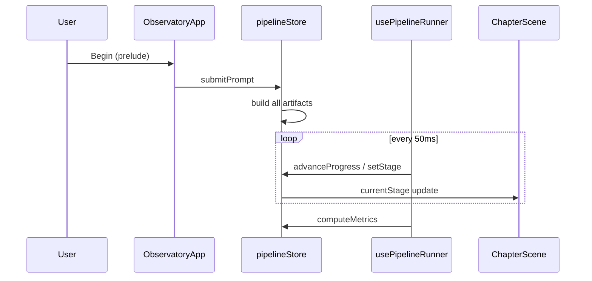

# Data flow

## Prompt → artifacts (once)

On `submitPrompt(prompt)`:

```
tokenize(prompt)
  → buildEmbeddings(tokens)
  → buildContextBlocks(prompt, len, ragEnabled)
  → buildAttentionMatrix(tokens, heads)
  → buildLogits(tokens, config, 0)
  → buildKVCache(config, seqLen)
  → buildHiddenStateSlices(...)
  → simulateResponse(prompt)
```

All stored in Zustand. **Not** recomputed on chapter change.

## Runner → UI (continuous)

```
usePipelineRunner (50ms)
  → advanceProgress OR setStage(next)
  → ChapterScene re-renders (currentStage)
  → StageSection mounts section component
  → Section reads store selectors
```

## Streaming exception

During `streaming` stage, runner calls `appendStreamToken` — mutates `streamedText` incrementally from precomputed `generatedTokens`.

## Autoregressive exception

During `autoregressive`, runner periodically `refreshLogits(arStep)` for sampling visualization.

## Completion

When final stage completes → `computeMetrics()` → `metrics` in store → `JourneyComplete` overlay.


