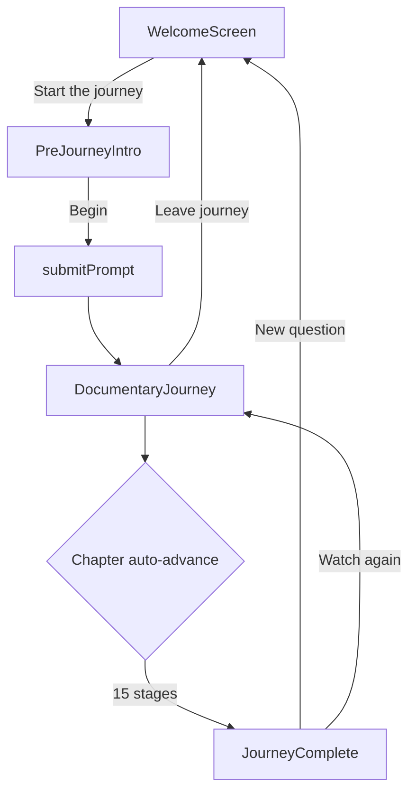

# Experience flow

## Phases (UI shell)

`ObservatoryApp` drives three **local phases** (`AppPhase`) before/during the Zustand `active` flag:

```
welcome ──(Start the journey)──► prelude ──(Begin)──► journey
   ▲                                                    │
   └──────────── reset / exit ──────────────────────────┘
```

| Phase | Component | Store `active` | Purpose |
|-------|-----------|----------------|---------|
| `welcome` | `WelcomeScreen` | `false` | Editorial entry, prompt, collapsed settings |
| `prelude` | `PreJourneyIntro` | `false` | Cinematic copy; **no simulation yet** |
| `journey` | `DocumentaryJourney` | `true` | 15 chapters after `submitPrompt()` |

**Why split prelude from welcome:** Simulation artifacts are not built until the user confirms readiness. Reduces “something already running” anxiety.

---

## Journey chapter flow (inside `active`)

```
usePipelineRunner (50ms tick)
        │
        ▼
currentStage + stageProgress
        │
        ▼
ChapterScene (title, summary, optional brain focus)
        │
        ▼
StageSection → sections/<Stage>Section.tsx
        │
        ▼
SceneChrome (transport + menu) + SceneProgress (dots)
```

On `generationComplete`, `JourneyComplete` overlay offers summary / replay / new question.

---

## Mermaid: full user path



---

## Learning depth during flow

Set on welcome (Customize) or from journey menu (`ModeToggle`). Affects **same** chapter structure — only **content density** inside `StageSection` changes.

---

## Keyboard shortcuts (journey only)

| Key | Action |
|-----|--------|
| Space | Pause / resume |
| Shift + ← | Previous chapter |
| Shift + → | Next chapter |

See [../REFERENCE/keyboard-shortcuts.md](../REFERENCE/keyboard-shortcuts.md).

---

## Code entry points

| File | Role |
|------|------|
| `src/components/ObservatoryApp.tsx` | Phase routing |
| `src/components/home/WelcomeScreen.tsx` | Welcome |
| `src/components/home/PreJourneyIntro.tsx` | Prelude |
| `src/components/journey/DocumentaryJourney.tsx` | Journey shell |
